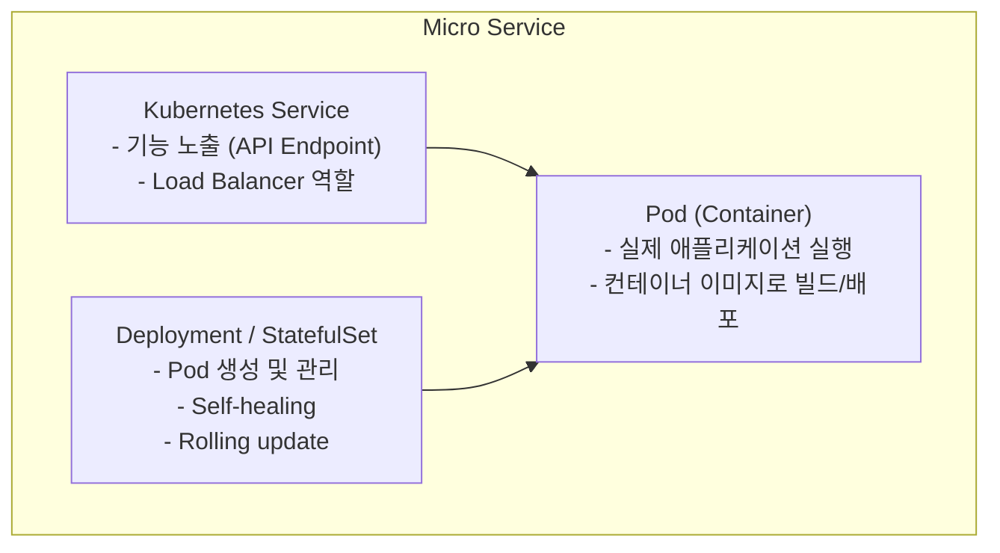

# 마이크로서비스 아키텍처 (MSA) 정의

## 소프트웨어 구조 설계 관점의 마이크로서비스 정의

마이크로서비스의 정의는 일반적으로 모호한 편이나, 소프트웨어 구조 설계자 입장에서는 다음과 같이 명확하게 정의하여 활용할 수 있다.

---

## 1. 단위 기능을 제공하는 서비스

마이크로서비스는 **특정 단위 기능을 제공하는 독립적인 서비스**이다.

### 서비스 분리 예시: 읽기·쓰기 부하가 다른 도메인

#### 분리된 설계
- **example-read-service**: 조회(GET) 요청만 처리
- **example-write-service**: 변경(POST/PUT 등) 요청만 처리

#### 통합된 설계
- **example-api-service**: 조회와 변경을 한 서비스에서 처리

> 어떤 방식을 선택할지는 비즈니스 요구사항, 확장성 요구, 성능 격리 필요성 등을 고려하여 결정한다.

---

## 2. 독립적인 확장성(Scalability)

마이크로서비스는 **서버의 독립적인 확장성을 내포**한다.

### 확장성의 독립성

#### 분리된 서비스의 경우
- `example-read-service`는 GET을 처리하는 **복수 인스턴스**로 구성
- `example-write-service`는 변경 요청을 처리하는 **복수 인스턴스**로 구성
- 두 서비스의 **확장성은 서로 독립적**
  - 읽기 트래픽만 늘면 read 쪽만 스케일 아웃
  - 쓰기 트래픽만 늘면 write 쪽만 스케일 아웃

#### 통합된 서비스의 경우
- `example-api-service`가 읽기·쓰기를 모두 처리
- 확장 시 GET/SET 처리 능력이 **함께 증가**
- 한쪽 트래픽만 증가해도 전체 서비스를 스케일 아웃해야 함

> **서비스를 구분한다는 것은 서로 독립적이라는 의미**이며, 이는 확장성, 배포, 장애 격리 등 모든 측면에 적용된다.

---

## 3. Kubernetes 구현 관점의 정의

마이크로서비스를 Kubernetes로 구현할 때, 다음과 같은 구성 요소로 명확히 정의할 수 있다.

### 마이크로서비스 = Kubernetes Service + Controller + Pod



### 구성 요소 설명

#### **Pod**
- 하나의 마이크로서비스는 **Kubernetes Pod**로 구현됨
- 컨테이너 이미지로 빌드되어 배포됨
- 실제 애플리케이션 로직이 실행되는 단위

#### **Kubernetes Service**
- Pod가 제공하는 기능을 외부에 노출
- 여러 Pod 간 **Load Balancer** 역할 담당
- 안정적인 네트워크 엔드포인트 제공

#### **Controller (Deployment / StatefulSet)**
- Pod의 생성 및 관리
- **Self-healing**: Pod 장애 시 자동 재시작
- **Scaling**: 트래픽에 따른 자동/수동 확장
- **Rolling update**: 무중단 배포

---

## 이 정의의 장점

### 1. 명확한 설계 단위
- 마이크로서비스를 **Kubernetes Service/Controller/Pod**로 구성되는 단위로 정의
- 설계 검토 시 유닛(Unit)으로서 명확한 경계를 가짐

### 2. 실용적인 의사결정
- 서비스를 분리할지 통합할지 결정할 때 구체적인 기준 제시
- 확장성, 배포 독립성, 리소스 효율성을 고려한 판단 가능

### 3. 구현과 설계의 일치
- 추상적인 개념이 아닌 실제 구현 단위와 일치
- 개발, 배포, 운영 관점에서 일관된 이해 가능

---

## 배포 단위 예시 (일반)

### 시나리오: 조회와 변경의 성능 격리 필요

```yaml
# example-read-service
apiVersion: v1
kind: Service
metadata:
  name: example-read-service
---
apiVersion: apps/v1
kind: Deployment
metadata:
  name: example-read-deployment
spec:
  replicas: 5  # 조회 트래픽이 높아 5개 복제
---

# example-write-service
apiVersion: v1
kind: Service
metadata:
  name: example-write-service
---
apiVersion: apps/v1
kind: Deployment
metadata:
  name: example-write-deployment
spec:
  replicas: 2  # 변경 트래픽이 낮아 2개 복제
```

### 설계 결정 근거
- **성능 격리**: 조회 트래픽이 변경 성능에 영향 없음 (품질 시나리오에서 정의한 목표에 대응)
- **독립 확장**: 각 워크로드 특성에 맞게 독립적으로 스케일링
- **명확한 책임**: 각 서비스가 단일 책임 원칙 준수

---

## 결론

마이크로서비스를 **Kubernetes의 Service/Controller/Pod로 구성되는 단위**로 정의함으로써:
- 설계자는 명확한 단위로 아키텍처를 검토할 수 있고
- 개발자는 구현 범위를 명확히 이해할 수 있으며
- 운영자는 배포 및 관리 단위를 일관되게 다룰 수 있다

이는 MSA의 모호함을 해소하고 실용적인 설계 의사결정을 가능하게 한다.
