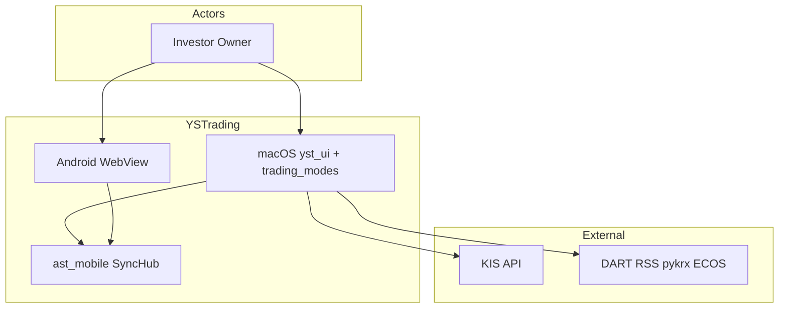
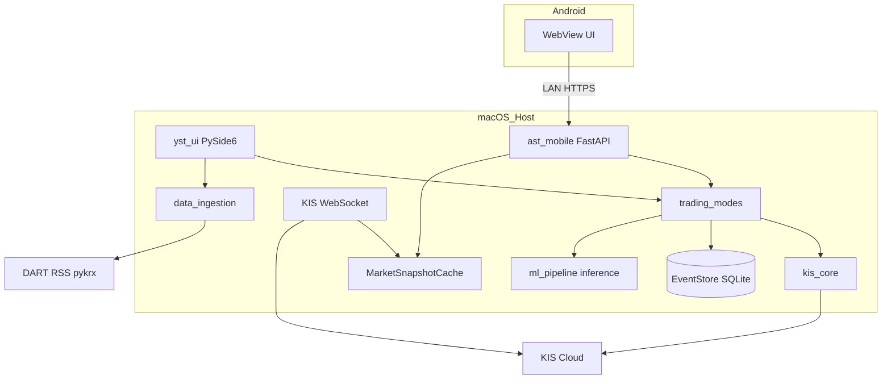
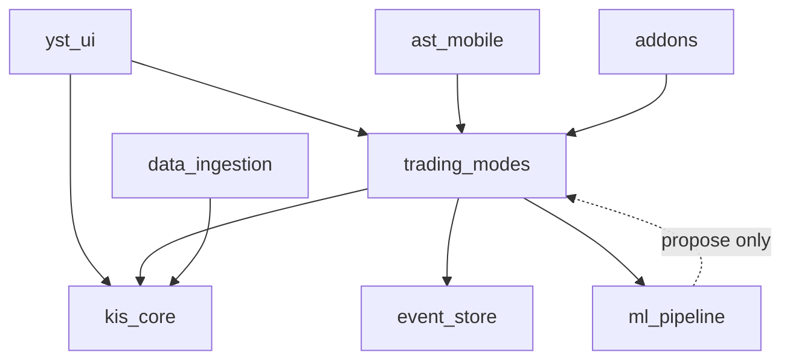
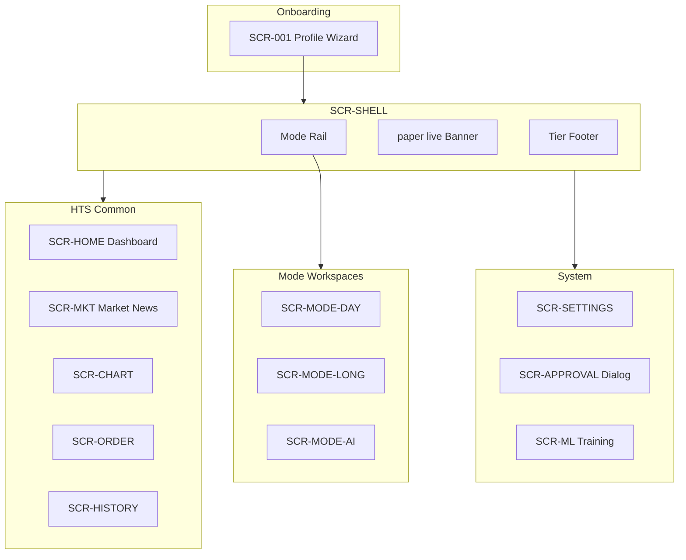
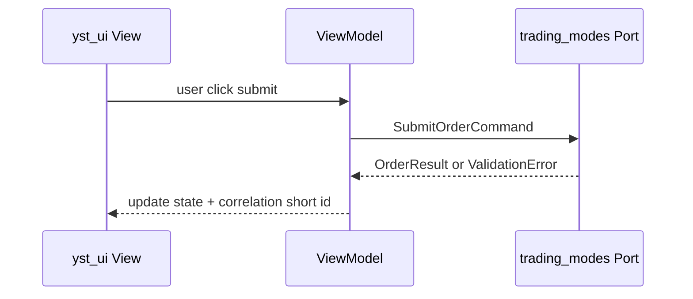

# 소프트웨어 아키텍처 명세서 — YSTrading

| 항목 | 내용 |
|------|------|
| TraceID | ARC-000 |
| 버전 | 1.0 (Phase 7) |
| 상태 | Phase 7 통합 · Phase 8 평가 [부록 H](#부록-h-구조-평가-phase-8) |
| 정본 분할 | [architecture/](architecture/), [ui/](ui/), [operations/](operations/) |

---

## 1. 개요

### 1.1 시스템 정의

YSTrading은 **개인 투자자 1인**을 위한 macOS 데스크톱(주) + Android(보조) 증권 매매·분석 앱이다. 한국투자증권(KIS) Open API, 개인화 RNN, 모의/실전 프로필, AI 승인 게이트를 통합한다.

**범위 안**: 시세·주문·4매매 모드·RiskGuard·RNN 학습·SyncHub·뉴스/공시 맥락.  
**범위 밖**: 멀티 사용자 SaaS, 클라우드 주문 중계, HTS 100% 동등, 투자 자문 라이선스.



출처: [SYS-001-system.md](SYS-001-system.md)

### 1.2 비즈니스 컨텍스트

| 목표 ID | 요약 |
|---------|------|
| BG-01~05 | 안전한 실매매, 모드별 전략, AI 통제, Android 패리티, 이력 추적 |

출처: [BUS-001-business.md](BUS-001-business.md)

### 1.3 제약 사항

| 구분 | 제약 |
|------|------|
| 비즈니스 | 개인 단독; 수익 미보장 명시 |
| 기술 | KIS TR·WS 한도; 시세 HTS급 비보장 |
| 보안 | `secrets.enc`; live 기본 확인·AI 기본 승인 |
| 조직 | GitHub Actions CI; **live 주문 CI 금지** |
| UI | PoC `gui_desktop` 미사용; [ADR-005](adr/ADR-005-greenfield-ui-and-modes.md) |

---

## 2. 요구사항

### 2.1 기능 요구사항 (구조적으로 중요 UC)

| UC | 제목 | 구조 영향 |
|----|------|-----------|
| UC-001 | 프로필 paper/live | 배포·KIS 엔드포인트 분기 |
| UC-002 | 수동 주문 | OrderService 단일 경로 |
| UC-003 | 현황·시세 | WS+REST, MarketSnapshotCache |
| UC-004 | 단타 휴리스틱 | `daytrade/` |
| UC-006 | AI·승인 | ApprovalGate, RNN |
| UC-007 | RNN 학습 | ml_pipeline, DAT-002 |
| UC-010 | Android 패리티 | SyncHub |
| UC-011 | RiskGuard | 주문 전 규칙 체인 |
| UC-012 | 뉴스·공시 | data_ingestion External |
| UC-013 | Android 음성·NL 매매 | nl_command → confirm → OrderService |

전체: [UCL-001-usecases.md](UCL-001-usecases.md)

### 2.2 비기능·품질 속성

| 우선 QA | 대표 NFR/QS |
|---------|-------------|
| 안전 | NFR-S-02~03, QS-004, QS-013~016 |
| 보안 | NFR-SEC-01, QS-009, QS-017~018 |
| 실시간 | NFR-T-01, QS-001, QS-013 |
| 신뢰성 | NFR-R-01, REL-001 |
| 재현 | NFR-M-01, QS-020 |

출처: [QLT-001-qualities.md](QLT-001-qualities.md), [QLT-002-commercial-quality-baseline.md](QLT-002-commercial-quality-baseline.md)

---

## 3. 시스템 구조 (동작 뷰)

### 3.1 배치 토폴로지

macOS가 **KIS·EventStore·ML·SyncHub** 호스트. Android는 WebView + (선택) 암호화 KIS 직접 호출.



상세: [architecture/ARC-002-deployment.md](architecture/ARC-002-deployment.md)

### 3.2 주요 동작 경로

| 경로 | 요약 |
|------|------|
| 시세 | WS → Cache; 단절 시 REST ([CND-004](candidate/CND-004-performance-realtime.md)) |
| 주문 | UI → TM → RG → OS → kis_core |
| AI | Addon propose → Gate → RG → OS |
| Android 승인 | 폴링 15s / Hub API ([ADR-007](adr/ADR-007-connectivity-and-shared-math-v1.md)) |
| 학습 | 오프라인 ETL → train → `artifacts/models/` |

### 3.3 횡단 관심사

| 관심사 | 정본 |
|--------|------|
| 복원력·CB·멱등 | [ARC-004](architecture/ARC-004-resilience-security-crosscut.md) |
| 로깅·추적 | [OPS-003](operations/OPS-003-logging-observability.md) |
| 이슈·디버깅 | [OPS-004](operations/OPS-004-debugging-issue-intake.md) |
| 배포·CI | [DEP-001-deployment.md](DEP-001-deployment.md), [OPS-001](operations/OPS-001-github-cicd.md) |

---

## 4. 모듈 구조 (개발 뷰)

구현·스키마·테스트: [DAT-003](data/DAT-003-data-schemas.md), [INT-001](implementation/INT-001-module-interfaces.md), [PLAN-001](implementation/PLAN-001-implementation-schedule.md), [TRACK-001](implementation/TRACK-001-progress.md), [TST-001](implementation/TST-001-testing-strategy.md).

### 4.1 레이어

```
Presentation   →  yst_ui, ast_mobile(WebView assets)
Application    →  trading_modes (modes, RG, Gate, orchestrator)
Domain         →  (모드 내부 엔티티·정책)
Infrastructure →  kis_core, event_store, ml_pipeline, data_ingestion, addons
```

### 4.2 패키지·의존



상세: [architecture/ARC-001-module.md](architecture/ARC-001-module.md), [ARC-003-trading-modes-greenfield.md](architecture/ARC-003-trading-modes-greenfield.md)

### 4.3 저장소 (로컬)

| 데이터 | 경로 |
|--------|------|
| 설정 | `~/.YSTrading/config.yaml` |
| 비밀 | `secrets.enc` |
| 감사 | `~/.YSTrading/data/events.db` |
| 로그 | `~/.YSTrading/logs/` |
| ML | `artifacts/models/`, `artifacts/datasets/` |

---

## 5. UI 설계 (Presentation)

> **UI 정본 폴더**: [ui/README.md](ui/README.md). 본 절은 아키텍처 관점 **통합 요약**이다.

### 5.1 UI 아키텍처 원칙

| 원칙 | 설명 | 문서 |
|------|------|------|
| 그린필드 | `yst_ui` 신규; PoC GUI 미의존 | [UI-000](ui/UI-000-greenfield-principles.md), ADR-005 |
| 모드 레일 | 1차 내비 = Manual·Day·Long·AI | UI-000 §3 |
| 일반 용어 | 화면에 Tier·OAuth 금지 | [UI-004](ui/UI-004-plain-language-and-labels.md) |
| 신뢰 표시 | 출처·시각·실시간 여부 | `TierFooterWidget` |
| 테마 | Cursor Light | [UI-005](ui/UI-005-cursor-light-theme.md) |
| 바인딩 | View → ViewModel → `trading_modes` 포트 | [UI-QT6](ui/UI-QT6-layout-conventions.md) |

### 5.2 화면 맵 (SCR)



| 그룹 | 대표 SCR | UC |
|------|----------|-----|
| 셸·공통 | SCR-SHELL, SCR-HOME, SCR-ORDER | UC-002, 003 |
| 모드 | SCR-MODE-DAY/LONG/AI | UC-004, 005, 006 |
| 시스템 | SCR-SETTINGS, SCR-APPROVAL | UC-006, 011 |
| Android | SCR-AND-PAIR, SCR-AND-HOME | UC-010 |

콘티: [UI-001](ui/UI-001-storyboards-shell-common.md), [UI-002](ui/UI-002-storyboards-trading-modes.md), [UI-003](ui/UI-003-storyboards-system-android.md)

### 5.3 Presentation ↔ Application 계약



| 규칙 | 설명 |
|------|------|
| UI 금지 | PySide6에서 `kis_core` 직접 import 금지 |
| 스레드 | KIS·학습은 `QThread`/`Worker`; UI 스레드 블록 금지 |
| 오류 | `correlation_id` 8자 사용자 표시 ([OPS-003](operations/OPS-003-logging-observability.md)) |
| live | `RiskAckDialog` + 배너 ([UI-001](ui/UI-001-storyboards-shell-common.md)) |

### 5.4 Android UI

| 항목 | 설계 |
|------|------|
| 셸 | WebView + 네이티브 알림·페어링 |
| API | SyncHub REST; `X-Session-Token` |
| 패리티 | 동일 SCR-ID·플로우 ([UI-003](ui/UI-003-storyboards-system-android.md)) |
| 오프라인 | 읽기 전용; [CND-001](candidate/CND-001-android-sync.md) MIT-HUB-01 |

---

## 6. 로깅·운영 진단

| 계층 | 문서 | 요약 |
|------|------|------|
| 로깅 | [OPS-003](operations/OPS-003-logging-observability.md) | JSON line + EventStore audit + Hub access |
| 이슈·디버깅 | [OPS-004](operations/OPS-004-debugging-issue-intake.md) | Diagnostic Pack, 플레이북, REQ 카드 |
| MLOps | [OPS-002](operations/OPS-002-devops-mlops.md) | 학습·승격 |

`correlation_id`는 UI·TM·kis·로그·Audit **공통 축**이다.

---

## 부록 A. 도메인 모델

[domain/DOM-001-model.md](domain/DOM-001-model.md) — OrderIntent, Approval, TrainingExample, Tier 메타.

---

## 부록 B. 품질 시나리오

[quality/QSC-001-scenarios.md](quality/QSC-001-scenarios.md) · 평가 [QEV-001](quality/QEV-001-evaluations.md)

---

## 부록 C. 품질 선정 요약

| 시나리오 | QA | NFR |
|----------|-----|-----|
| QS-001 | 실시간 | NFR-T-01 |
| QS-004 | 안전 | NFR-S-03 |
| QS-017~018 | 보안 | NFR-SEC-01 |

전체: [QLT-001](QLT-001-qualities.md)

---

## 부록 D. 후보 구조 설계

[CAT-001](candidate/CAT-001-candidates.md) · CND-001~005 · [CND-006 보완](candidate/CND-006-mitigation-adopted.md)

---

## 부록 E. 후보 구조 평가·채택

| 분류 | 채택 | 기각 |
|------|------|------|
| 시세 | WS+REST, Hub 델타 | REST-only, — |
| Android | SyncHub | 클라우드 릴레이 |
| ML | LSTM+D2 | Transformer v1 |
| 모듈 | trading_modes | GUI 비대, MSA |
| 안전 | RG+Gate | OPA |

[DEC-002](decision/DEC-002-evaluations.md) · [DEC-001](decision/DEC-001-decisions.md)

---

## 부록 F. 통합 근거

Phase 6 산출(ARC-001~004, ADR 001~009, UI, data, security)을 본 명세로 통합. 신규 구현은 **본 문서 + 링크된 TraceID 정본**을 따른다.

---

## 부록 G. UI 설계 산출물 색인

| TraceID | 문서 |
|---------|------|
| UI-000 | 그린필드·IA |
| UI-QT6-000 | PySide6 위젯 트리 |
| UI-001~003 | 스토리보드 |
| UI-004~005 | 용어·테마 |

---

## 부록 H. 구조 평가 (Phase 8)

**평가 정본**: [evaluation/EVL-002-architecture-evaluation.md](evaluation/EVL-002-architecture-evaluation.md)

| 항목 | 결과 (요약) |
|------|-------------|
| NFR 충족 | 안전·보안 **높음**; 실시간 **중~높음**(한계 명시); AI **중** |
| 구조 결정 일치 | DEC-001 채택과 3~6장 **일치** |
| 잔여 위험 | WS 복잡도, Hub 맥 의존, RNN 데이터 부족 — [CND-006](candidate/CND-006-mitigation-adopted.md) |
| v1 구현 갭 | CB·Diagnostic Pack·`yst_logging` **구현 예정** |

식별 결정 목록: [evaluation/EVL-001-architecture-decisions.md](evaluation/EVL-001-architecture-decisions.md)

---

## 변경 이력

| 날짜 | 버전 | 내용 |
|------|------|------|
| 2026-06-02 | 1.0 | Phase 7 통합; §5 UI; §6 로깅·디버깅; 부록 H |
