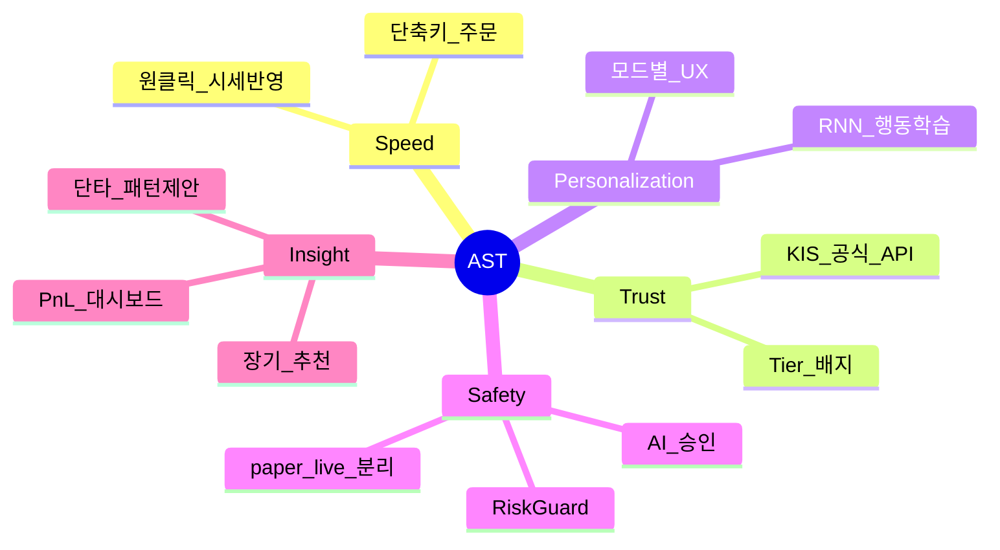
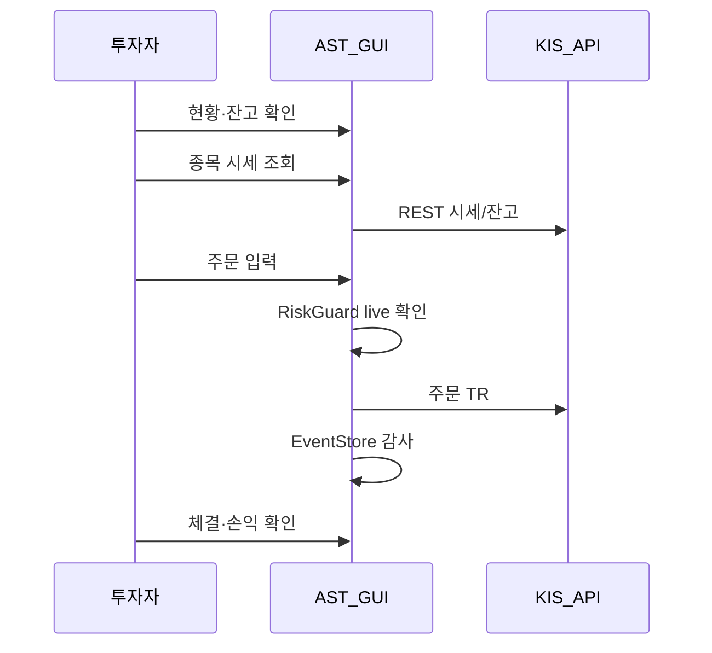

# 비즈니스 요구 — YSTrading

| 항목 | 내용 |
|------|------|
| TraceID | BUS-001 |
| 문서 ID | BUS-AST-001 |
| 버전 | 0.1 |
| 입력 | [system.md](SYS-001-system.md), [../doc/01-requirements.md](../doc/01-requirements.md), 사용자 확장 요구 |

---

## 1. 비즈니스 목표 (Business Goals)

| ID | 목표 | 측정 지표(개인 제품 관점) |
|----|------|---------------------------|
| BG-01 | **빠른 매매** | 관심 종목 → 주문 제출까지 UI 경로 ≤ 3단계(수동 모드) |
| BG-02 | **정보 신뢰** | 주문·AI 제안 화면에 데이터 Tier·시각·출처 표시 100% |
| BG-03 | **손실 통제** | live 주문 100% 사전 확인; AI는 승인 없이 주문 0건(기본 정책) |
| BG-04 | **개인화 수익** | paper에서 전략 검증 후 live 전환; AI는 paper 학습 우선 |
| BG-05 | **이력 가시성** | 모든 주문·제안·승인·체결 추적 가능(correlation_id) |
| BG-06 | **어디서나 동일 경험** | macOS 핵심 기능 Android에서 동등 접근(승인 푸시 포함) |

---

## 2. 비즈니스 드라이버

| 드라이버 | 설명 | 설계 함의 |
|----------|------|-----------|
| **속도** | HTS 대비 개인 워크플로 단축 | Quick 패널·관심종목·시세→주문 연동 |
| **신뢰** | 잘못된 시세로 인한 오판 방지 | Tier A 우선, 지연·시뮬 명시 |
| **개인화** | “내” 패턴 반영 | Tier3 이벤트 + RNN |
| **안전** | 실전 오주문·무분별 AI 방지 | 이중 확인·승인 게이트·한도 |
| **학습** | 모의로 검증 후 실전 | 프로필 전환·동일 코드 경로 |
| **투명성** | 왜 이 매매인가 | AI·단타·장기 모드 **근거 패널** |

---

## 3. 이해관계자

| 이해관계자 | 관심 | AST 대응 |
|------------|------|----------|
| **개인 투자자(오너)** | 수익·시간·통제 | 4매매 모드·승인·손익 |
| **KIS(공급자)** | API 약관·한도 | TR 레지스트리·로그 마스킹 |
| **데이터 제공자** | 라이선스 | doc/08 준수·출처 표시 |
| **미래의 유지보수자(본인)** | 테스트·재현 | CI·lock·패키지 경계 |

---

## 4. 핵심 비즈니스 프로세스

### 4.1 일상 매매 (Manual)

### 4.2 단타 모드 (Day)

1. 사용자가 **당일 거래 대상 종목** 선택.
2. 시스템이 **당일 분봉·가격 시계열**을 수집(Tier A/B + Tier1 보조).
3. **IntradayPatternAnalyzer** 가 저점·고점 후보 구간 산출(휴리스틱 + 통계; v1).
4. UI에 **매수 구간·매도 구간·신뢰도·근거 차트** 제시.
5. 사용자가 제안 수락 시 → Manual 주문 플로우로 연결(시세 반영).

### 4.3 장기 모드 (Long)

1. 다원 피처(재무 링크·모멘텀·변동성·Tier3 선호) 집계.
2. **LongTermScorer** 가 후보 종목 랭킹.
3. 관심종목·워치리스트 갱신 제안.
4. 주문은 사용자 주도.

### 4.4 AI 자동 모드

1. **오프라인**: Tier1+Tier3로 RNN 학습 → `artifacts/models/rnn_personal/{version}`.
2. **온라인**: 실시간 피처 윈도우 → 추론 → `propose_action`(매수/매도/홀드).
3. **ApprovalGate**: 매수·매도 직전 푸시/GUI 승인; **근거 패널**(피처 기여·최근 패턴 유사도).
4. 승인 시에만 `OrderService` 호출; 거부 시 EventStore에 기록.

### 4.5 paper ↔ live 전환

- **학습·백테스트·모의 매매**: `paper` 프로필.
- **실전 매매**: 명시적 `live` 전환 + 배너·확인.
- 동일 주문 코드 경로; TR ID·base_url만 프로필 매핑.

---

## 5. 성공 기준 (Outcome)

| 시나리오 | 성공 조건 |
|----------|-----------|
| 모닝 브리핑 | 현황 탭에서 계좌·지수·관심종목 1화면 요약 |
| 급한 매도 | 30초 이내 시세 확인→매도 주문 제출(네트워크 정상) |
| 단타 제안 | 선택 종목 당일 차트 + 저/고점 제안 1회 이상 갱신 |
| AI 승인 | 제안 후 60초 내 모바일/데스크톱에서 승인/거부 가능 |
| 손익 확인 | 거래·손익 탭에서 기간별 PnL·체결 목록 조회 |

---

## 6. 리스크 (비즈니스)

| 리스크 | 완화 |
|--------|------|
| API 지연·장애 | REST 폴링 백오프; WS 선택; “지연 가능” 표시 |
| AI 오매매 | 기본 승인 필수; paper 검증; 일일 한도 |
| 데이터 오류 | 다원 원천 교차; Tier C는 참고용 고정 |
| 규제·약관 | 자동주문 opt-in; 면책·로그 |
| Android 동기 지연 | 승인 요청 TTL·재전송; 로컬 큐 |

---

## 7. Phase 1 체크포인트

- [x] 목표·드라이버·이해관계자·핵심 프로세스
- [x] [system.md](SYS-001-system.md) 범위와 일관

**다음**: Phase 2 Use Case 명세.
