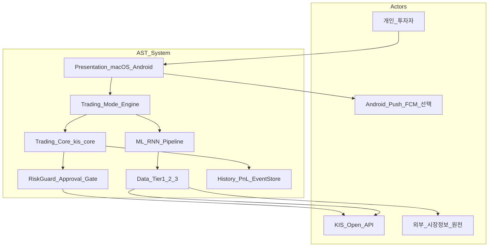

# 시스템 정의 — YSTrading

| 항목 | 내용 |
|------|------|
| TraceID | SYS-001 |
| 문서 ID | SYS-AST-001 |
| 버전 | 0.1 (Phase 1 산출) |
| 상태 | Phase 7~8 반영 — 통합 명세 [ARC-000-architecture.md](ARC-000-architecture.md) |
| 근거 요구 | [../doc/01-requirements.md](../doc/01-requirements.md), [../doc/12-requirements-and-quality-attributes-ko.md](../doc/12-requirements-and-quality-attributes-ko.md), 사용자 확장 요구(2026-06) |

---

## 1. 시스템 목적

**YSTrading** 는 개인 투자자가 **한국투자증권(KIS) Open API** 및 **다양한 공개·준공개 시장 정보 원천**을 통해 국내 주식을 **쉽고 빠르게** 매매하고, **손익·이력·리스크**를 한곳에서 관리하며, **매매 모드(수동·단타·장기·AI 자동)** 에 따라 차별화된 의사결정 지원을 받는 **개인용 통합 트레이딩 플랫폼**이다.

핵심 가치 제안:

1. **HTS급 기본 기능** — 시세·차트·주문·잔고·체결·뉴스·손익 등 전형적 HTS 워크플로를 데스크톱(맥북)에서 제공한다.
2. **개인 최적화** — 관심종목·단축 주문·활동 기록·개인화 AI 등 범용 HTS 대비 **나만의** 투자 패턴을 반영한다.
3. **신뢰 가능한 정보** — Tier(출처·지연)를 명시하고, 실시간에 가까운 데이터는 **KIS REST/WebSocket**을 우선한다.
4. **안전한 실전** — 모의(`paper`)·실전(`live`) 단일 코드 경로, RiskGuard; AI 매매는 **기본 사전 승인**, 무승인 자동은 **설정 On 시에만**(기본 Off).

---

## 2. 시스템 경계

### 2.1 In-Scope (시스템 내부)

| 영역 | 포함 내용 |
|------|-----------|
| **클라이언트** | macOS `yst_ui`(PySide6, Cursor Light), Android(암호화 키 내장·KIS 직접 + 선택 SyncHub) |
| **트레이딩 코어** | KIS OAuth·REST·(선택) WebSocket, 주문·조회·프로필 검증 |
| **매매 모드 엔진** | Manual, DayTrade(당일 패턴 제안), LongTerm(추천), AI-Auto(RNN 추론+승인 게이트) |
| **데이터 계층** | Tier1(공개 OHLCV), Tier2(모의 스냅샷), Tier3(사용자 이벤트), 외부 뉴스/공시 어댑터 |
| **ML** | RNN 기반 개인화 시퀀스 모델, 학습 파이프라인, 아티팩트 레지스트리, 추론 Addon |
| **이력·손익** | EventStore, 체결·주문 감사, PnL 집계(가능 범위), export |
| **보안·설정** | KIS 키 **암호화 blob**(`secrets.enc`), 모의/실전 시각 구분, Cursor Light UI |

### 2.2 Out-of-Scope (시스템 외부 — 연동만)

| 항목 | 비고 |
|------|------|
| KIS·KRX 백엔드 | REST/WebSocket 소비자 |
| 증권사 공식 HTS/MTS | 기능·지연 100% 패리티 **비보장** |
| 세무·법무·투자 자문 | 사용자 책임 |
| 타 증권사 API | v1은 KIS만; 어댑터 확장은 후속 ADR |
| 클라우드 호스팅 매매 엔진 | v1은 **로컬 우선**; Android는 데스크톱/동기 허브와 연동 |

### 2.3 경계 다이어그램

---

## 3. 주요 액터

| 액터 | 역할 |
|------|------|
| **개인 투자자** | 설정·매매·승인·모드 전환·학습 데이터 생성(행동) |
| **KIS Open API** | 인증, 시세·주문·잔고·체결 |
| **공개 데이터 원천** | pykrx, DART 링크, 공개 지수/환율 폴링 등 ([doc/08](../doc/08-opensource-and-data-sources.md)) |
| **ML 운영자(동일인)** | 오프라인 학습·모델 배포·paper에서 검증 |
| **Android 알림 채널** | AI 승인 요청 푸시(선택 구현) |

---

## 4. 매매 모드 (시스템 관점)

| 모드 ID | 명칭 | 목적 | 자동 주문 |
|---------|------|------|-----------|
| `MODE_MANUAL` | 매뉴얼 | HTS형 직접 주문 | 사용자 명시 실행만 |
| `MODE_DAY` | 단타 | 당일 종목 등락 패턴 분석 → **매수·매도 타이밍 제안** | 제안만; 실행은 사용자(또는 정책에 따라 1클릭) |
| `MODE_LONG` | 장기 투자 | 다원 정보·패턴 기반 **종목 추천·관심목록 갱신** | 추천·알림; 주문은 사용자 확인 |
| `MODE_AI` | AI 자동 | RNN 개인 패턴 학습 → 매매 타이밍 제안·실행 | 기본: **승인 게이트**; `ai_auto_without_approval` **Off(기본)** / On 시 무승인 자동 |

모드는 **상호 배타적이지 않음**: UI 탭/워크스페이스로 전환하며, 동시에 백그라운드 데이터 수집(Tier3)은 공통으로 동작한다.

---

## 5. 제약사항

| ID | 제약 | 영향 |
|----|------|------|
| C-01 | KIS API 약관·호출 한도 | 폴링 주기·배치 학습 분리 |
| C-02 | `paper`와 `live` URL/키 혼선 금지 | 기동 시 `ProfileMismatchError` |
| C-03 | CI에서 실계좌 자동 주문 금지 | live E2E는 수동 UAT만 |
| C-04 | 전용 HTS급 틱·지연 미보장 | Tier 배지·면책 문구 필수 |
| C-05 | 비밀은 로컬 볼트·환경변수 | 채팅·커밋·로그 마스킹 |
| C-06 | 교육·개인 참고 구현 | 면책·RiskGuard 강화 |
| C-07 | Android는 v1 **기능 패리티 목표**, 네이티브 HTS 성능 아님 | 동기 API·Web 셸 또는 원격 UI |
| C-08 | **상용급** 안전·신뢰·보안 기준 ([QLT-002](QLT-002-commercial-quality-baseline.md)) — live/AI 릴리스 게이트 | ASR-015~022, [ARC-004](architecture/ARC-004-resilience-security-crosscut.md) |

---

## 6. 가정

1. 사용자는 KIS Open API **모의·실전** 계정을 각각 발급받았다.
2. 맥북이 **주 실행 환경**이며, Android는 동일 계정·설정을 **동기화**하거나 원격 제어한다.
3. RNN v1은 **국내 현금 주식·일/분봉 시퀀스** 중심이며, 파생·해외는 후속 범위다.
4. AI 자동 매매의 **법적·약관적 자동주문 허용 여부**는 사용자가 KIS 약관을 확인한다.

---

## 7. PoC·그린필드 관계

| PoC 패키지 | 본 설계 |
|------------|---------|
| `kis_core` | **재사용** — Infrastructure (`OrderPort` 등) |
| `event_store` | **재사용** — Tier3·감사 |
| `ml_pipeline` | **재사용** — 학습·추론 어댑터 |
| `data_ingestion` | **재사용** — Tier1 |
| `gui_desktop` | **사용 안 함** — 신규 `yst_ui` ([ADR-005](adr/ADR-005-greenfield-ui-and-modes.md)) |
| `addons` | 프로토콜 참고; 실행은 `trading_modes` 경유 |
| `ast_mobile` | SyncHub + Android 셸 ([UI-003](ui/UI-003-storyboards-system-android.md)) |

요구·품질 상세: 레거시 `doc/` (참고만). 구조·UI·모드 정본: `docs/` + [ui/](ui/) + [ARC-003](architecture/ARC-003-trading-modes-greenfield.md).

---

## 8. Phase 1 체크포인트

- [x] 목적·범위·액터·제약 정의
- [x] 매매 모드 4종 시스템 관점 정의
- [ ] `business.md`와 목표·드라이버 정합 (동일 Phase)

**다음**: Phase 2 `usecases.md` — 기능 시나리오 상세화.
