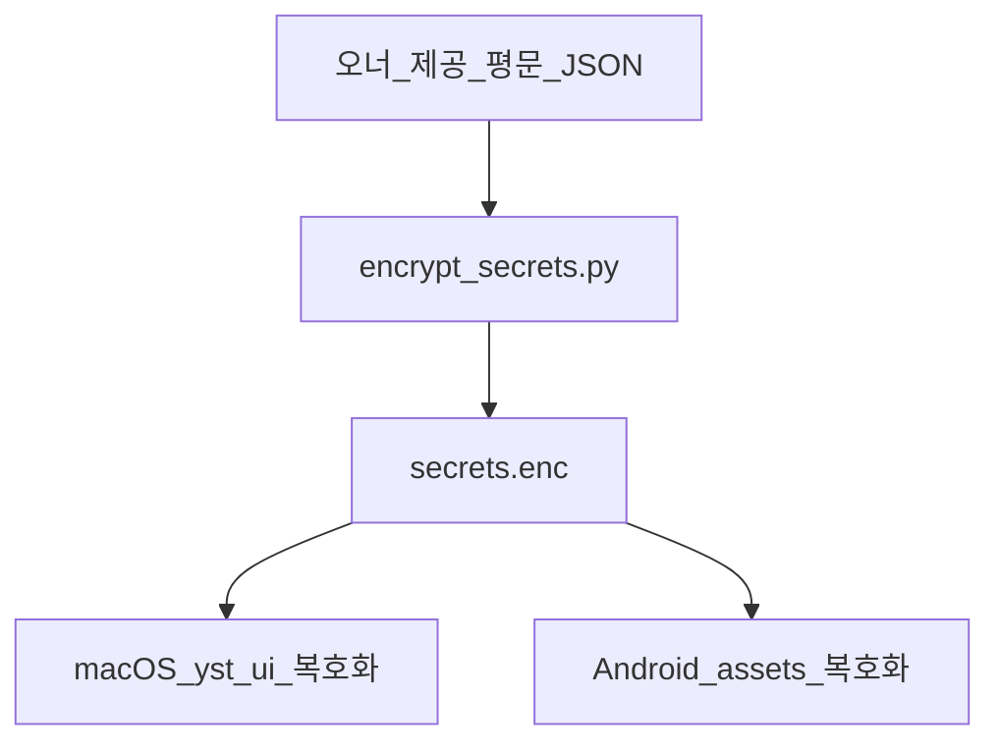

# ADR-006: 개인 전용 자격증명 — 암호화·Android 앱 내장

| 상태 | Accepted (오너 지시 2026-06) |
|------|------------------------------|
| TraceID | ADR-006 |
| 전제 | **본인만 사용**하는 개인 앱; 스토어 공개·다인 사용 **비목표** |

## Context

- 오너가 **한국투자증권 Open API** 키(모의·실전)를 제공한다.
- 개인 정보이며 **단독 사용**이다.
- Android 앱 배포 시, **필요한 만큼** 자격증명을 **암호화하여 APK에 포함**한다.
- macOS `yst_ui` 도 동일 정책으로 **암호화 저장** 후 사용한다.

기존 [ADR-001](ADR-001-android-synchub.md)의 「키는 맥북만」은 **개인 배포 모델**에서 일부 변경된다(아래 Decision).

## Decision

### 1. 저장 형식

| 플랫폼 | 위치 | 형식 |
|--------|------|------|
| macOS | `~/.YSTrading/secrets.enc` (또는 앱 번들 `resources/secrets.enc` 복사) | AES-256-GCM 또는 Fernet blob |
| Android | `assets/secrets.enc` | **동일 blob** (빌드 시 주입) |
| Git 저장소 | **평문 키 금지** | `.gitignore`: `secrets/plain/`, `*.key` |

오너가 제공한 평문은 **빌드 PC에서만** `scripts/encrypt_secrets.py` 로 암호화한다.

### 2. 암호화 모델 (개인용)

| 항목 | 내용 |
|------|------|
| 평문 스키마 | `paper`: app_key, app_secret, account(optional) · `live`: 동일 + account 필수 |
| 마스터 키 | 빌드 시 32바이트 랜덤 → **앱에 난독화 포함**(개인용 수준); 환경변수 `YST_SECRETS_KEY` 로 로컬 빌드만 가능하게 |
| 런타임 | 기동 시 메모리에만 복호화; 로그·UI에 **키 출력 금지** |
| 로테이션 | 키 변경 시 `secrets.enc` 재생성 후 앱 재빌드 |

### 3. Android 배포

| 항목 | 결정 |
|------|------|
| APK/AAB | `secrets.enc` 를 **assets** 에 포함 |
| 독립 KIS 호출 | Android에서 **직접 KIS API** 호출 허용(맥북 없이도 조회·주문 가능 범위) |
| SyncHub | **병행 가능** — 맥북 켜져 있으면 동기·승인 보조 |
| 스토어 | 개인 사이드로드·비공개 배포 가정 |

### 4. macOS

| 항목 | 결정 |
|------|------|
| 최초 기동 | `secrets.enc` 없으면 SCR-001 마법사에서 **파일 가져오기** 또는 빌드 번들 복사 |
| 메모리 | `KisCredentialProvider` 인터페이스로 `kis_core` 에 주입 |

### 5. UI 표시

- 화면에 app_key·secret **일절 표시 안 함** ([UI-004](../ui/UI-004-plain-language-and-labels.md)).
- 설정 화면: 「증권사 연결됨」 / 「연결 실패」만.

## Options considered

1. **맥북만 키 (ADR-001 원안)** — 기각(오너: Android 내장 필요).
2. **평문 assets** — 기각(암호화 필수).
3. **암호화 blob + 앱 내장 (채택)** — 개인 solo 전제.

## Consequences

### Positive

- Android 단독 사용·배포 단순.
- 오너가 키를 한 번 제공하면 빌드 파이프라인으로 반복 주입 가능.

### Negative / Risack (오너 인지)

| 리스크 | 완화 |
|--------|------|
| APK 역공학으로 blob·난독화 키 노출 가능 | **본인 전용** 전제; 공개 스토어·타인 배포 금지 |
| 기기 분실 | OS 잠금·앱 PIN(후속) 권장 |
| 키 유출 시 계좌 위험 | KIS 포털에서 키 폐기·재발급 절차 문서화 |

### Supersede

- [ADR-001](ADR-001-android-synchub.md): 「KIS 키를 모바일에 두지 않음」→ **개인 앱에서는 암호화 내장 허용**. SyncHub는 **선택 동기** 경로로 유지.

## Compliance

| ASR | 내용 |
|-----|------|
| ASR-002 | paper/live URL·키 **교차 결합** 기동 거부 유지 |
| ASR-011 (신규 제안) | 평문 커밋·채팅·로그 금지 — [ASR-001](../ASR-001-asr.md) 갱신 |

## Links

- [UI-004](../ui/UI-004-plain-language-and-labels.md)
- [UC-001](../usecase/UC-001-profile-connect.md)
- [UC-010](../usecase/UC-010-android-parity.md)
