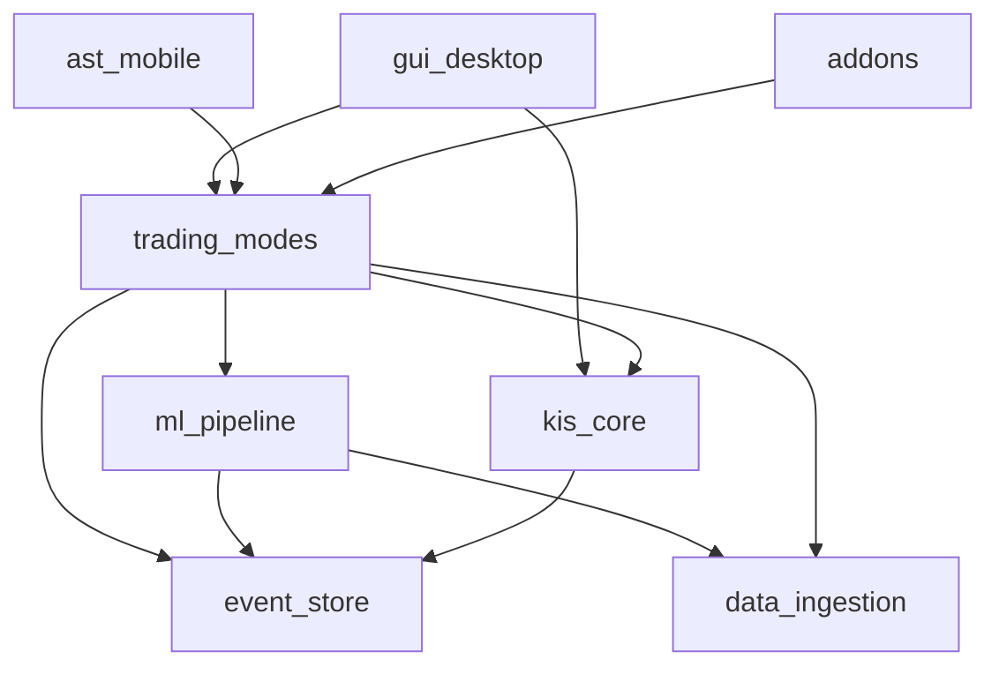

# 모듈 구조 (개발 뷰)


| 항목 | 내용 |
|------|------|
| TraceID | ARC-001 |

| 버전 | 0.1 (Phase 6.4) |

> **그린필드 정본**: Presentation·`trading_modes` 상세는 [ARC-003-trading-modes-greenfield.md](ARC-003-trading-modes-greenfield.md) · [ADR-005](../adr/ADR-005-greenfield-ui-and-modes.md). 본 문서 §2·§5의 `gui_desktop` 전제는 **역사 참고**.

---

## 1. 레이어 규칙

```
Presentation  →  Application  →  Domain  →  Infrastructure
     ↑              ↑
 gui_desktop    trading_modes
 ast_mobile          │
                     ↓
              kis_core, event_store, ml_pipeline, data_ingestion, addons
```

**의존 금지**: `kis_core` → GUI; `ml_pipeline` → PySide6.

---

## 2. 패키지 구조 (목표)

```text
packages/
  kis_core/              # Infrastructure: KIS REST/WS, OAuth, TR
  event_store/           # Infrastructure: SQLite Tier3
  data_ingestion/        # Tier1 ETL, registry client
  trading_modes/         # NEW Application
    manual/              # (thin — mostly gui)
    daytrade/
      pattern_analyzer.py
    longterm/
      scorer.py
    ai/
      addon_bridge.py
      approval_gate.py
    orchestrator.py
  analytics/             # OPTIONAL shared math
  ml_pipeline/
    rnn/
      model.py
      train_rnn_personal.py
      feature_window.py
    dataset.py
  addons/
    ai_trading_addon.py
  gui_desktop/           # Presentation macOS
  ast_mobile/            # SyncHub HTTP + static
```

---

## 3. 모듈 의존 다이어그램



---

## 4. 공개 인터페이스 (요약)

### 4.1 `trading_modes.orchestrator`

```python
class TradingMode(Enum):
    MANUAL = "manual"
    DAY = "day"
    LONG = "long"
    AI = "ai"

def set_mode(mode: TradingMode) -> None: ...
def get_workspace_context() -> WorkspaceContext: ...
```

### 4.2 `ApprovalGate` · `PolicyResolver`

```python
def requires_ai_approval(settings: GuiPersistentSettings) -> bool:
    return not settings.ai_auto_without_approval  # default False → approval required

def create_request(proposal: TradeProposal) -> ApprovalRequest: ...
def approve(request_id: UUID) -> None: ...
def reject(request_id: UUID, reason: str | None) -> None: ...
```

**설정** (`gui_settings.json`, schema ≥ 5): `ai_auto_without_approval: bool = false`, `ai_approval_ttl_sec: int = 60`.

### 4.3 `AddonHost` (기존 확장)

```python
def propose_action(ctx: MarketContext) -> ActionProposal | None: ...
```

### 4.4 `SyncHub` REST (v1 초안)

| Method | Path | 설명 |
|--------|------|------|
| GET | `/health` | 상태 |
| GET | `/profile` | paper/live |
| GET | `/quotes/{symbol}` | 캐시 시세 |
| POST | `/orders` | RiskGuard 후 주문 |
| GET | `/approvals/pending` | 승인 대기 |
| POST | `/approvals/{id}/approve` | 승인 |
| POST | `/approvals/{id}/reject` | 거부 |

---

## 5. GUI 모듈 매핑

| 탭/화면 | 모듈 |
|---------|------|
| 현황 | `gui_desktop.hts_dashboard_panel` + `trading_modes` context |
| 시세·차트 | `quote_panel`, `chart_panel` |
| 매매 | `trading_quick_panel`, `order_extras_panel` |
| 단타 | `daytrade_workspace` (신규) |
| 장기 | `longterm_workspace` (신규) |
| AI·모델 | `ml_model_panel` + `ApprovalDialog` |
| 거래·손익 | `history_pn_placeholder` → `HistoryAggregator` |

---

## 6. 데이터 모듈

| 모듈 | Tier |
|------|------|
| `kis_core` REST/WS | A/B |
| `data_ingestion` | C |
| `event_store` | 3 |
| `FeatureSnapshotter` (ml_pipeline) | 3→학습 |

---

## 7. 구현 로드맵 (모듈 순)

| 단계 | 모듈 | UC |
|------|------|-----|
| M1 | `trading_modes` 골격 + orchestrator | — |
| M2 | `daytrade.pattern_analyzer` | UC-004 |
| M3 | `longterm.scorer` | UC-005 |
| M4 | `ml_pipeline.rnn` + `ApprovalGate` | UC-006, UC-007 |
| M5 | `ast_mobile` SyncHub API | UC-010 |
| M6 | `HistoryAggregator` 강화 | UC-008 |

---

## 8. Phase 6 체크포인트

- [x] 레이어·패키지·의존
- [x] SyncHub API 초안
- [x] 신규 `trading_modes` 경계

**통합 명세**: [ARC-000-architecture.md](../ARC-000-architecture.md) (Phase 7~8 완료)
