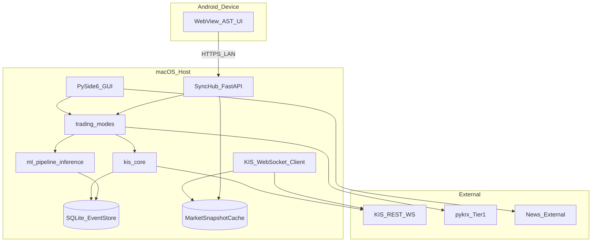

# 배치 구조 (동작 뷰)


| 항목 | 내용 |
|------|------|
| TraceID | ARC-002 |

| 버전 | 0.1 (Phase 6.3) |

---

## 1. 런타임 토폴로지



---

## 2. 노드 책임

| 노드 | 프로세스 | 데이터 저장 |
|------|----------|-------------|
| **macOS Host** | `yst-gui`, `sync-hub` (별도 프로세스 또는 스레드) | `~/.YSTrading/` |
| **Android** | WebView + 네이티브 알림 | 캐시만; 비밀 없음 |
| **KIS** | 클라우드 | — |
| **오프라인 ML** | CI 또는 로컬 `make train` | `artifacts/` |

---

## 3. 프로필·환경 배치

| 프로필 | KIS 엔드포인트 | 용도 |
|--------|----------------|------|
| paper | 모의 URL | 학습·모의 매매·AI 검증 |
| live | 실전 URL | 실매매·실승인 |

**전환**: 단일 macOS 프로세스 내 `KisProfile` 스왑; Android는 Hub API `GET /profile` 동기.

---

## 4. 네트워크·포트

| 서비스 | 포트(기본) | 바인딩 |
|--------|------------|--------|
| SyncHub | 8765 | `127.0.0.1` 또는 LAN `0.0.0.0` (설정) |
| KIS | 443 | 아웃바운드 |

**보안**: LAN 사용 시 페어링 QR + 단기 토큰; 인터넷 노출 금지(기본).

---

## 5. 실시간 데이터 경로

1. **Tier A/B**: KIS → WS/REST → `MarketSnapshotCache` → GUI/Android
2. **Tier C**: pykrx ETL (배치/온디맨드) → 차트·장기 피처
3. **Tier 3**: GUI → EventStore (로컬)

---

## 6. AI 승인 배치

```mermaid
sequenceDiagram
  participant Mac as macOS_AiAddon
  participant Hub as SyncHub
  participant And as Android
  participant KIS as KIS

  Mac->>Mac: RNN infer
  Mac->>Hub: POST /approvals
  Hub->>And: push notification
  And->>Hub: POST /approvals/id/approve
  Hub->>Mac: callback/wake
  Mac->>KIS: order (via kis_core)
```

---

## 7. CI/CD 배치

| 항목 | 정본 |
|------|------|
| 도구체인 결정 | [ADR-008](../adr/ADR-008-github-cicd-devops-mlops.md) |
| GitHub Actions 상세 | [OPS-001](../operations/OPS-001-github-cicd.md) |
| DevOps · MLOps | [OPS-002](../operations/OPS-002-devops-mlops.md) |
| 배포·롤백 11절 | [DEP-001](../DEP-001-deployment.md) |

- **GitHub Actions**: `ci.yml`, `ml-smoke.yml`, `release.yml` (구현 예정)
- **실계좌 live 주문 CI 없음** — mock/paper fixture만
- 산출: PyInstaller macOS, Android APK — 레거시 [doc/09](../doc/09-distribution-deliverables.md) 및 DEP-001 §6

---

## 8. Phase 6 체크포인트

- [x] macOS 중심 + Android 위성
- [x] paper/live·데이터 Tier 배치
- [x] 승인 흐름 배치
