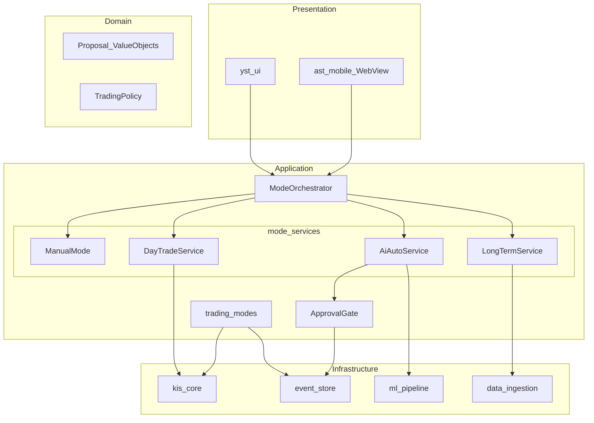

# trading_modes · yst_ui 그린필드 구조

| TraceID | ARC-003 |
|---------|---------|
| 상태 | Accepted (그린필드) |
| supersede | [ARC-001-module.md](ARC-001-module.md) §2·§5의 `gui_desktop` 전제 |
| UI 콘티 | [ui/README.md](../ui/README.md) |

---

## 1. 결정 요약

| 항목 | 그린필드 |
|------|----------|
| PoC | **요구·품질·KIS 지식만**; `gui_desktop` **미사용·미이전** |
| Presentation | **`yst_ui`** (PySide6) 신규 |
| Application | **`trading_modes`** 신규(도메인·포트·모드 서비스) |
| Infrastructure | `kis_core`, `event_store`, `ml_pipeline`, `data_ingestion` **어댑터 재사용** |
| Android | `ast_mobile` SyncHub + WebView; UI는 macOS와 **동일 API 계약** |

---

## 2. 레이어



**의존 금지**: `kis_core` → `yst_ui`; `ml_pipeline` → PySide6; `trading_modes` → Qt.

---

## 3. 패키지 구조 (목표)

```text
packages/
  yst_ui/                      # Presentation (NEW)
    shell/                     # SCR-SHELL, mode rail
    workspaces/                # manual_tabs, day, long, ai
    widgets/                   # proposal_card, tier_footer, chart_host
    dialogs/                   # approval, risk, onboarding
    viewmodels/                # Qt-free DTO binders → calls trading_modes ports
    app.py                     # entry

  trading_modes/               # Application (NEW — not PoC port)
    domain/
      mode.py                  # TradingMode enum
      proposals.py             # DaySuggestion, LongRank, ActionProposal
      policy.py                # ApprovalPolicy, RiskPolicy
    ports/
      market_data.py           # QuotePort, IntradayPort
      orders.py                # OrderPort
      events.py                # AuditPort
      ml_inference.py          # InferencePort
    manual/
      manual_mode.py           # thin: watchlist helpers, order prefill DTO
    daytrade/
      aggregator.py            # IntradayDataAggregator
      pattern_analyzer.py      # IntradayPatternAnalyzer (heuristic v1)
      service.py               # DayTradeService
    longterm/
      feature_builder.py
      scorer.py                # LongTermScorer
      service.py               # LongTermService
    ai/
      inference_bridge.py      # wraps ml_pipeline + addons protocol
      approval_gate.py
      service.py               # AiAutoService
    shared/                    # O-03 확정
      indicators.py
      normalize.py
    orchestrator.py            # ModeOrchestrator
    settings.py                # AppSettings (replaces gui_settings coupling)

  kis_core/                    # reuse
  event_store/                 # reuse
  ml_pipeline/                 # reuse; train CLI unchanged path
  data_ingestion/              # reuse
  ast_mobile/                  # SyncHub; static or SSR for SCR-AND-*

  gui_desktop/                 # DEPRECATED — do not import
```

### O-01 ~ O-04 (확정)

| ID | 결정 |
|----|------|
| O-01 | SyncHub **LAN + 페어링 토큰** — [ADR-007](../adr/ADR-007-connectivity-and-shared-math-v1.md) |
| O-02 | Android 승인 **폴링 15s + 로컬 알림** |
| O-03 | **`trading_modes/shared/`** (`indicators.py`, `normalize.py`) |
| O-04 | PoC GUI **이전 없음** — `trading_modes`·`yst_ui` 신규 |

---

## 4. ModeOrchestrator

```python
class TradingMode(StrEnum):
    MANUAL = "manual"
    DAY = "day"
    LONG = "long"
    AI = "ai"


@dataclass(frozen=True)
class WorkspaceContext:
    mode: TradingMode
    profile: Literal["paper", "live"]
    # ViewModels pull mode-specific state via ports


class ModeOrchestrator:
    def set_mode(self, mode: TradingMode) -> WorkspaceContext: ...
    def get_context(self) -> WorkspaceContext: ...

    # Facades used by yst_ui (no Qt types below this line)
    def day(self) -> DayTradeService: ...
    def long(self) -> LongTermService: ...
    def ai(self) -> AiAutoService: ...
    def approval(self) -> ApprovalGate: ...
```

| 규칙 | 설명 |
|------|------|
| 단일 활성 모드 | UI 포커스 1개; Tier3 수집은 **모드 무관** 백그라운드 |
| 주문 실행 | **항상** `OrderPort` → `kis_core` + `RiskGuard` (live) |
| AI 실행 | `AiAutoService` → (optional) `ApprovalGate` → `OrderPort` |

---

## 5. 모드별 책임 (오너 정의 정합)

| 모드 | 서비스 | 입력 | 출력 | 자동 주문 |
|------|--------|------|------|-----------|
| Manual | `ManualMode` | 사용자 입력 | `OrderIntent` | 없음 |
| Day | `DayTradeService` | 종목·당일 분봉 | `DaySuggestion[]` | 없음 |
| Long | `LongTermService` | 유니버스·성향 | `LongRank[]` | 없음 |
| AI | `AiAutoService` | 피처 윈도우 | `ActionProposal` | 설정 On 시만 Gate 생략 |

### Day — `IntradayPatternAnalyzer` (v1)

- 스무딩 + 국소 극값; `buy_window`, `sell_window`, `confidence`, `rationale_tags[]`
- UI: [UI-002](../ui/UI-002-storyboards-trading-modes.md) SCR-MODE-DAY

### Long — `LongTermScorer`

- Tier1 OHLCV + Tier3 선호; 재무 미연동 시 한계 명시
- UI: SCR-MODE-LONG

### AI — `ApprovalGate`

- `requires_approval = not settings.ai_auto_without_approval` (기본 True)
- TTL `ai_approval_ttl_sec`; EventStore 감사
- ADR: [ADR-004](../adr/ADR-004-ai-auto-without-approval-setting.md)

---

## 6. 포트(헥사고날) 요약

| Port | 구현체 | 용도 |
|------|--------|------|
| `QuotePort` | `kis_core` adapter | 시세·호가 |
| `IntradayPort` | KIS 분봉 + Tier1 fallback | Day |
| `OrderPort` | `kis_core.OrderService` | 모든 모드 주문 |
| `AuditPort` | `event_store` | Tier3·감사 |
| `InferencePort` | `ml_pipeline` + artifact registry | AI |

`yst_ui` ViewModel은 **포트만** 호출; TR ID·URL은 어댑터 내부.

---

## 7. 설정 (`AppSettings`)

PoC `gui_settings.json` 스키마를 **베끼지 않고** 호환 필드만 흡수.

| 키 | 기본 | 모듈 |
|----|------|------|
| `ai_auto_without_approval` | false | `ai/approval_gate` |
| `ai_approval_ttl_sec` | 60 | `ai/approval_gate` |
| `daytrade_sensitivity` | medium | `daytrade/pattern_analyzer` |
| `daytrade_auto_refresh_sec` | 60 | `daytrade/service` |
| `active_profile` | paper | `orchestrator` |
| `android_poll_interval_sec` | 15 | ast_mobile (O-02) |
| `android_use_fcm` | false | ast_mobile (v2) |

저장: `~/.YSTrading/settings.json` (경로는 배포 ADR에서 확정).

---

## 8. SyncHub API (Android)

[ARC-001](ARC-001-module.md) §4.4 + [ADR-007](../adr/ADR-007-connectivity-and-shared-math-v1.md) (O-01·O-02).

| Method | Path | 설명 |
|--------|------|------|
| POST | `/pair` | body `{ "code": "......" }` → `session_token` |
| GET | `/mode` | 현재 `TradingMode` |
| GET | `/day/suggestions?symbol=` | Day 제안 JSON |
| GET | `/approvals/pending` | 승인 큐 (Android **15s** 폴링) |

헤더: `X-Session-Token` (O-01). FCM은 v2 (`android_use_fcm` default false).

---

## 9. 구현 순서 (모듈 허가 단위)

| 단계 | 산출 | UC |
|------|------|-----|
| G0 | `trading_modes` domain + ports + orchestrator 스텁 | — |
| G1 | `yst_ui` shell + SCR-001~002 + Manual T-HOME/ORDER | UC-001, UC-002, UC-003 |
| G2 | `DayTradeService` + SCR-MODE-DAY | UC-004 |
| G3 | `LongTermService` + SCR-MODE-LONG | UC-005 |
| G4 | `AiAutoService` + ApprovalGate + SCR-MODE-AI | UC-006 |
| G5 | ML Lab UI + train path | UC-007 |
| G6 | `ast_mobile` + SCR-AND-* | UC-010 |

각 단계: **해당 모듈 허가 후** 코드 작성(collaborative-design-first).

---

## 10. 체크포인트

- [x] PoC GUI 비사용 명시
- [x] 4매매 모드 서비스 경계
- [x] UI 콘티와 1:1 (UI-002, UI-003)
- [ ] Phase 7 `architecture.md` 통합 본문 흡수

**다음**: [ADR-005-greenfield-ui-and-modes.md](../adr/ADR-005-greenfield-ui-and-modes.md)
