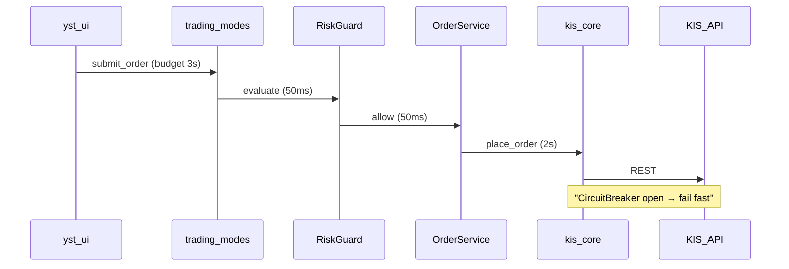
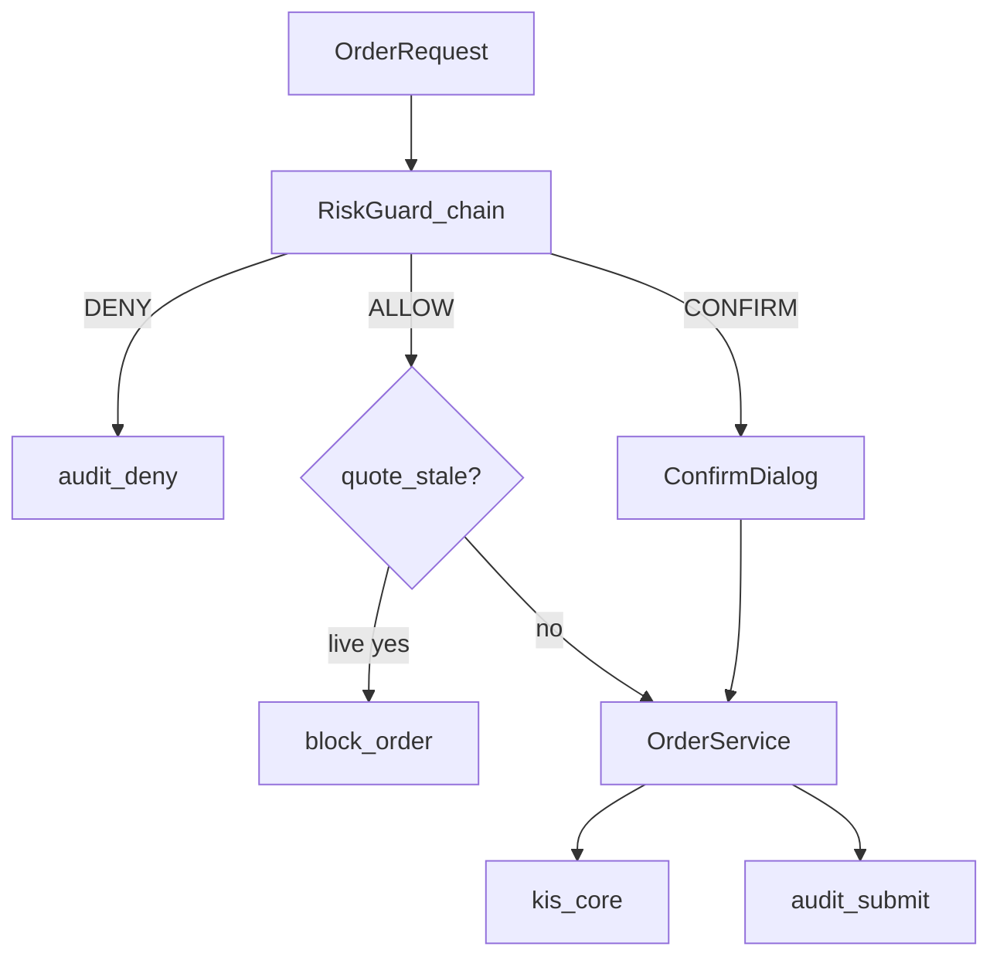

# ARC-004 — 복원력·보안 횡단 관심사

| 항목 | 내용 |
|------|------|
| TraceID | ARC-004 |
| 버전 | 0.1 |
| ADR | [ADR-009](../adr/ADR-009-commercial-quality-security-baseline.md) |

본 문서는 **모듈 간 공통 패턴** 정본이다. 모듈 상세는 [ARC-001](ARC-001-module.md), [ARC-003](ARC-003-trading-modes-greenfield.md).

---

## 1. 호출 체인·타임아웃 예산

| 구간 | 예산 | 초과 시 |
|------|------|---------|
| UI 로컬 검증 | 50ms | 인라인 오류 |
| RiskGuard | 50ms | DENY(안전 쪽) |
| KIS REST | 2s | 재시도 정책([REL-001](../reliability/REL-001-slo-resilience-patterns.md)) |
| 전체 주문 | 3s | 사용자 취소 가능·상태 `UNKNOWN` 감사 |

---

## 2. kis_core — 복원력

| 패턴 | 구현 요약 |
|------|-----------|
| **Circuit Breaker** | 연속 5xx/타임아웃 N회 → OPEN 30s → HALF_OPEN probe |
| **Retry** | 401: 토큰 1회 갱신; 429/5xx: 지수 백오프+jitter, max 3 |
| **Idempotency** | `client_order_id` UUID; 서버 중복 시 동일 결과 반환 처리 |
| **Rate self-limit** | TR별 토큰 버킷(KIS 한도 문서 준수) |
| **WS 폴백** | WS 끊김 3s → REST 폴링 Tier A; UI 배지 `연결 끊김` |

---

## 3. OrderService · RiskGuard

| 규칙 | 설명 |
|------|------|
| RG-07 | live + 시세 `as_of` > 5s → **주문 거부**(설정 가능) |
| RG-08 | `client_order_id` 중복 → 거부 |
| RG-09 | Circuit OPEN → 주문 큐잉 **금지**, 명시 오류 |

---

## 4. EventStore — 내구성·감사

| 항목 | 정책 |
|------|------|
| 엔진 | SQLite **WAL** |
| 감사 | `audit_events` **append-only** 트리거 |
| 백업 | 일 1회 파일 복사; 기동 시 `PRAGMA integrity_check` |
| 복구 | 크래시 후 미확정 주문 `RECONCILE` job |

금전 이벤트 스키마: [SEC-001](../security/SEC-001-threat-model-and-controls.md) §4.

---

## 5. SyncHub · Android 보안 경계

| 계층 | 통제 |
|------|------|
| Transport | HTTPS(TLS 1.2+); LAN 기본 |
| Auth | 페어링 후 `X-Session-Token`; TTL 24h; 로테이션 |
| AuthZ | 주문 API는 토큰+IP(선택 allowlist) |
| Rate | Hub 60 req/min/IP |
| 실패 | 토큰 무효 → 401, 감사 |

---

## 6. ML 추론 경로 (안전)

| 조건 | 동작 |
|------|------|
| `confidence < θ` | HOLD only, audit |
| 시세 stale | infer skip |
| `data_hash` 불일치 | 모델 로드 거부 |
| ApprovalGate Off | RiskGuard만 live |

---

## 7. 관측 (횡단)

| 신호 | 형식 |
|------|------|
| 앱 로그 | JSON line: `level`, `trace_id`, `component`, **마스킹** |
| 감사 | EventStore 전용; 삭제 불가 |
| 메트릭 | 로컬 Prometheus textfile **선택** |

---

## 8. 구현 우선순위

| P | 항목 |
|---|------|
| P0 | RG-07/08, 멱등 ID, audit append-only, 401 retry |
| P0 | Circuit breaker, paper/live guard |
| P1 | WS 폴백, 백업 job, Hub rate limit |
| P2 | SBOM, TLS pinning, root detect |

---

## 관련

- [REL-001](../reliability/REL-001-slo-resilience-patterns.md)
- [SEC-001](../security/SEC-001-threat-model-and-controls.md)
