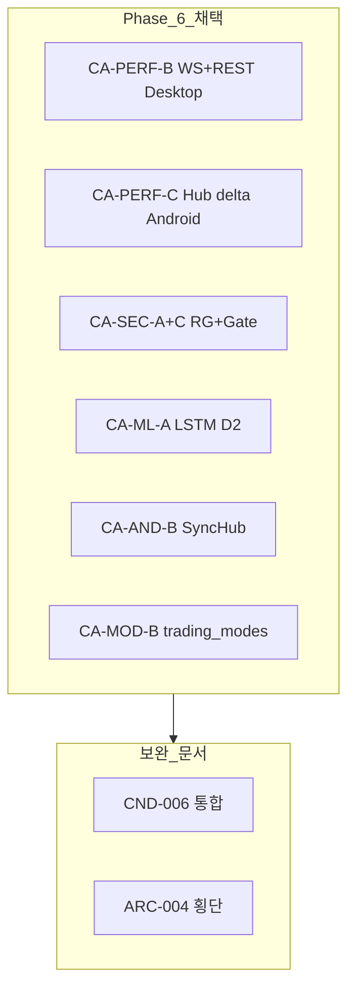

# 후보 구조 통합 목록

| 항목 | 내용 |
|------|------|
| TraceID | CAT-001 |
| 버전 | 0.2 |

평가: [DEC-002](../decision/DEC-002-evaluations.md) · 품질 시나리오: [QEV-001](../quality/QEV-001-evaluations.md) · **읽기 가이드**: [README.md](README.md)

---

## 후보 목록

| 후보 ID | TraceID | 제목 | 관심사 | 문서 | 상충 |
|---------|---------|------|--------|------|------|
| CA-PERF | CND-004 | 실시간 시세·WS/REST | 실시간 | [CND-004](CND-004-performance-realtime.md) | A vs B vs C |
| CA-SEC | CND-005 | 보안·RiskGuard·승인 | 안전·AI | [CND-005](CND-005-security-safety.md) | A+C vs B |
| CA-ML | CND-003 | ML RNN 아키텍처 | RNN | [CND-003](CND-003-ml-rnn-architecture.md) | A vs B vs C · D1~D3 |
| CA-AND | CND-001 | Android 동기 | Android | [CND-001](CND-001-android-sync.md) | A vs B vs C |
| CA-MOD | CND-002 | 레이어·모듈 | 모듈 | [CND-002](CND-002-layered-modularity.md) | A vs B vs C |

각 CND 문서에는 **후보별 Mermaid 도식**, **장단점 표**, **채택 구조 §보완 설계**가 있다.

---

## 채택 조합 (요약)

| 영역 | 채택 | 보완 정본 |
|------|------|-----------|
| 시세 | B+C | [CND-004](CND-004-performance-realtime.md) §6 · [CND-006](CND-006-mitigation-adopted.md) |
| Android | B | [CND-001](CND-001-android-sync.md) §6 |
| ML | A+D2 | [CND-003](CND-003-ml-rnn-architecture.md) §5 |
| 모듈 | B | [CND-002](CND-002-layered-modularity.md) §6 |
| 안전 | A+C | [CND-005](CND-005-security-safety.md) §6 |

---

## 상충 요약

| 상충 | 제목 | 해결 방향 | 평가 근거 |
|------|------|-----------|-----------|
| REST vs WS | 시세 수집 방식 | Desktop **WS + REST fallback**; Android **Hub 델타** | QS-001; [DEC-002](../decision/DEC-002-evaluations.md) |
| GUI 비대 vs 신규 패키지 | 모드 코드 위치 | **`trading_modes` 신설** + `yst_ui` | CA-MOD-B; ADR-003·005 |
| Android 독립 vs SyncHub | 모바일 KIS 위치 | **SyncHub** + ADR-006 암호화 보조 | QS-010·017; ADR-001 |
| OPA vs 인코드 규칙 | 정책 표현 | **RiskGuard 체인** | X-04 |
| Transformer vs LSTM | AI 모델 | **LSTM BC v1** | X-02 |

---

## 문서 확장 (v0.2)

| 추가 | 설명 |
|------|------|
| [CND-006-mitigation-adopted.md](CND-006-mitigation-adopted.md) | 채택 구조 단점 → MIT-* 보완 ID 통합 |
| CND-001~005 v0.2 | 후보별 구조·시퀀스·상태 도식, 상세 설명, §채택 보완 |

**다음**: [DEC-002-evaluations.md](../decision/DEC-002-evaluations.md) → [DEC-001-decisions.md](../decision/DEC-001-decisions.md)
