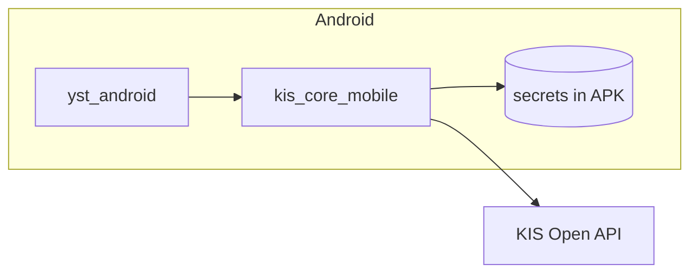
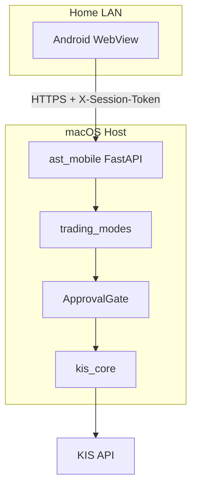
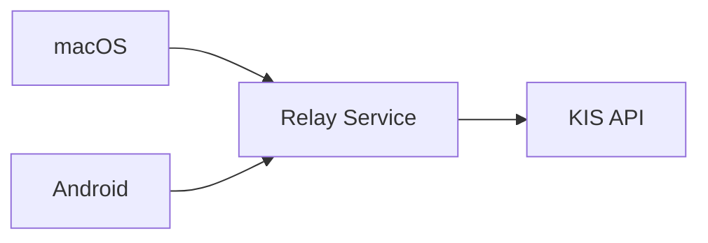
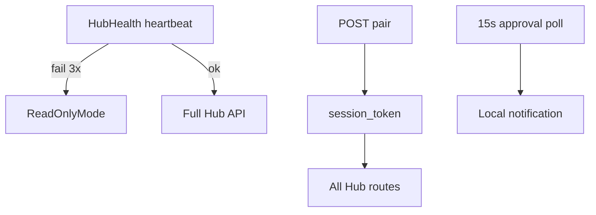

# 후보 구조 — Android 동기 (QS-010, 012, 017)

| 항목 | 내용 |
|------|------|
| TraceID | CND-001 |
| 버전 | 0.2 |
| 평가 | [DEC-002](../decision/DEC-002-evaluations.md) CA-AND-* |
| 채택 | **CA-AND-B** → [ADR-001](../adr/ADR-001-android-synchub.md), [ADR-007](../adr/ADR-007-connectivity-and-shared-math-v1.md) |

## 1. 문제 정의

Android에서도 macOS와 **동일한 매매·AI 승인·시세 맥락**이 필요하다. 동시에 KIS **앱키·시크릿·계좌**를 모바일에 평문으로 두는 상용 패턴은 기각한다([DEC-001](../decision/DEC-001-decisions.md) X-01). 개인 배포에서는 [ADR-006](../adr/ADR-006-personal-credentials-encryption.md)으로 **암호화 내장 단독 API**도 허용하되, 본 후보 비교의 초점은 **동기·승인 UX**이다.

---

## 2. 후보 A — 독립 Android KIS 클라이언트

### 2.1 개념

Android 앱이 **자체 OAuth·REST·(선택) WS**로 KIS에 직접 붙는다. macOS와 **상태·승인 큐를 공유하지 않는다.**



### 2.2 동작 요약

| 단계 | 설명 |
|------|------|
| 인증 | 앱 기동 시 `secrets.enc` 복호화 → 토큰 발급 |
| 시세 | 폰에서 WS 또는 REST 폴링 |
| 주문 | `OrderService` Android 복제본 |
| AI 승인 | macOS와 **별도** 큐 — 동시 접속 시 불일치 가능 |

### 2.3 장단점

| 장점 | 단점 |
|------|------|
| 맥북 없이 **완전 독립** 동작 | 키·토큰이 **단말에 존재**(탈취면 계좌 위험) |
| LAN·Hub 불필요 | 로직·버전 **이중 유지**(desktop/mobile drift) |
| | UC-010 **기능 패리티** 검증 비용 2배 |

### 2.4 판정

- **상용 평문 분산**: **기각** (X-01)
- **개인 암호화 내장**: ADR-006으로 **보조 경로**만 허용; SyncHub와 **병행 가능**

---

## 3. 후보 B — WebView + SyncHub on macOS (채택)

### 3.1 개념

macOS가 **KIS·trading_modes·ApprovalGate**의 단일 호스트. Android는 **WebView UI + LAN API**로 호스트에 붙는다.



### 3.2 승인·시세 시퀀스 (이해용)

```mermaid
sequenceDiagram
  participant And as Android_WebView
  participant Hub as ast_mobile
  participant Gate as ApprovalGate
  participant TM as trading_modes

  Note over And,TM: AI 제안 발생 on Mac
  TM->>Gate: proposal pending
  And->>Hub: GET approvals pending
  Hub-->>And: list proposals
  And->>Hub: POST approve id
  Hub->>Gate: allow
  Gate->>TM: execute via OrderService
```

### 3.3 장단점

| 장점 | 단점 |
|------|------|
| KIS 키·주문 로직 **한 곳** | 맥북 **켜져 있어야** Hub 풀기능 |
| 승인 큐 **단일** | LAN·페어링 **구현 필수** |
| UC-010 패리티 **API 계약**으로 통일 | WebView 성능·네이티브 HTS 아님 |

### 3.4 판정

**채택** (CA-AND-B). 오너 동의: [FBK-001](../FBK-001-design-owner-feedback.md) #1.

---

## 4. 후보 C — 클라우드 릴레이

### 4.1 개념

중간 **VPC/서버**가 시세·주문·승인을 중계. 단말은 클라우드만 신뢰한다.



### 4.2 장단점

| 장점 | 단점 |
|------|------|
| 맥 오프라인에도 폰이 **항상** 연결 가능 | **프라이버시**(매매·포지션 서버 경유) |
| | 월 비용·운영·침해 표면 증가 |
| | 개인 솔로 앱에 **과설계** |

### 4.3 판정

**기각** — 비용·프라이버시·운영 부담.

---

## 5. 비교표

| 기준 | A 독립 KIS | B SyncHub | C 클라우드 |
|------|------------|-----------|------------|
| 키 노출 면 | 단말+APK | macOS 집중 | 서버+단말 |
| 맥 없이 매매 | 가능 | 제한/ADR-006 보조 | 가능 |
| 패리티 | 낮음(이중 코드) | 높음(단일 TM) | 중간 |
| QS-010·012 | 부분 | **충족** | 충족(과잉) |
| 구현 복잡도 | 중 | 중 | **높음** |

---

## 6. 채택 구조 보완 (CA-AND-B)

단점 **「맥 의존」「LAN 위협」「승인 지연」** 에 대한 구체 설계. 통합표: [CND-006](CND-006-mitigation-adopted.md) §MIT-HUB.

| 보완 ID | 대상 단점 | 설계 |
|---------|-----------|------|
| MIT-HUB-01 | 맥 오프라인 | `HubHealthService`: heartbeat 10s; 실패 시 **읽기 전용** + 주문 버튼 비활성; 캐시 `last_good_snapshot` |
| MIT-HUB-02 | LAN 스니핑 | 페어링 6자리·`X-Session-Token`·세션 24h 만료; Hub `0.0.0.0` 대신 설정 IP; v2 mTLS |
| MIT-HUB-03 | 승인 늦음 | `WorkManager` 15s `GET /approvals/pending` + `NotificationChannel` `ai_approval` |
| MIT-HUB-04 | 시세 불일치 | push payload `seq`; gap 시 `GET /quotes/snapshot?symbols=` full refresh |



**ADR-006 보조 경로**: 폰 단독 KIS 시에도 **ApprovalGate 규칙 동일** — 무승인은 [ADR-004](../adr/ADR-004-ai-auto-without-approval-setting.md) 토글만.

---

## 7. 관련 문서

- [UC-010](../usecase/UC-010-android-parity.md) · [UI-003](../ui/UI-003-storyboards-system-android.md) SCR-AND-PAIR
- [SEC-001](../security/SEC-001-threat-model-and-controls.md) Hub 위협

---

## 변경 이력

| 날짜 | 내용 |
|------|------|
| 2026-06-02 | v0.2 — 후보 도식·보완 설계 |
