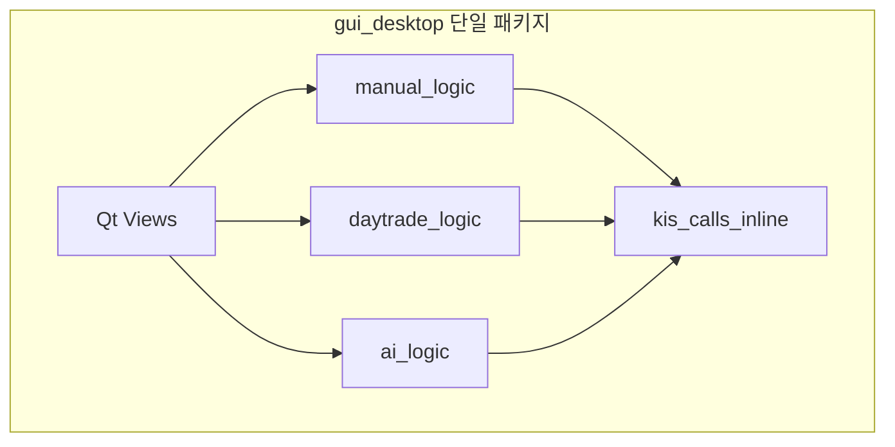
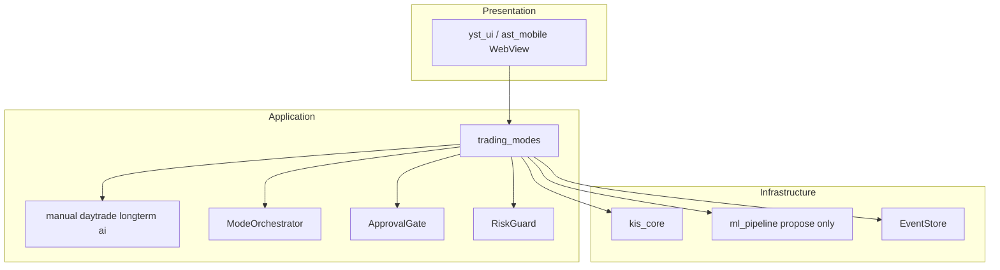
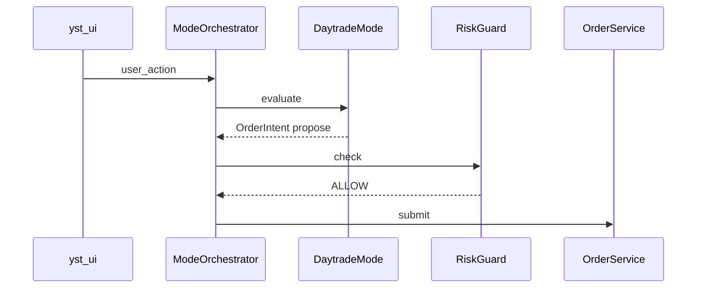
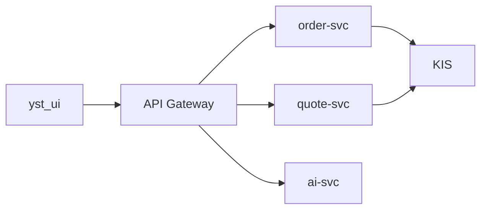
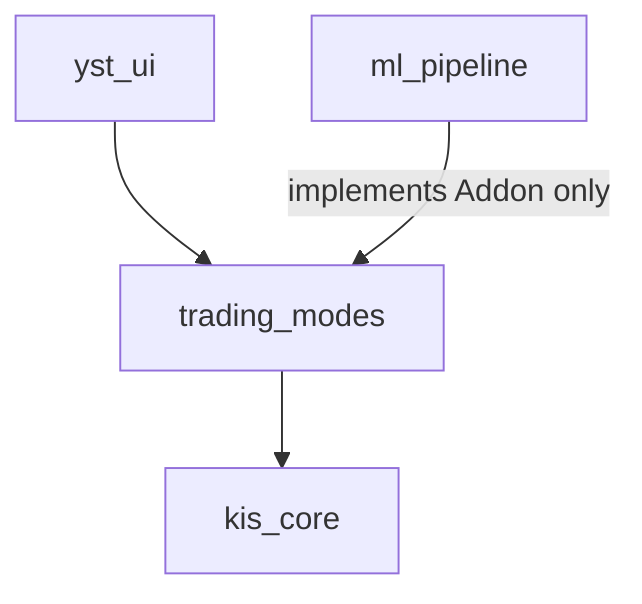

# 후보 구조 — 레이어·모듈 (변경 용이성)

| 항목 | 내용 |
|------|------|
| TraceID | CND-002 |
| 버전 | 0.2 |
| 평가 | [DEC-002](../decision/DEC-002-evaluations.md) CA-MOD-* |
| 채택 | **CA-MOD-B** → [ADR-003](../adr/ADR-003-trading-modes-package.md), [ADR-005](../adr/ADR-005-greenfield-ui-and-modes.md) |

## 1. 문제 정의

Manual / Daytrade / Longterm / AI 모드가 한 화면·한 패키지에 쌓이면 **결합도**가 올라가고, 모드 추가·승인 정책 변경 시 **회귀 범위**가 커진다. 목표는 **모드별 경계**와 **UI·도메인 분리**이다.

---

## 2. 후보 A — 기존 `gui_desktop` 확장 (GUI 비대화)

### 2.1 구조

모든 모드 로직·KIS 호출·AI가 **데스크톱 GUI 패키지 안**에 존재한다.

### 2.2 설명

- **단기**: 화면 하나 추가할 때 파일 몇 개만 수정하면 되어 **빠르게** 보인다.
- **장기**: import 그래프가 순환하기 쉽고, Android·CLI·테스트가 **GUI를 끌고 다님**.
- 단위 테스트 시 Qt 이벤트 루프 **모킹** 부담.

### 2.3 장단점

| 장점 | 단점 |
|------|------|
| 초기 속도 | 패키지 **비대화**·책임 혼재 |
| PoC 재사용 용이 | SyncHub·Android와 **로직 공유 불가** |
| | QS 유지보수 **저하** |

### 2.4 판정

**기각** (CA-MOD-A). [ADR-005](../adr/ADR-005-greenfield-ui-and-modes.md)로 `yst_ui` 신규·PoC GUI 미사용.

---

## 3. 후보 B — `trading_modes` Application 레이어 (채택)

### 3.1 구조

UI는 **얇게**, 매매·모드·승인은 **Application 패키지**에 둔다.

### 3.2 모드 오케스트레이션 (개념)

### 3.3 장단점

| 장점 | 단점 |
|------|------|
| 모드 **경계 명확** | 초기 **패키지 분리 비용** |
| Hub·Desktop **동일 TM** | 의존 규칙 **팀 discipline** 필요 |
| 테스트 시 UI 없이 TM 단위 가능 | |

### 3.4 판정

**채택** (CA-MOD-B). 상세: [ARC-003](../architecture/ARC-003-trading-modes-greenfield.md).

---

## 4. 후보 C — 마이크로서비스 분리 (MSA)

### 4.1 구조

모드·주문·시세를 **별도 프로세스/컨테이너**로 분리하고 API로 통신한다.

### 4.2 장단점

| 장점 | 단점 |
|------|------|
| 팀·스케일 시 독립 배포 | **솔로 1인** 운영·배포·디버깅 과다 |
| | LAN 지연·분산 트랜잭션 |
| | 개인 앱 **오버헤드** |

### 4.3 판정

**기각** (X-03, CA-MOD-C).

---

## 5. 비교표

| 기준 | A GUI 비대 | B trading_modes | C MSA |
|------|------------|-----------------|-------|
| 변경 용이성 | 낮음(후기) | **높음** | 중(운영 부담) |
| Android 공유 | 어려움 | **Hub로 공유** | 가능(과잉) |
| 테스트 | 무거움 | **TM 단위** | E2E 복잡 |
| 솔로 적합도 | 중 | **높음** | 낮음 |

---

## 6. 채택 구조 보완 (CA-MOD-B)

| 보완 ID | 단점 | 설계 |
|---------|------|------|
| MIT-MOD-01 | 순환 import | **허용 방향만**: `yst_ui → trading_modes → kis_core`; `ml_pipeline`은 `TradingModeAddon` 프로토콜로 **역참조 금지** |
| MIT-MOD-02 | Day/Long 수식 중복 | `trading_modes/shared/indicators.py` — [ADR-007 O-03](../adr/ADR-007-connectivity-and-shared-math-v1.md) |
| MIT-MOD-03 | 리팩터 회귀 | **모드별 계약 테스트** + `ModeOrchestrator` 통합 시나리오 1개/모드 |

**금지**: `kis_core → yst_ui`, `trading_modes → ml_pipeline` (역방향 import).

**Greenfield**: [ADR-005](../adr/ADR-005-greenfield-ui-and-modes.md) — 레거시 GUI 코드 경로 **미연결**.

---

## 7. 관련 문서

- [ARC-001](../architecture/ARC-001-module.md) · [ARC-003](../architecture/ARC-003-trading-modes-greenfield.md)
- [CND-006](CND-006-mitigation-adopted.md) §MIT-MOD

---

## 변경 이력

| 날짜 | 내용 |
|------|------|
| 2026-06-02 | v0.2 — 후보 도식·보완 설계 |
