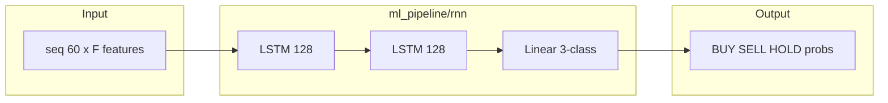
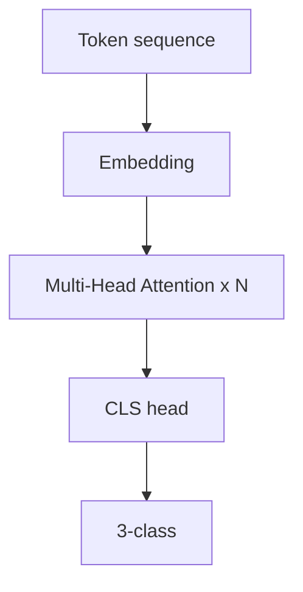
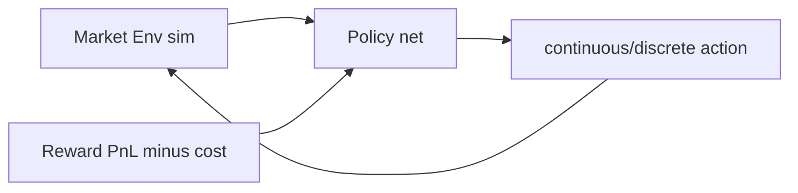
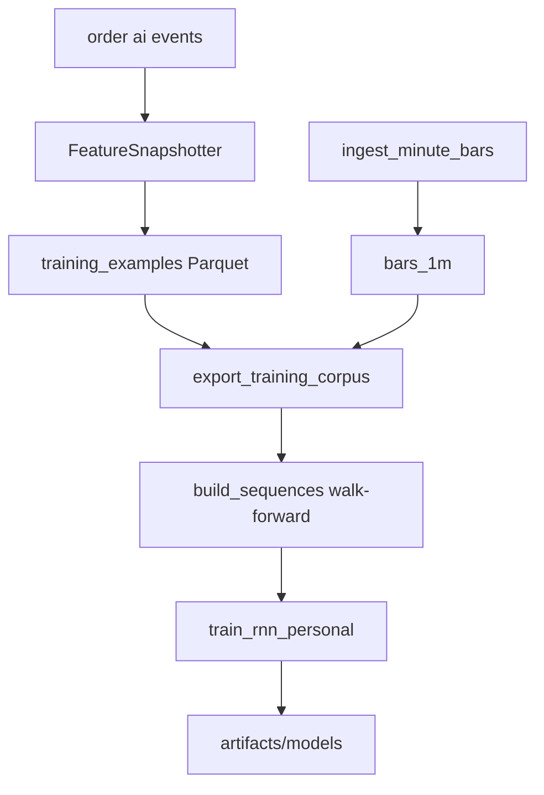
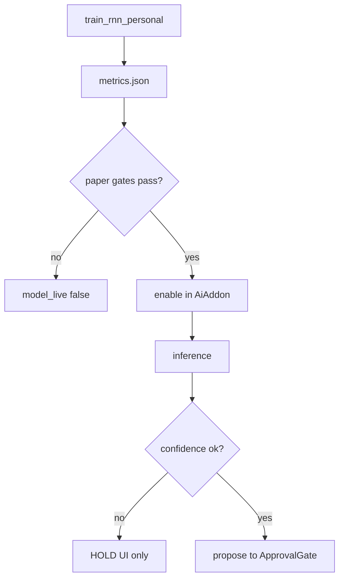

# 후보 구조 — ML RNN (QS-008, 011, 020)

| 항목 | 내용 |
|------|------|
| TraceID | CND-003 |
| 버전 | 0.2 |
| 평가 | [DEC-002](../decision/DEC-002-evaluations.md) CA-ML-* |
| 채택 | **CA-ML-A + D2** → [ADR-002](../adr/ADR-002-rnn-personal-model.md), [DAT-002](../data/DAT-002-rnn-training-collection-flow.md) |

## 1. 문제 정의

AI 모드가 **개인 매매 패턴**을 학습해 제안하되, (1) 데이터가 적고 (2) 수익을 **보장할 수 없으며** (3) live에서 **설명·감사**가 필요하다. 모델·데이터 파이프라인 후보를 비교한다.

---

## 2. 모델 후보

### 2.1 후보 A — LSTM 2-layer Behavior Cloning (채택)

#### 구조

#### 설명

| 항목 | 내용 |
|------|------|
| 입력 | 60×1분 윈도우: 수익률, 거래량 z, 포지션, 시간 encoding 등 ([DAT-002](../data/DAT-002-rnn-training-collection-flow.md)) |
| 라벨 | 사용자 **실제** BUY/SELL/HOLD (BC) |
| 추론 | `RnnInferenceEngine` → `AiTradingAddon` → **ApprovalGate** |
| 학습 | 오프라인 `train_rnn_personal.py`; GUI는 torch **미import** |

#### 장단점

| 장점 | 단점 |
|------|------|
| 시계열에 **검증된** 구조 | **수익 미보장** |
| 파라미터 규모 **적절**(개인 데이터) | 레짐 변화 시 **성능 저하** |
| softmax로 **설명 가능** 수준 | |

---

### 2.2 후보 B — Transformer 시퀀스

#### 구조

#### 설명

- Self-attention으로 **장거리 의존** 포착 가능.
- 개인 데이터 **수백~수천 샘플**에서는 **과적합**·불안정 학습.
- Attention weight 해석은 가능하나 **운영자에게 설명** 부담 큼.

#### 판정

**기각 v1** (CA-ML-B, X-02). v2에서 데이터 10× 이상·ADR 재검토.

---

### 2.3 후보 C — FinRL 강화학습 에이전트

#### 구조

#### 설명

- **보상 shaping**·시뮬레이터 품질에 결과가 좌우됨.
- live 배포 전 **안전 검증** 난이도 BC보다 높음.
- doc/04 **로드맵** — v1 BC 안정 후 검토.

#### 판정

**후속** (v2+), v1 **비채택**.

---

## 3. 데이터 수집 후보

| ID | 방식 | 설명 | 판정 |
|----|------|------|------|
| **D1** | EventStore Tier3만 | 행동 이벤트만·가격 조인 어려움 | 기각 |
| **D2** | Tier1 Parquet + Tier3 스냅샷 | 분봉 ETL + `FeatureSnapshotter` | **채택** |
| **D3** | 온라인 스트림 학습 | 장중 모델 갱신 | 기각(복잡·재현성) |

### D2 수집 Flow (채택)

상세: [DAT-002](../data/DAT-002-rnn-training-collection-flow.md).

---

## 4. 모델·데이터 비교표

| 기준 | A LSTM BC | B Transformer | C FinRL |
|------|-----------|-----------------|---------|
| 소량 데이터 | **적합** | 부적합 | 시뮬 의존 |
| 설명·감사 | **중** | 낮~중 | 낮음 |
| 구현·MLOps | **중** | 높음 | **매우 높음** |
| QS-008·011 | **충족** | 리스크 | 리스크 |

---

## 5. 채택 구조 보완 (CA-ML-A + D2)

| 보완 ID | 단점 | 설계 |
|---------|------|------|
| MIT-ML-01 | 샘플 부족 | BUY/SELL 각 **<200** → 학습 CLI exit 1; UI 「데이터 수집 중」 |
| MIT-ML-02 | 과적합 | **walk-forward** split; early stopping; `schema_version` 고정 |
| MIT-ML-03 | live 손실 | **paper 승격**: `eval_rnn_paper` 통과 전 `model_live` 플래그 false |
| MIT-ML-04 | 저신뢰 제안 | `max(softmax) < 0.4` → **HOLD만** 표시·주문 intent 없음 |
| MIT-ML-05 | 무승인 사고 | `ai_auto_without_approval` **default false** ([ADR-004](../adr/ADR-004-ai-auto-without-approval-setting.md)) |
| MIT-ML-06 | 코퍼스 변조 | export 시 `data_hash`; [QS-020](../quality/QS-020-ml-data-integrity.md) |

**운영**: [OPS-002](../operations/OPS-002-devops-mlops.md) — artifact 경로·승격 체크리스트.

---

## 6. 관련 문서

- [UC-006](../usecase/UC-006-ai-auto-approval.md) · [UC-007](../usecase/UC-007-rnn-training-data.md)
- [DOM-001](../domain/DOM-001-model.md) ML 섹션
- [CND-006](CND-006-mitigation-adopted.md) §MIT-ML

---

## 변경 이력

| 날짜 | 내용 |
|------|------|
| 2026-06-02 | v0.2 — 후보 도식·데이터·보완 설계 |
