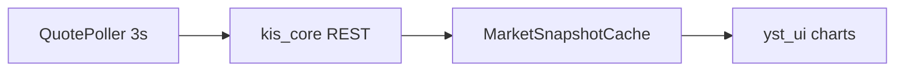
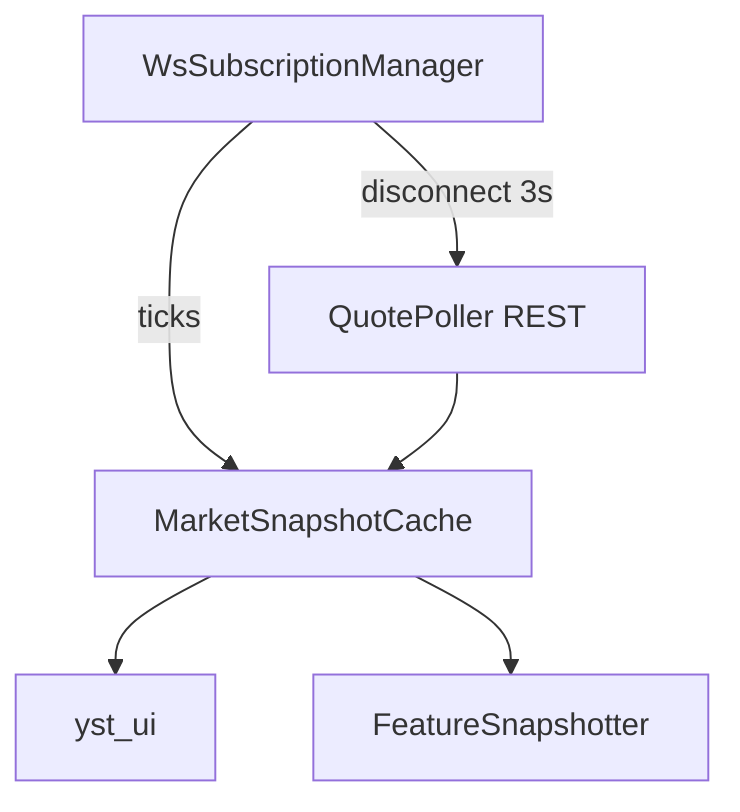
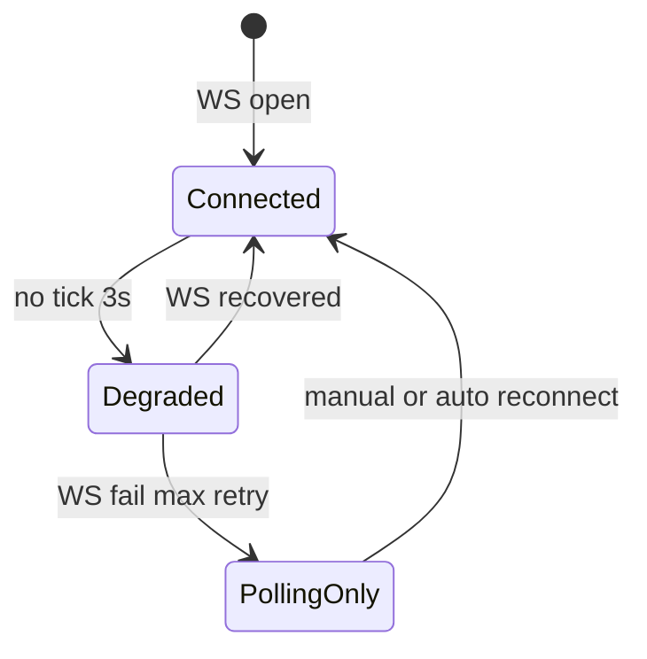
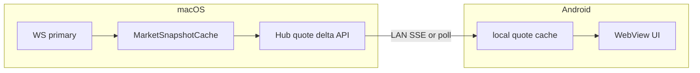
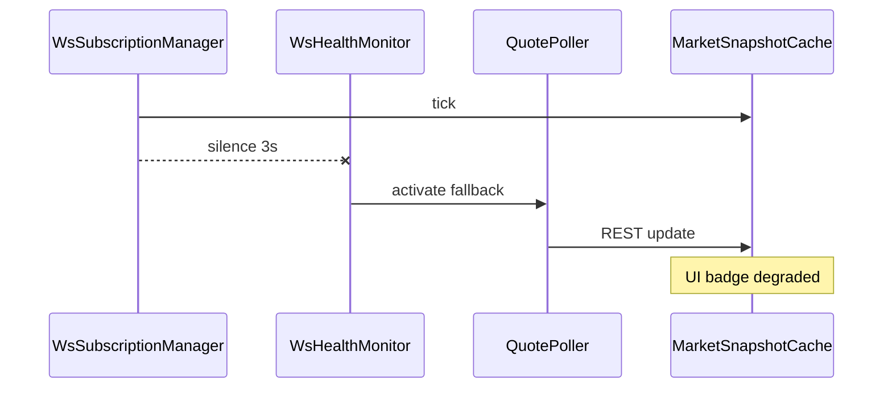

# 후보 구조 — 성능·실시간 (QS-001, NFR-T-01)

| 항목 | 내용 |
|------|------|
| TraceID | CND-004 |
| 버전 | 0.2 |
| 평가 | [DEC-002](../decision/DEC-002-evaluations.md) CA-PERF-* |
| 채택 | **CA-PERF-B** (Desktop) + **CA-PERF-C** (Android via Hub) |

## 1. 문제 정의

대시보드·단타·AI 스냅샷이 **최신 시세**에 의존한다. KIS 한도·연결 안정성·개인 앱 규모를 고려해 **시세 수집 아키텍처**를 고른다. HTS급 틱·100% 실시간은 **비목표**([SYS-001](../SYS-001-system.md) C-04).

---

## 2. 후보 A — REST 폴링만

### 2.1 구조

### 2.2 설명

| 항목 | 내용 |
|------|------|
| 동작 | 타이머마다 관심종목 REST 조회 → 캐시 갱신 |
| 장점 | WS 인증·재연결 **없음**; 구현·디버깅 **단순** |
| 단점 | 최소 **폴링 주기(3s)** 지연; TR **한도 소모** |
| Tier | A에 가깝지만 체감은 **지연** |

### 2.3 판정

**단독 채택 기각** — **폴백 경로**로만 사용 (CA-PERF-A).

---

## 3. 후보 B — KIS WebSocket + REST 폴백 (Desktop 채택)

### 3.1 구조

### 3.2 연결 상태기

### 3.3 설명

| 항목 | 내용 |
|------|------|
| 정상 | WS로 체결·호가 틱 수신 → 캐시 **즉시** 갱신 |
| 장애 | 3s 무틱 → REST 폴링 **Tier A 유지**; UI `연결 끊김` |
| 장점 | **저지연** 체감 |
| 단점 | 재연결·구독 목록 **상태 관리** |

### 3.4 판정

**채택** Desktop (D-01, CA-PERF-B).

---

## 4. 후보 C — macOS 캐시 + SyncHub 델타 푸시 (Android 채택)

### 4.1 구조

### 4.2 설명

- Android가 KIS WS를 **직접** 열지 않아도 **맥과 동일 시세**를 볼 수 있음.
- 맥이 **슬립/오프라인**이면 Android 시세도 **정지**(MIT-HUB-01과 연동).
- 델타 `{symbol, price, seq, as_of}` — `seq` gap 시 full snapshot.

### 4.3 판정

**채택** mobile 경로 (CA-PERF-C). Desktop은 B, Android는 **C via Hub**.

---

## 5. 비교표

| 기준 | A REST only | B WS+REST | C Hub 델타 |
|------|-------------|-----------|------------|
| Desktop 지연 | 높음 | **낮음** | — |
| Android 지연 | (독립 시 A) | (독립 시 B) | **맥 연동 시 낮음** |
| 복잡도 | 낮음 | 중 | 중 |
| 호스트 의존 | 없음 | 없음 | **맥 필요** |
| QS-001 | 부분 | **Must** | UC-010 보조 |

---

## 6. 채택 조합 보완 (B + C)

| 보완 ID | 단점 | 설계 |
|---------|------|------|
| MIT-PERF-01 | WS 단절 | `WsHealthMonitor.last_tick_at`; 3s → `QuotePoller` 활성 |
| MIT-PERF-02 | 재연결 폭주 | backoff 1s→60s cap; jitter; HALF_OPEN 1-symbol probe |
| MIT-PERF-03 | stale 주문 | **RG-07**: live + quote `as_of` > 5s → DENY ([ARC-004](../architecture/ARC-004-resilience-security-crosscut.md)) |
| MIT-PERF-04 | 사용자 기대 과다 | UI Tier 배지 + 「HTS급 미보장」 |
| MIT-PERF-05 | Hub seq gap | `GET /quotes/snapshot` full refresh ([CND-001](CND-001-android-sync.md) MIT-HUB-04) |

**kis_core**: Circuit Breaker OPEN 시 WS·REST 모두 fail-fast — [REL-001](../reliability/REL-001-slo-resilience-patterns.md).

---

## 7. 관련 문서

- [UC-003](../usecase/UC-003-market-dashboard.md) · [QS-001](../quality/QS-001-realtime-market-data.md)
- [CND-006](CND-006-mitigation-adopted.md) §MIT-PERF

---

## 변경 이력

| 날짜 | 내용 |
|------|------|
| 2026-06-02 | v0.2 — 후보 도식·조합 보완 |
