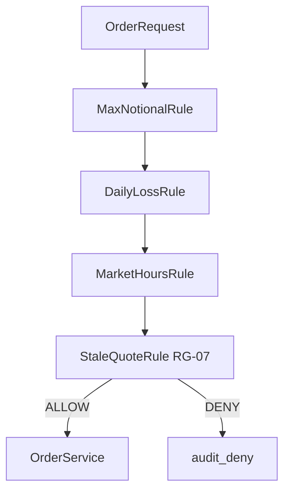
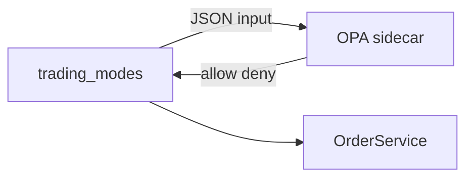
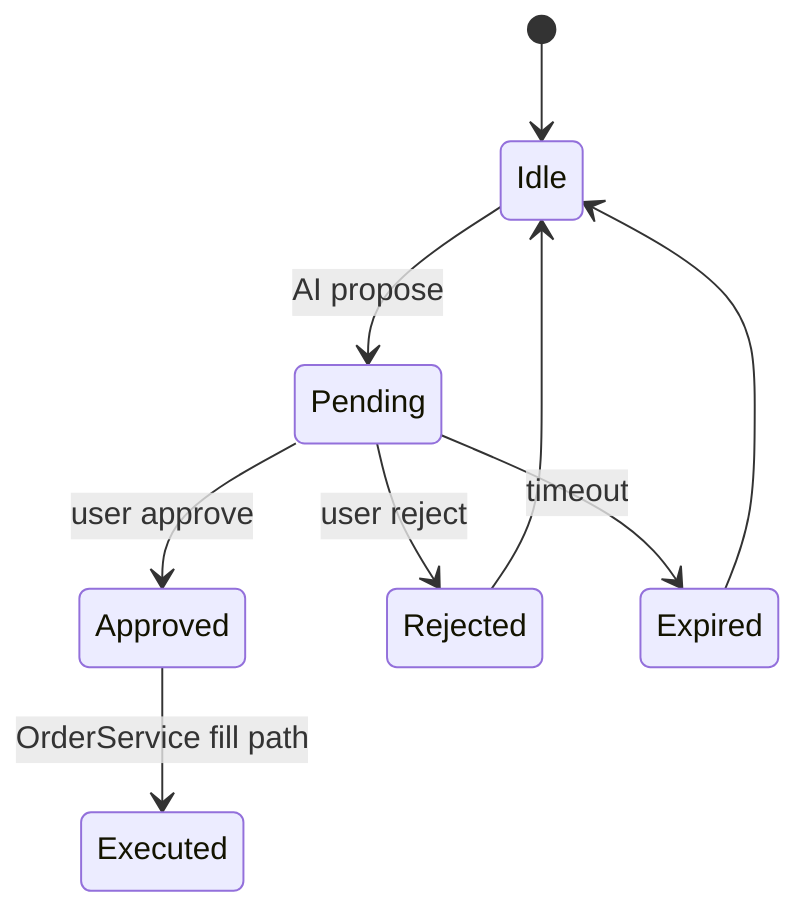
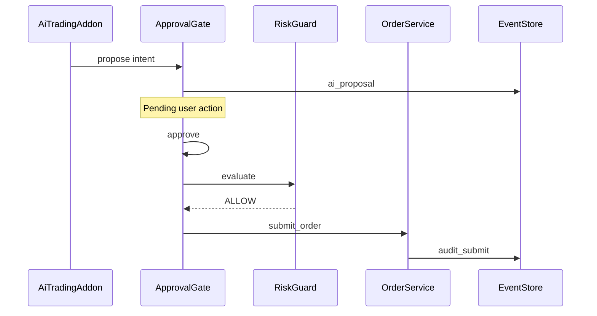
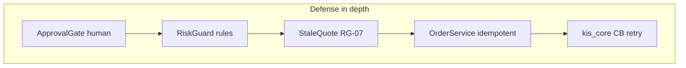

# 후보 구조 — 보안·안전 (QS-002~004, 009, 013~018)

| 항목 | 내용 |
|------|------|
| TraceID | CND-005 |
| 버전 | 0.2 |
| 평가 | [DEC-002](../decision/DEC-002-evaluations.md) CA-SEC-* |
| 채택 | **CA-SEC-A + CA-SEC-C** (RiskGuard + ApprovalGate) |

## 1. 문제 정의

주문·AI 자동매매는 **금전 손실**과 **규제·감사** 리스크가 있다. 규칙을 **어디에** 두고, **누가** 실행 권한을 갖는지 아키텍처를 정한다.

---

## 2. 후보 A — RiskGuard 단일 모듈 (채택 일부)

### 2.1 구조

### 2.2 설명

| 항목 | 내용 |
|------|------|
| 패턴 | **규칙 체인** `RiskRule.evaluate(ctx) → ALLOW|DENY|CONFIRM` |
| 위치 | `OrderService.submit` **진입 전 필수** |
| 확장 | RG-01~09; 상용 RG-07~09 ([ARC-004](../architecture/ARC-004-resilience-security-crosscut.md)) |
| 장점 | 코드 내 **명시적**·디버그 용이 |
| 단점 | 규칙 증가 시 **파일·테스트** 증가 |

---

## 3. 후보 B — OPA / Cedar 외부 정책 엔진

### 3.1 구조

### 3.2 설명

- 정책을 **Rego** 등으로 분리·버전 관리.
- 팀·엔터프라이즈에 유리.
- 개인 앱: sidecar **배포·지연·학습곡선** 부담.

### 3.3 판정

**기각** (CA-SEC-B, X-04).

---

## 4. 후보 C — ApprovalGate 별도 상태머신 (채택 일부)

### 4.1 구조

### 4.2 AI 주문 경로 (A+C 조합)

### 4.3 설명

| 항목 | 내용 |
|------|------|
| 책임 | **AI·고위험 제안**의 인간 승인 |
| 기본 | 승인 **필수**; [ADR-004](../adr/ADR-004-ai-auto-without-approval-setting.md) 토글 On 시만 생략 |
| 장점 | 실행 경로 **단일**(OrderService) |
| 단점 | 승인 UX·폴링 **추가 구현** |

---

## 5. 비교표

| 기준 | A RiskGuard | B OPA | C ApprovalGate |
|------|-------------|-------|----------------|
| 주문 전 규칙 | **핵심** | 동일 가능 | AI 전용 아님 |
| AI 승인 | 보조 | 보조 | **핵심** |
| 솔로 운영 | **적합** | 과함 | **적합** |
| 감사 | EventStore | +정책 로그 | **proposal/approve** |
| 채택 | **예** | 아니오 | **예** |

**조합**: A는 **모든 주문**, C는 **AI propose 경로** — 중복이 아니라 **계층 분리**.

---

## 6. 채택 구조 보완 (CA-SEC-A+C)

| 보완 ID | 단점 | 설계 |
|---------|------|------|
| MIT-SEC-01 | RG 체인 지연 | 규칙 **50ms 예산**; `DailyLossRule`은 EventStore **일 집계 캐시** |
| MIT-SEC-02 | Gate 우회 | Addon **`propose` only**; `OrderService`는 Gate/RG 통과 객체만 수신 (D-06) |
| MIT-SEC-03 | 감사 누락 | SQLite WAL **append-only**; deny/approve/submit correlation_id |
| MIT-SEC-04 | CONFIRM 피로 | `CONFIRM`은 live·고액만; paper는 설정으로 완화 |
| MIT-SEC-05 | Hub 토큰 | LAN 페어링·세션 — [ADR-007](../adr/ADR-007-connectivity-and-shared-math-v1.md) |
| MIT-SEC-06 | API 장애 중 주문 | **RG-09**: Circuit OPEN → 주문 **거부** not queue |

**상용 기준선**: [ADR-009](../adr/ADR-009-commercial-quality-security-baseline.md), [SEC-001](../security/SEC-001-threat-model-and-controls.md), QS-013~018.

---

## 7. 관련 문서

- [UC-006](../usecase/UC-006-ai-auto-approval.md) · [UC-011](../usecase/UC-011-risk-guard.md)
- [ARC-004](../architecture/ARC-004-resilience-security-crosscut.md)
- [CND-006](CND-006-mitigation-adopted.md) §MIT-SEC

---

## 변경 이력

| 날짜 | 내용 |
|------|------|
| 2026-06-02 | v0.2 — 후보 도식·조합·보완 설계 |
