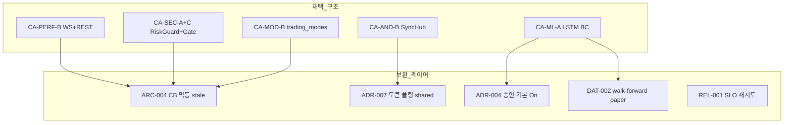
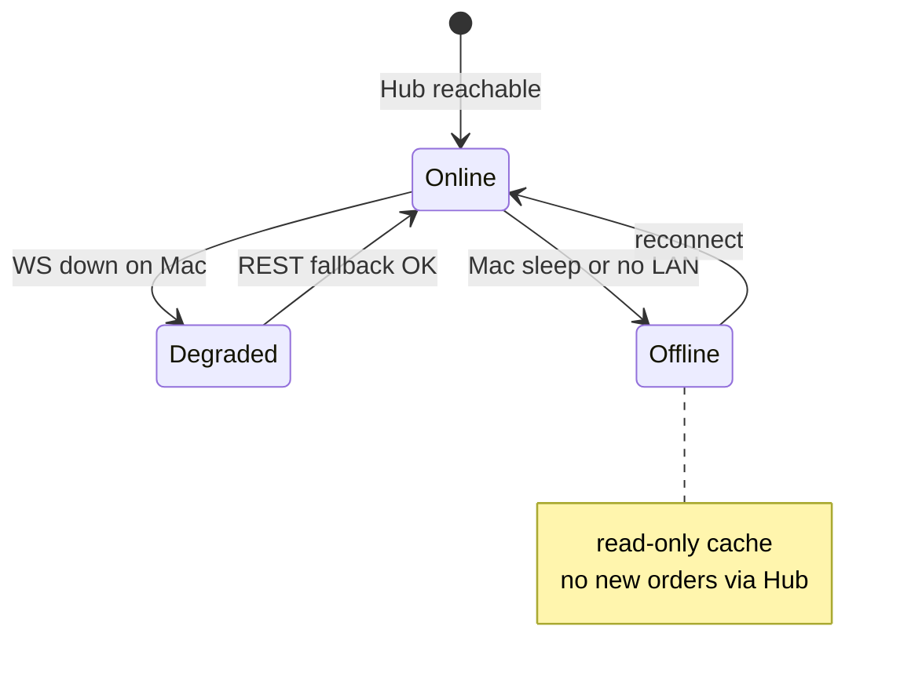

# CND-006 — 채택 후보 구조 단점 보완 설계 (통합)

| 항목 | 내용 |
|------|------|
| TraceID | CND-006 |
| 버전 | 0.1 |
| 입력 | [DEC-001](../decision/DEC-001-decisions.md) 채택 항목 · CND-001~005 |

본 문서는 **채택된 후보 조합**의 공통 단점과, 이를 상쇄하기 위한 **구체적 설계·컴포넌트·정책**을 한곳에 모은다. 모듈별 상세는 각 CND 문서 §「채택 구조 보완」과 [ARC-004](../architecture/ARC-004-resilience-security-crosscut.md)를 본다.

---

## 1. 보완 설계 맵 (한눈에)

---

## 2. 채택별 단점 → 보완 (요약표)

| 채택 ID | 제목 | 핵심 단점 | 보완 설계 ID | 구현·문서 정본 |
|---------|------|-----------|--------------|----------------|
| CA-PERF-B | Desktop WS+REST | 연결 끊김·재연결 버그 | MIT-PERF-01~04 | [CND-004](CND-004-performance-realtime.md) §보완 |
| CA-PERF-C | Hub 시세 델타 | 맥북 의존 | MIT-HUB-01~03 | [CND-001](CND-001-android-sync.md) §보완 |
| CA-AND-B | SyncHub | LAN 스니핑·토큰 탈취 | MIT-SEC-HUB-01~04 | [ADR-007](../adr/ADR-007-connectivity-and-shared-math-v1.md), [SEC-001](../security/SEC-001-threat-model-and-controls.md) |
| CA-MOD-B | trading_modes | 초기 리팩터 비용 | MIT-MOD-01~02 | [ARC-003](../architecture/ARC-003-trading-modes-greenfield.md) |
| CA-ML-A | LSTM BC | 과적합·수익 미보장 | MIT-ML-01~05 | [DAT-002](../data/DAT-002-rnn-training-collection-flow.md), [OPS-002](../operations/OPS-002-devops-mlops.md) |
| CA-SEC-A+C | RG + Gate | 코드량·지연 | MIT-SEC-01~03 | [ARC-004](../architecture/ARC-004-resilience-security-crosscut.md) |

---

## 3. MIT-PERF — 실시간 (CA-PERF-B/C)

| ID | 단점 | 보완 | 동작 |
|----|------|------|------|
| MIT-PERF-01 | WS 단절 시 빈 화면 | **3s 감지 → REST 폴링** | `WsHealthMonitor`: `last_tick_at` > 3s → `QuotePoller` Tier A, UI `연결 끊김` |
| MIT-PERF-02 | 재연결 폭주 | **지수 백오프+jitter** | 1s→2s→4s… max 60s; HALF_OPEN 시 1종목 probe |
| MIT-PERF-03 | stale 시 주문 | **RG-07** | live + `as_of` > 5s → OrderService 진입 전 DENY |
| MIT-PERF-04 | HTS 대비 지연 기대 | **문서·배지** | Tier A/B/C + `collected_at`; [SYS-001](../SYS-001-system.md) C-04 비보장 명시 |

---

## 4. MIT-HUB — Android SyncHub (CA-AND-B, CA-PERF-C)

| ID | 단점 | 보완 | 동작 |
|----|------|------|------|
| MIT-HUB-01 | 맥 오프라인 | **제한 모드** | `HubStatus=offline` → 읽기 전용 캐시·주문 비활성; ADR-006 폰 단독 API는 **별도 경로**(승인 UX 동일) |
| MIT-HUB-02 | LAN 무단 접근 | **페어링+세션 토큰** | `POST /pair` 6자리·`X-Session-Token`·60s 갱신; bind `LAN only` |
| MIT-HUB-03 | 승인 지연 | **15s 폴링+로컬 알림** | `GET /approvals/pending`; FCM v2·기본 Off |
| MIT-HUB-04 | 시세 불일치 | **델타 버전** | Hub push `{symbol, seq, as_of}`; 클라이언트 `seq` gap 시 full snapshot REST |

---

## 5. MIT-ML — LSTM BC (CA-ML-A, D2)

| ID | 단점 | 보완 | 동작 |
|----|------|------|------|
| MIT-ML-01 | 데이터 부족 | **최소량 게이트** | BUY+SELL 각 200건 미만 → `train` 거부·UI 「수집 중」 |
| MIT-ML-02 | 과적합 | **walk-forward + early stop** | 시간 셔플 금지; val loss 3 epoch 무개선 중단 |
| MIT-ML-03 | live 오판 | **paper 승격 게이트** | `eval_rnn_paper` Sharpe/MDD 임계 + [OPS-002](../operations/OPS-002-devops-mlops.md) |
| MIT-ML-04 | 침묵 실패 | **confidence floor** | softmax max < 0.4 → HOLD 제안만·주문 없음 |
| MIT-ML-05 | 무승인 사고 | **ADR-004 기본 false** | `ai_auto_without_approval` 명시 On만 Gate 생략 |

---

## 6. MIT-SEC — RiskGuard + ApprovalGate (CA-SEC-A+C)

| ID | 단점 | 보완 | 동작 |
|----|------|------|------|
| MIT-SEC-01 | RG 지연 | **50ms 예산** | 규칙 체인 순차·무거운 규칙은 캐시(일일 손실 합계) |
| MIT-SEC-02 | Gate 우회 | **단일 OrderService** | Addon은 `propose`만; 실행은 Gate ALLOW 후만 |
| MIT-SEC-03 | 감사 누락 | **append-only EventStore** | deny/allow/submit/fill 전부 `correlation_id` |

---

## 7. MIT-MOD — trading_modes (CA-MOD-B)

| ID | 단점 | 보완 | 동작 |
|----|------|------|------|
| MIT-MOD-01 | 패키지 간 순환 | **의존 방향 고정** | `yst_ui → trading_modes → kis_core`; ml은 `propose` 인터페이스만 |
| MIT-MOD-02 | 수식 중복 | **shared/** | [ADR-007 O-03](../adr/ADR-007-connectivity-and-shared-math-v1.md) `indicators.py` |

---

## 8. 검증·릴리스 연결

| 보완 ID | QS/ASR | 검증 |
|---------|--------|------|
| MIT-PERF-03 | QS-015 | 통합: stale 시 주문 거부 테스트 |
| MIT-ML-03 | QS-011, NFR-04 | CI: paper eval artifact |
| MIT-HUB-02 | QS-017 | 페어링 없이 API 401 |
| MIT-SEC-03 | QS-018 | EventStore 무결성 spot-check |

---

## 변경 이력

| 날짜 | 내용 |
|------|------|
| 2026-06-02 | v0.1 — 채택 구조 보완 통합 |
