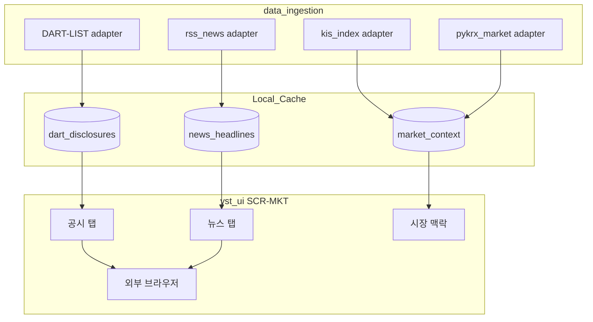

# DAT-001 — 외부 데이터 원천 카탈로그 (뉴스·공시·시장 맥락)

| 항목 | 내용 |
|------|------|
| TraceID | DAT-001 |
| 버전 | 0.1 |
| UC | [UC-012](../usecase/UC-012-news-disclosure.md), [UC-009](../usecase/UC-009-multi-source-data.md), [UC-003](../usecase/UC-003-market-dashboard.md) |

KIS Open API는 **시세·주문·잔고** 중심이며, **뉴스·공시 전문 API는 제공하지 않습니다**. UC-012는 아래 **외부 원천 + 링크 아웃**으로 구현합니다.

---

## 1. Tier·신뢰 표시 (UI 공통)

| Tier | 의미 | UI |
|------|------|-----|
| **A** | KIS 공식 시세·지수 | 실시간에 가까움, `as_of` |
| **B** | KIS WebSocket 파생 | A와 동일 배지 계열 |
| **C** | pykrx 등 공개 시계열 | 지연·참고용 고정 문구 |
| **External** | DART·RSS·링크 | 출처명·수집 시각·**본문 미저장** |

---

## 2. UC-012 — 공시 (Disclosure) v1

| SRC-ID | 제목 | 제공자 | 접근 방식 | 엔드포인트·문서 | 인증 | 갱신 주기 | 앱 저장 필드 | 비고 |
|--------|------|--------|-----------|-----------------|------|-----------|-------------|------|
| **DART-LIST** | 공시 목록 검색 | 금융감독원 OpenDART | REST GET JSON | `https://opendart.fss.or.kr/api/list.json` · [공시검색 가이드](https://opendart.fss.or.kr/guide/detail.do?apiGrpCd=DS001&apiId=2019001) | `crtfc_key` (40자, [opendart.fss.or.kr](https://opendart.fss.or.kr/) 발급) | 15분 (`IngestScheduler`) | `rcept_no`, `corp_name`, `stock_code`, `report_nm`, `rcept_dt`, `dart_view_url` | **v1 공시 탭 정본** |
| **DART-CORP** | 종목↔고유번호 | OpenDART | 일 1회 파일 | `https://opendart.fss.or.kr/api/corpCode.xml` (압축) · 고유번호 API | 동일 키 | 1일 | `stock_code` → `corp_code` 맵 SQLite | 신규 상장 시 재동기화 |
| **DART-VIEW** | 공시 원문 보기 | DART 웹 | **앱 외부 브라우저** | `https://dart.fss.or.kr/dsaf001/main.do?rcept_no={rcept_no}` | — | — | URL만 보관 | iframe **미사용**(약관·X-Frame) |
| **KIND-LINK** | 거래소 공시 (보조) | 한국거래소 KIND | 링크만 | `https://kind.krx.co.kr/disclosure/todaydisclosure.do` | 없음 | — | 북마크 링크 | API 연동은 **v2** |

**DART-LIST 호출 예 (개념)**

| 파라미터 | 필수 | 설명 |
|----------|------|------|
| `crtfc_key` | Y | API 키 |
| `corp_code` | N | 8자리 (종목 필터 시) |
| `bgn_de` / `end_de` | N | YYYYMMDD (미지정 시 당일·범위 제한 준수) |
| `page_no` / `page_count` | N | 페이지 (최대 100건/页) |

---

## 3. UC-012 — 뉴스 (News) v1

원칙: **헤드라인·URL·시각·출처만** 저장. **본문·이미지 크롤링 금지**(저작권·이용약관).

| SRC-ID | 제목 | 제공자 | 접근 방식 | URL·형식 | 인증 | 갱신 주기 | 앱 저장 | 비고 |
|--------|------|--------|-----------|----------|------|-----------|---------|------|
| **RSS-HK** | 한국경제 증권 | 한국경제 | RSS 2.0 | `https://www.hankyung.com/feed/finance` (운영 시 200 확인 후 `config` 고정) | 없음 | 30분 | `title`, `link`, `published_at`, `source=hankyung` | 파싱 실패 시 해당 소스만 비활성 |
| **RSS-NAVER** | 네이버 금융 주요뉴스 | 네이버 | RSS (섹션별) | `config/news_feeds.yaml` 에 등록 (예: 시황·종목) | 없음 | 15분 | 동일 | **종목 매칭**: 제목 키워드 + `stock_code` alias 테이블 |
| **LINK-NAVER-NEWS** | 종목 뉴스 페이지 | 네이버 금융 | **링크 아웃** | `https://finance.naver.com/item/news.naver?code={stock_code}` | — | — | UI 버튼만 | 전체 목록은 브라우저 |
| **LINK-GOOGLE** | 웹 검색 보조 | Google | 링크 아웃 | `https://www.google.com/search?q={corp_name}+주식+뉴스` | — | — | UI | 자동 수집 아님 |

**v2 후보**: 공식 제휴 API·유료 뉴스 DB·자체 `krx-news-rest-api` 류 **로컬 캐시 서비스**(운영 부담 있음) — ADR 별도.

---

## 4. UC-012 / UC-003 — 시장 맥락 (Market context) v1

| SRC-ID | 제목 | 제공자 | 접근 방식 | API·함수 | Tier | 갱신 | UI 위치 | 비고 |
|--------|------|--------|-----------|----------|------|------|---------|------|
| **KIS-IDX** | 국내 지수 시세 | KIS Open API | REST | `[국내주식] 업종/기타` — 지수 조회 TR (포털: `inquire-index-price` 등) · [KIS Developers](https://apiportal.koreainvestment.com/) | A | 3s~60s | 현황 탭 지수 카드 | 계좌와 동일 OAuth |
| **KIS-MKT** | 국내 업종·시장 요약 | KIS Open API | REST | 동일 카테고리 내 시장 요약 TR | A/B | 60s | 시장 브리핑 상단 | TR ID는 포털 Excel 정본 |
| **PYK-OHLC** | 지수·종목 OHLCV | pykrx (KRX) | Python lib | `stock.get_index_ohlcv`, `stock.get_market_ohlcv` | C | 온디맨드·일봉 ETL | 차트·장기 피처 | [UC-007](DAT-002-rnn-training-collection-flow.md) Tier1 |
| **PYK-MKT** | 시가총액·거래대금 순위 | pykrx | Python lib | `get_market_cap`, `get_market_trading_value` | C | 1일 | 시장 탭 보조 | 참고용 |
| **ECOS-FX** | 원·달러 환율 | 한국은행 ECOS | REST Open API | `https://ecos.bok.or.kr/api/` (통계표 코드) | External | 1일 | 현황 환율 라벨 | **v1.1** (`BOK_API_KEY`) |

**시장 브리핑 구성 (v1)**

1. `KIS-IDX`: KOSPI·KOSDAQ 지수·등락률  
2. `PYK-MKT`: 당일 거래대금 상위 5 (참고)  
3. `ECOS-FX`(선택): USD/KRW  
4. 사용자 관심종목: `MarketSnapshotCache` (KIS Tier A)

---

## 5. `data_ingestion` 어댑터 매핑 (구현)

| 패키지 모듈 | SRC-ID |
|-------------|--------|
| `adapters/dart_list.py` | DART-LIST, DART-CORP |
| `adapters/rss_news.py` | RSS-HK, RSS-NAVER |
| `adapters/kis_index.py` | KIS-IDX, KIS-MKT |
| `adapters/pykrx_market.py` | PYK-OHLC, PYK-MKT |
| `adapters/ecos_fx.py` (v1.1) | ECOS-FX |

공통: `DataSourceRegistry` · `IngestScheduler` · `~/.YSTrading/cache/external/` · 실패 시 [UC-009](../usecase/UC-009-multi-source-data.md) last-good.

---

## 6. 설정·비밀

| 키 | 위치 | SRC |
|----|------|-----|
| `dart.crtfc_key` | `~/.YSTrading/config.yaml` (gitignore) | DART-* |
| `bok.ecos_key` | 동일 (v1.1) | ECOS-FX |
| KIS 키 | `secrets.enc` | KIS-* |
| RSS URL 목록 | `config/news_feeds.yaml` (repo 추적 가능) | RSS-* |

---

## 7. UC-012 화면 데이터 Flow

---

## 8. 법·약관 체크리스트

- [ ] OpenDART 이용약관·호출 한도 준수  
- [ ] RSS 제공처 `robots.txt`·이용약관 확인 후 URL 고정  
- [ ] 뉴스 **본문 DB 저장 안 함**  
- [ ] UI에 출처·Tier·`collected_at` 표시 ([ASR-001](../ASR-001-asr.md))

---

## 변경 이력

| 날짜 | 내용 |
|------|------|
| 2026-06-02 | v0.1 — UC-012 소스 구체화 |
