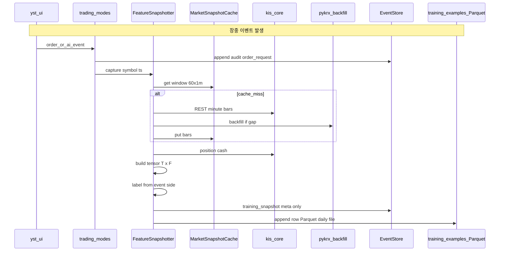
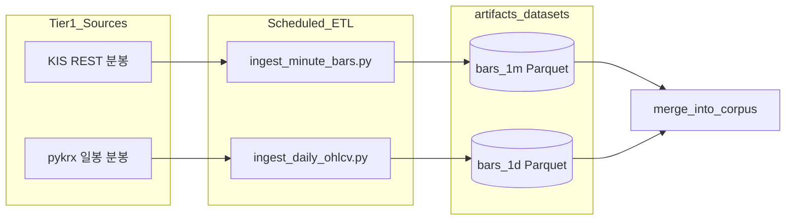
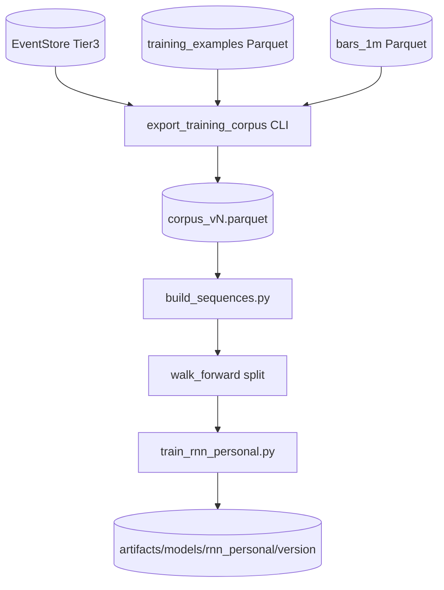
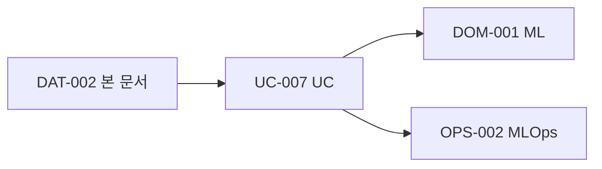

# DAT-002 — RNN 학습 데이터·수집 Flow

| 항목 | 내용 |
|------|------|
| TraceID | DAT-002 |
| 버전 | 0.2 |
| ADR | [ADR-002](../adr/ADR-002-rnn-personal-model.md), [ADR-010](../adr/ADR-010-open-ml-data-and-crossmodal-training.md) |
| 스키마 | [DAT-003](DAT-003-data-schemas.md) |
| UC | [UC-007](../usecase/UC-007-rnn-training-data.md), [UC-006](../usecase/UC-006-ai-auto-approval.md) |

v1 RNN 핵심은 **Tier1 분봉 + Tier3 BC 라벨**이다. **v1.5**부터 Tier0 일봉·Alpha158류·**DART/RSS↔KIS 크로스모달 플래그**를 조인한다. **v2**에 FinGPT `sentiment_*`·Chronos 보조를 추가한다 ([ADR-010](../adr/ADR-010-open-ml-data-and-crossmodal-training.md)). **뉴스 본문**은 저장·학습 입력에 넣지 않는다.

---

## 1. 필요 데이터 요약

### 1.1 입력 X (시퀀스)

| 그룹 | 필드 (예) | 원천 SRC | 수집 |
|------|-----------|----------|------|
| 가격 | `return_1m`, `return_5m`, `log_return` | **KIS-WS/REST** + **PYK-OHLC** 백필 | 실시간 캐시 + 일봉 ETL |
| 거래량 | `volume`, `volume_z` (rolling z) | 동일 | 동일 |
| 포지션 | `position_flag`, `qty_norm`, `avg_price_dist` | **KIS** 잔고 조회 | 주문·체결 후 갱신 |
| 시간 | `minute_of_day_sin`, `minute_of_day_cos` | 로컬 | 스냅샷 시각 |
| 계좌 | `cash_ratio`, `profile_paper` (0/1) | **KIS** + 설정 | 스냅샷 |
| crossmodal v1.5 | `crossmodal_*` 4종 | DART+RSS+KIS `ts` | [DAT-003 §5](DAT-003-data-schemas.md) |
| sentiment v2 | `sentiment_mean_24h`, `sentiment_last` | FinGPT 배치 | 헤드라인만 |
| alpha | `rsi_14`, `corr_price_vol_10`, … | Tier0/1 + shared | `config/ml_feature_schema.yaml` |

**윈도우**: `seq_len = 60`. 설정: `config/ml_feature_schema.yaml`.

### 1.2 라벨 y (행동 복제, BC)

| 라벨 | 값 | 정의 시점 | 원천 이벤트 |
|------|-----|-----------|-------------|
| `BUY` | 0 | 사용자 **실제 매수** 체결 직전 스냅샷 | `order_request` side=buy, filled |
| `SELL` | 1 | 실제 매도 | 동일 |
| `HOLD` | 2 | 그 외 분·무행동 | 타임아웃·관망 |
| `weight_accept` | 0~1 | (선택) AI/단타 제안 **수락** | `ai_approval` approve / daytrade accept |

### 1.3 메타·품질

| 필드 | 용도 |
|------|------|
| `example_id`, `ts`, `symbol`, `profile` | 행 식별 |
| `correlation_id` | UC-002/006 감사 추적 |
| `schema_version` | 피처 스키마 버전 |
| `data_hash` | 코퍼스 무결성 ([QS-020](../quality/QS-020-ml-data-integrity.md)) |

---

## 2. 런타임 수집 Flow (Tier3 + 스냅샷)

**트리거**: UC-002 수동 주문, UC-006 AI 제안·승인·체결, (선택) UC-004 제안 수락.

| 단계 | 컴포넌트 | 출력 |
|------|----------|------|
| 1 | `EventStore` | `order_request`, `fill`, `ai_proposal`, `ai_approval` |
| 2 | `FeatureSnapshotter` | `TrainingExample` 레코드 |
| 3 | 일별 Parquet | `~/.YSTrading/data/training_examples/YYYY-MM-DD.parquet` |
| 4 | PII 마스킹 | app_key·계좌번호·이름 필드 제거 ([ASR-006](../ASR-001-asr.md)) |

**HOLD 샘플링**: 매 1분 **관심종목 집합**에 대해 포지션만 변화 없으면 `HOLD` 1건 (과다 시 다운샘플 1/5).

---

## 3. Tier1 백필·ETL Flow (오프라인·배치)

| Job | 주기 | SRC | 산출 경로 |
|-----|------|-----|-----------|
| `ingest_daily_tier0.py` | 1일 1회 17:00 | pykrx, **FDR** | `artifacts/datasets/bars_1d/{symbol}/` (Tier0) |
| `ingest_minute_bars.py` | 장중 5m / 장후 1회 | KIS REST | `artifacts/datasets/bars_1m/{symbol}/` |
| `ingest_daily_ohlcv.py` | 1일 1회 18:00 | pykrx | 동일 bars_1d 병합 |
| `join_crossmodal.py` | 1일 1회 | DART, RSS, (v2 FinGPT) | `crossmodal_daily/{symbol}/` |
| `batch_sentiment.py` | 1일 1회 (v2) | RSS titles → FinGPT | `artifacts/datasets/sentiment/` |
| `sync_watchlist_universe.py` | 1일 1회 | KIS 종목마스터 | `universe.csv` |

---

## 4. 학습 코퍼스 Export → Train Flow

| 명령 (개념) | 입력 | 출력 |
|-------------|------|------|
| `export_training_corpus --from events --tier3 --bars bars_1m` | ES + Parquet | `artifacts/datasets/corpus_{date}.parquet` |
| `build_sequences.py --schema 1 --seq-len 60` | corpus | `train/val/test` npz + `metadata.json` |
| `train_rnn_personal.py --epochs N` | npz | `model.pt`, `metrics.json` |
| `eval_rnn_paper.py` | model + paper | 승격 게이트 ([OPS-002](../operations/OPS-002-devops-mlops.md)) |

**Walk-forward**: 훈련 `T0~T1`, 검증 `T1~T2`, 테스트 `T2~T3` — 시간 순서 **셔플 금지** ([ASR-007](../ASR-001-asr.md)).

---

## 5. 저장소·경로 정본

| 데이터 | 경로 | Git |
|--------|------|-----|
| 실시간 스냅샷 Parquet | `~/.YSTrading/data/training_examples/` | no |
| EventStore | `~/.YSTrading/data/events.db` | no |
| 분봉 ETL | `artifacts/datasets/bars_1m/` | no (대용량) |
| 코퍼스 | `artifacts/datasets/corpus_*.parquet` | no |
| 학습 산출 | `artifacts/models/rnn_personal/{version}/` | no |

---

## 6. 데이터 최소량 (v1 가이드)

| 항목 | 권장 최소 | 비고 |
|------|-----------|------|
| `BUY`+`SELL` 라벨 각 | 200건+ | paper 기간 3개월+ |
| 종목 수 | 5+ | 관심종목 위주 |
| 분봉 커버리지 | 라벨 시각 ±60분 95% | KIS 장중 가용 |

미달 시: 학습 **거부**·UI 「데이터 수집 중」([UC-007](../usecase/UC-007-rnn-training-data.md)).

---

## 7. UC-007·DOM과의 관계

---

## 변경 이력

| 날짜 | 내용 |
|------|------|
| 2026-06-02 | v0.1 — 수집·ETL·학습 Flow 구체화 |
| 2026-06-02 | v0.2 — Tier0·crossmodal·FinGPT v2·ADR-010 |
