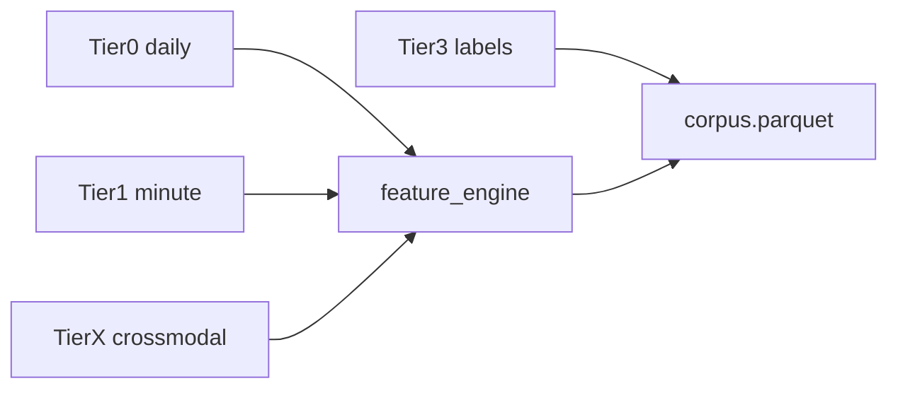
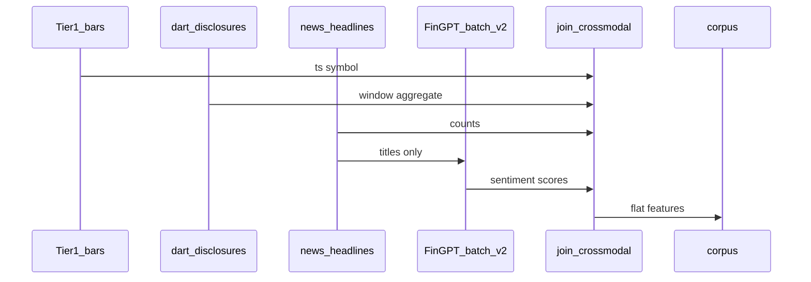

# DAT-003 — 시스템 자료 구조·데이터 스키마 정본

| 항목 | 내용 |
|------|------|
| TraceID | DAT-003 |
| 버전 | 0.1 |
| ADR | [ADR-010](../adr/ADR-010-open-ml-data-and-crossmodal-training.md) |
| 도메인 | [DOM-001](../domain/DOM-001-model.md) |

본 문서는 **저장·교환·API** 단위 스키마 정본이다. 모듈 **호출 계약**은 [INT-001](../implementation/INT-001-module-interfaces.md).

---

## 1. Tier 데이터 분류

| Tier | 저장 | 갱신 | 용도 |
|------|------|------|------|
| **Tier0** | `artifacts/datasets/bars_1d/{symbol}/` | 1일 ETL | 일봉 백필·Alpha 피처·콜드스타트 |
| **Tier1** | `bars_1m/`, `MarketSnapshotCache` | 실시간+ETL | RNN X, 시세 UI |
| **Tier2** | EventStore 메타 | paper 세션 | 분포 정렬 |
| **Tier3** | EventStore, `training_examples/` | 이벤트 | BC 라벨 y |
| **TierX** | `crossmodal_daily/`, `sentiment/` (v2) | 배치 | DART/RSS↔KIS 조인·FinGPT |



---

## 2. SQLite — EventStore (`events.db`)

WAL, append-only. `schema_version` 테이블 = `3`.

### 2.1 `audit_events`

| 컬럼 | 타입 | NULL | 설명 |
|------|------|------|------|
| `id` | INTEGER PK | N | autoincrement |
| `event_id` | TEXT UNIQUE | N | UUID |
| `event_type` | TEXT | N | §2.2 |
| `ts` | TEXT | N | ISO8601 ms KST |
| `correlation_id` | TEXT | N | UUID |
| `source_uc` | TEXT | Y | UC-002 등 |
| `profile` | TEXT | N | paper/live |
| `symbol` | TEXT | Y | |
| `payload_json` | TEXT | N | 이벤트별 스키마 §2.3 |
| `schema_version` | INTEGER | N | payload 스키마 |

인덱스: `(correlation_id)`, `(event_type, ts)`, `(symbol, ts)`.

### 2.2 `event_type` 열거

| 값 | payload 핵심 |
|----|----------------|
| `order_request` | side, qty, price, client_order_id |
| `order_submit` | client_order_id, kis_order_id, status |
| `fill` | fill_qty, fill_price |
| `ai_proposal` | model_version, confidence, probs_json |
| `ai_approval` | decision: approve/reject/defer |
| `risk_deny` | rule_id, reason |
| `training_snapshot` | example_id, feature_schema_version |
| `nl_parse` | intent_id, action, symbol, confidence, channel |
| `nl_confirm` | intent_id, confirmed |
| `nl_execute` | correlation_id, client_order_id |

### 2.3 `payload_json` 예 — `order_request`

```json
{
  "side": "BUY",
  "qty": 10,
  "price": 72000,
  "order_type": "LIMIT",
  "client_order_id": "550e8400-e29b-41d4-a716-446655440000"
}
```

---

## 3. Parquet — 분봉·일봉

### 3.1 `bars_1m` (Tier1)

경로: `artifacts/datasets/bars_1m/{symbol}/part-{YYYY-MM-DD}.parquet`

| 컬럼 | 타입 | 설명 |
|------|------|------|
| `ts` | timestamp[ns, tz=Asia/Seoul] | 분 시작 |
| `symbol` | string | 6자리 |
| `open` | float64 | |
| `high` | float64 | |
| `low` | float64 | |
| `close` | float64 | |
| `volume` | int64 | |
| `source` | string | KIS-WS, KIS-REST, PYK |
| `tier` | string | A, B, C |

### 3.2 `bars_1d` (Tier0)

| 컬럼 | 타입 | 설명 |
|------|------|------|
| `date` | date | |
| `symbol` | string | |
| `open`, `high`, `low`, `close` | float64 | |
| `volume` | int64 | |
| `source` | string | PYK, FDR |

### 3.3 `training_examples` (일별)

경로: `~/.YSTrading/data/training_examples/YYYY-MM-DD.parquet`

| 컬럼 | 타입 | 설명 |
|------|------|------|
| `example_id` | string UUID | |
| `ts` | timestamp | 라벨 시점 |
| `symbol` | string | |
| `profile` | string | |
| `label` | int8 | 0=BUY, 1=SELL, 2=HOLD |
| `weight` | float32 | accept 가중 |
| `correlation_id` | string | |
| `seq_features` | binary | npz 직렬화 또는 외부 ref |
| `feature_schema_version` | int16 | 현재 **2** |

### 3.4 `corpus` (학습 병합)

| 컬럼 | 타입 | 설명 |
|------|------|------|
| `example_id` | string | |
| `ts`, `symbol`, `label`, `weight` | | |
| `f_001` … `f_F` | float32 | 플랫 피처 (F≈80 v1.5) |
| `crossmodal_disclosure_count_24h` | int16 | v1.5 |
| `crossmodal_news_count_24h` | int16 | v1.5 |
| `crossmodal_hours_since_disclosure` | float32 | v1.5 |
| `sentiment_mean_24h` | float32 | v2 FinGPT |
| `sentiment_last` | float32 | v2 |
| `data_hash` | string | export 시 |

---

## 4. 캐시·로컬 JSON

### 4.1 `MarketSnapshotCache` (메모리 + 선택 스냅)

```json
{
  "symbol": "005930",
  "last": 71800,
  "bid": 71700,
  "ask": 71800,
  "volume": 12345678,
  "as_of": "2026-06-02T14:30:00+09:00",
  "tier": "A",
  "source": "KIS-WS",
  "seq": 1042
}
```

### 4.2 `external_cache` (UC-012)

| 테이블 파일 | 내용 |
|-------------|------|
| `dart_disclosures.sqlite` | DART-LIST 정규화 |
| `news_headlines.sqlite` | RSS 메타만 |
| `market_context.json` | 지수·환율 스냅 |

#### `dart_disclosures` 행

| 컬럼 | 타입 |
|------|------|
| `rcept_no` | TEXT PK |
| `stock_code` | TEXT |
| `report_nm` | TEXT |
| `rcept_dt` | TEXT YYYYMMDD |
| `collected_at` | TEXT |

#### `news_headlines` 행

| 컬럼 | 타입 |
|------|------|
| `id` | TEXT PK |
| `title` | TEXT |
| `link` | TEXT |
| `published_at` | TEXT |
| `source` | TEXT |
| `matched_symbols` | TEXT JSON array |

---

## 5. 크로스모달 조인 (DART/RSS ↔ KIS) — ADR-010 #7

### 5.1 조인 키·윈도우

| 항목 | 규칙 |
|------|------|
| 키 | `symbol` (6자리) |
| 시장 시각 | KIS `ts` (스냅샷) |
| 공시·뉴스 창 | `[ts - 24h, ts]` **닫힌 구간** |
| 뉴스 매칭 | `matched_symbols` 또는 제목 키워드 |

### 5.2 v1.5 피처 (FinGPT 없음)

| 피처 ID | 계산 |
|---------|------|
| `crossmodal_disclosure_count_24h` | DART 행 수 |
| `crossmodal_news_count_24h` | RSS 행 수 |
| `crossmodal_hours_since_disclosure` | 최근 공시까지 시간; 없으면 999 |
| `crossmodal_has_disclosure_24h` | 0/1 |

### 5.3 v2 FinGPT 배치

| 단계 | 산출 |
|------|------|
| `batch_sentiment.py` | 헤드라인 → `sentiment_score` ∈ [-1,1] |
| `join_crossmodal.py` | `sentiment_mean_24h`, `sentiment_last` |
| 학습 | corpus 컬럼 추가; **본문 저장 금지** 유지 |



---

## 6. Alpha158류 피처 (schema v2)

정의 정본: `config/ml_feature_schema.yaml` (구현). 카테고리:

| 그룹 | 예시 컬럼 | 윈도우 |
|------|-----------|--------|
| price | `return_1m`, `log_return_5m` | 1,5,60 분 |
| volume | `volume_z_20` | 20 |
| alpha_roll | `rsi_14`, `corr_price_vol_10` | 5,10,20,60 |
| position | `position_flag`, `cash_ratio` | 스냅샷 |
| time | `minute_sin`, `minute_cos` | |
| crossmodal | §5.2 | |
| sentiment | §5.3 v2 | |

`feature_schema_version=2` 시 F≈80 (문서화 후 고정).

---

## 7. ML 아티팩트

### 7.1 `metadata.json`

```json
{
  "version": "20260602-001",
  "model_type": "lstm_bc",
  "feature_schema_version": 2,
  "seq_len": 60,
  "data_hash": "sha256:...",
  "git_sha": "abc1234",
  "promotion_stage": "candidate",
  "metrics": { "val_loss": 0.42 }
}
```

### 7.2 v2 `tsfm_sidecar.json` (선택)

Chronos 예측 요약만; **주문 직결 없음**.

---

## 8. Hub REST DTO (요약)

| Method | Path | Body/Response |
|--------|------|---------------|
| POST | `/pair` | `{code}` → `{session_token}` |
| GET | `/quotes/snapshot` | `?symbols=` → `[MarketSnapshot]` |
| GET | `/approvals/pending` | `[ApprovalDTO]` |
| POST | `/approvals/{id}/approve` | 204 |
| POST | `/nl/parse` | ParseResult JSON |
| POST | `/nl/confirm` | OrderResult |

상세: [INT-001](../implementation/INT-001-module-interfaces.md) · UC-013 [DOM-013](../domain/DOM-013-voice-nl-domain.md).

### 8.1 `nl_intents` (메모리 또는 SQLite TTL)

| 컬럼 | 타입 |
|------|------|
| `intent_id` | TEXT PK |
| `payload_json` | TEXT ParsedTradeIntent |
| `expires_at` | TEXT |
| `confirmed` | INTEGER 0/1 |

---

## 변경 이력

| 날짜 | 내용 |
|------|------|
| 2026-06-02 | v0.1 — Tier0·crossmodal·schema v2 |
