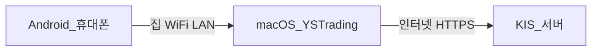
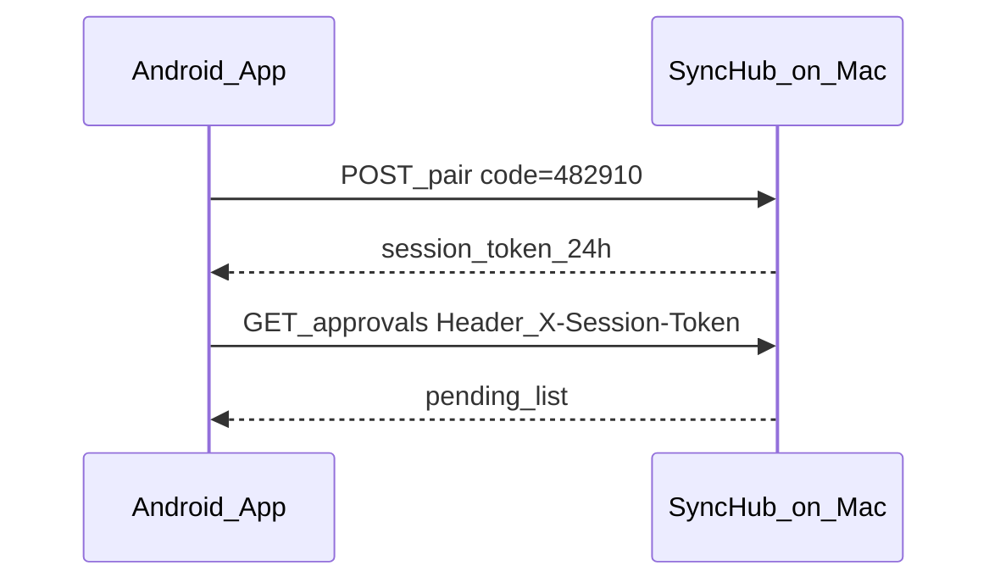
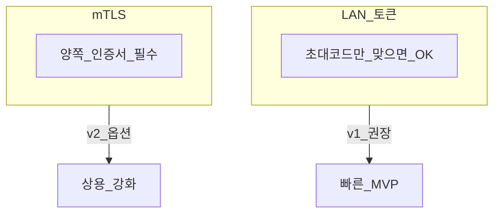
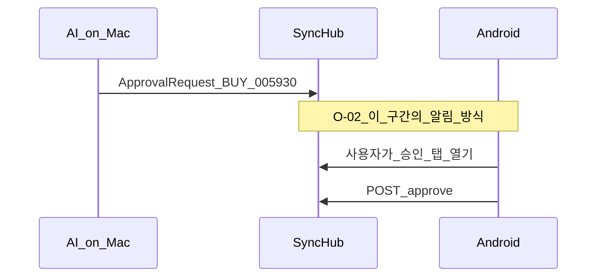
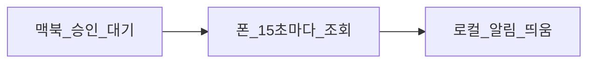
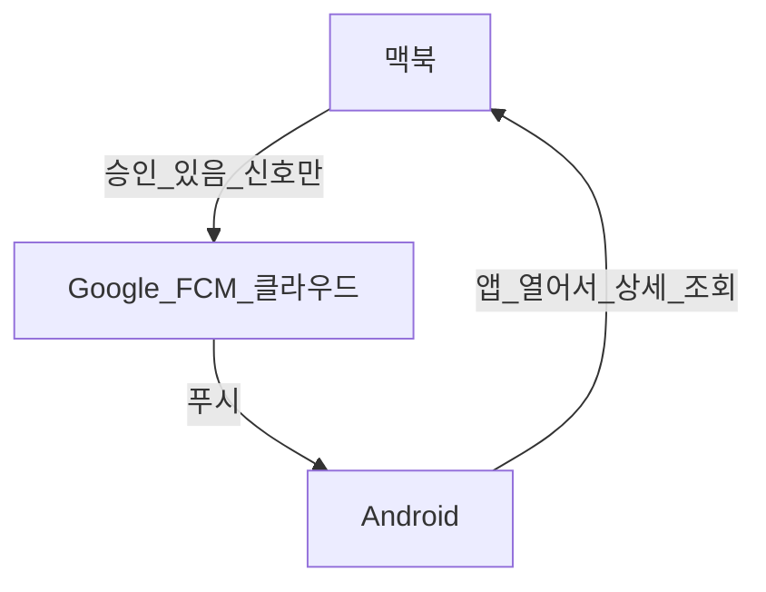
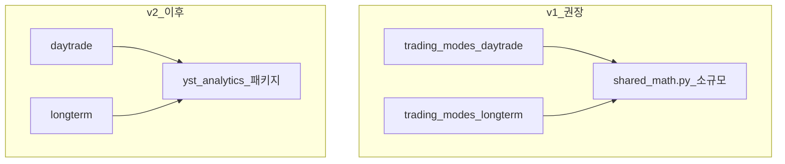

# 설계 항목 O-01~03 — 쉬운 설명 (확정됨)

| TraceID | DEC-003 |
|---------|---------|
| 대상 | 개인 투자자(오너) 검토용 — 기술 용어 최소화 |
| 상태 | **확정** (2026-06-02, 권장안 적용) — [ADR-007](../adr/ADR-007-connectivity-and-shared-math-v1.md) |

[DEC-001](DEC-001-decisions.md) D-09~D-11. 아래는 **당시 판단 근거**를 남긴 교육용 문서입니다.

---

## O-01 — Android가 맥북과 어떻게 “안전하게” 연결할까?

### 한 줄 요약

**같은 집 Wi-Fi** 안에서, 휴대폰이 **맥북의 YSTrading**에 주문·승인 요청을 보낼 때, **낯선 사람이 끼어들지 못하게 막는 방법**을 고르는 문제입니다.

### 왜 필요한가?

- SyncHub 경로: 휴대폰은 맥북에 **연결 코드**로 붙습니다(O-01).
- KIS 키는 [ADR-006](../adr/ADR-006-personal-credentials-encryption.md)대로 **암호화하여 Android·macOS** 각각 사용할 수 있습니다.
- 그런데 Wi-Fi는 **같은 공유기를 쓰는 다른 기기**도 이론상 패킷을 볼 수 있습니다.

### 선택지 A — **LAN + 페어링 토큰** (v1 권장)

**비유**: 아파트 현관에 **오늘만 통하는 초대 코드**를 걸어 두고, 코드 아는 휴대폰만 문을 연다.

| 항목 | 설명 |
|------|------|
| 동작 | 맥북 화면에 **6자리 코드 + QR** 표시 → 휴대폰에 입력 → 이후 요청 헤더에 토큰 첨부 |
| 장점 | 구현·설정이 단순; 인증서 설치 없음 |
| 단점 | Wi-Fi에 **공격자가 이미 침입**해 있으면 토큰 탈취 위험(가정: 가정망 신뢰) |
| Qt6 UI | [UI-003](../ui/UI-003-storyboards-system-android.md) `SCR-AND-PAIR` — `QLabel` QR, `QLineEdit` 코드 |

### 선택지 B — **mTLS** (상용·강화안)

**비유**: 휴대폰과 맥북이 **서로 신분증(인증서)** 을 보여 주고 맞을 때만 대화.

| 항목 | 설명 |
|------|------|
| 동작 | 맥·폰 각각 **클라이언트 인증서** 설치; HTTPS 연결 시 양쪽 검증 |
| 장점 | 토큰 탈취만으로는 연결 어렵음; 회사망·상용에 적합 |
| 단점 | 인증서 발급·갱신·폰 설치 UX가 무겁음 |

### 오너에게 묻는 질문

1. 맥북·휴대폰은 **항상 집 Wi-Fi**만 쓰나요, 카페·회사망도 쓰나요?
2. “코드 한 번 맞추기” 수준이면 충분한가요, 아니면 **인증서까지** 원하시나요?

**v1 기본값**: **LAN + 페어링 토큰**(60초마다 코드 갱신 가능).

---

## O-02 — AI 승인 알림을 **어떻게** 휴대폰에 보낼까?

### 한 줄 요약

맥북이 “지금 매수해도 될까요?”라고 물을 때, **휴대폰이 벨을 울리게** 하는 **배달 방식**을 고르는 문제입니다.

### 상황 그림

### 선택지 A — **로컬 알림 + 폴링** (v1 권장)

**비유**: 휴대폰이 **10초마다 현관 벨 눌렀는지** 맥북에 물어 보고, 있으면 **앱 안에서** 알림을 띄운다.

| 항목 | 설명 |
|------|------|
| 동작 | Android 앱이 SyncHub `GET /approvals/pending` 주기 호출; 새 건이면 `NotificationManager` 로컬 알림 |
| 장점 | Google 계정·FCM 설정 **불필요**; 프라이버시(승인 내용이 구글 클라우드 안 감) |
| 단점 | 앱이 **백그라운드에서 자주 깨어남**; 배터리·지연(최대 폴링 주기만큼) |

### 선택지 B — **FCM 푸시** (구글 클라우드)

**비유**: 맥북(또는 중계 서버)이 **구글 우체국**에 “이 폰에 편지 보내줘”라고 하면, 폰이 잠자도 **띵** 한다.

| 항목 | 설명 |
|------|------|
| 동작 | Firebase 프로젝트·`google-services.json`; 서버가 FCM API로 push |
| 장점 | **즉시** 알림; 앱이 꺼져 있어도 도달 |
| 단점 | Google 의존·추가 인프라; payload에 **민감 정보 넣지 말 것**(“승인 1건” 수준만) |

### 비교 표

| | 로컬+폴링 | FCM |
|---|-----------|-----|
| 설정 난이도 | 낮음 | 중간 |
| 알림 속도 | 폴링 주기(예 15초) | 수 초 |
| 개인정보 | 집 LAN 안에서 끝 | 메타데이터가 Google 경유 |
| 맥북 꺼짐 | 알림 불가 | 중계 서버 있으면 가능 |

**v1 기본값**: **로컬 알림 + 폴링**(설정에서 FCM On은 **후속**).

---

## O-03 — 수학·통계 코드를 **어디에** 둘까?

### 한 줄 요약

단타·장기 모드가 **비슷한 계산**(이동평균, 정규화, 피크 찾기)을 쓸 때, **한 곳에 모아 둘지** vs **모드 폴더 안에만** 둘지 정하는 문제입니다. **화면/기능과 무관**한 내부 정리입니다.

### 비유

| 방식 | 비유 |
|------|------|
| **모드 안에만** | 단타 주방·장기 주방에 **각각 칼** 하나씩 |
| **공통 `analytics`** | **공용 조리도구 서랍** 하나 두고 두 부엌이 같이 씀 |

### 왜 지금은 급하지 않나?

- UI·승인·주문이 **먼저**입니다.
- 중복이 **3곳 이상** 생기면 그때 패키지로 **뽑아 내면** 됩니다.

### v1 결정 (권장)

| 항목 | 내용 |
|------|------|
| 위치 | `trading_modes/shared/indicators.py` 정도의 **작은 파일** |
| 금지 | `yst_ui`가 수학 모듈 import 하지 않음 |
| 후속 | 패턴 반복되면 `yst_analytics` ADR 별도 |

**오너 결정 필요도**: **낮음** — 개발 편의용; v1 권장안으로 진행 가능.

---

## 요약 — 확정 (v1)

| ID | **확정** | 한 줄 |
|----|----------|------|
| O-01 | LAN + 페어링 토큰 | 집 Wi-Fi + QR/6자리 코드 |
| O-02 | 로컬 알림 + 폴링 15s | FCM은 v2·설정 Off |
| O-03 | `trading_modes/shared/` | `yst_analytics`는 v2 |

→ [DEC-001](DEC-001-decisions.md) D-09~D-11 · [ADR-007](../adr/ADR-007-connectivity-and-shared-math-v1.md)

---

## 관련 UI·구현

| 항목 | 문서 |
|------|------|
| 페어링 화면 Qt6 | [UI-003](../ui/UI-003-storyboards-system-android.md) SCR-AND-PAIR |
| 승인 모달 Qt6 | UI-003 SCR-APPROVAL |
| SyncHub API | [ARC-001](../architecture/ARC-001-module.md) §4.4, [ARC-003](../architecture/ARC-003-trading-modes-greenfield.md) |
