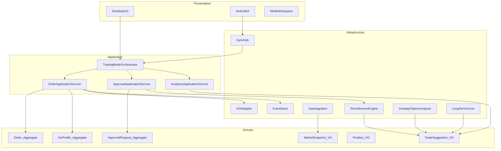
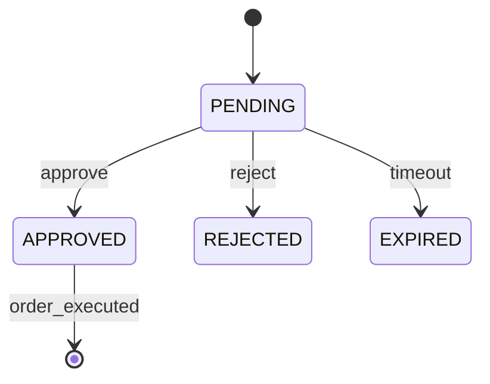
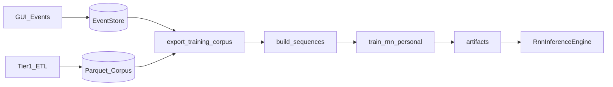

# 통합 도메인 모델

| 버전 | 0.1 (Phase 3) |
|------|----------------|
| TraceID | DOM-001 |

---

## 1. 컨텍스트 맵



---

## 2. 논리 컴포넌트

| 컴포넌트 | 책임 | UC |
|----------|------|-----|
| **KisProfile** | paper/live, base_url, credentials ref, TR map | UC-001 |
| **AccessTokenManager** | OAuth 캐시·갱신 | UC-001 |
| **OrderService** | 주문·조회 유스케이스 진입 | UC-002 |
| **OrderValidator** | 수량·가격·상품 검증 | UC-002 |
| **RiskGuard** | 정책 규칙 체인 | UC-011 |
| **TradingModeOrchestrator** | 모드별 UI·백엔드 라우팅 | UC-004~006 |
| **IntradayPatternAnalyzer** | 당일 패턴·제안 | UC-004 |
| **LongTermScorer** | 장기 랭킹 | UC-005 |
| **RnnInferenceEngine** | 시퀀스 추론 | UC-006 |
| **ApprovalGate** | 승인 TTL·상태머신 | UC-006 |
| **FeatureSnapshotter** | 학습용 스냅샷 | UC-007 |
| **HistoryAggregator** | PnL·체결 집계 | UC-008 |
| **DataSourceRegistry** | 원천 메타·TTL | UC-009 |
| **MarketSnapshotCache** | 통합 시세 캐시 | UC-003, UC-009 |
| **EventStore** | append-only 감사·Tier3 | UC-007, UC-008 |
| **AddonHost** | propose_action 디스패치 | UC-006 |
| **SyncHub** | Android API·푸시 브리지 | UC-010 |

---

## 3. 핵심 애그리게이트

### 3.1 Order (주문)

| 속성 | 타입 | 설명 |
|------|------|------|
| orderId | UUID | 내부 |
| symbol | string | 종목 |
| side | BUY/SELL | |
| qty, price | decimal | |
| profile | paper/live | |
| status | PENDING/SENT/REJECTED/FILLED | |
| kisMeta | JSON | TR 응답 요약 |
| correlationId | UUID | 추적 |

**불변식**: live 전송 전 RiskGuard PASS.

### 3.2 ApprovalRequest (AI 승인)

| 속성 | 설명 |
|------|------|
| requestId | UUID |
| proposedAction | BUY/SELL |
| symbol, qty, price | |
| rationale | RationaleBundle |
| state | PENDING/APPROVED/REJECTED/EXPIRED |
| expiresAt | UTC |
| deviceChannel | desktop/android |

**상태 전이**:



### 3.3 TradeSuggestion (제안 VO)

공통: `mode`, `symbol`, `confidence`, `rationaleTags`, `createdAt`

- Day: `buyWindow`, `sellWindow`
- Long: `rank`, `scoreBreakdown`
- AI: `action`, `attributionVector`

---

## 4. ML 도메인 (RNN)

### 4.1 TrainingExample

```
example_id, ts, profile, symbol,
sequence_tensor[T,F], label_action,
meta: {correlation_id, source_uc}
```

### 4.2 ModelArtifact

```
version, schema_version, weights_path,
metrics: {val_acc, val_loss},
data_hash, trained_at
```

### 4.3 InferencePipeline

1. `FeatureWindowBuilder.build(symbol, now)`
2. `RnnModel.forward` → logits
3. `ActionPolicy` → propose or hold
4. `ApprovalGate` if not HOLD

**학습 데이터 수집 경로** (상세 Flow·피처·SRC): [DAT-002-rnn-training-collection-flow.md](../data/DAT-002-rnn-training-collection-flow.md)



---

## 5. UC별 도메인 문서

| UC | 문서 |
|----|------|
| UC-006, UC-007 | [UC-006-ai-domain.md](DOM-006-ai-domain.md) |
| UC-004 | [UC-004-daytrade-domain.md](DOM-004-daytrade-domain.md) |

(기타 UC는 본 통합 모델에 흡수; Phase 3.1 선택 산출)

---

## 6. 패키지 매핑 (현재 → 목표)

| 도메인 컴포넌트 | 패키지(현재/목표) |
|-----------------|-------------------|
| KISAdapter | `kis_core` |
| DesktopGUI | `gui_desktop` |
| EventStore | `event_store` |
| RnnEngine, Train | `ml_pipeline` (+ `ml_pipeline/rnn/`) |
| AddonHost | `addons` |
| SyncHub, Android | `ast_mobile`, `packaging/android-app` |
| DataIngest | `data_ingestion` |
| Intraday/Long (신규) | `analytics` 또는 `trading_modes` (신규 패키지) |

---

## 7. Phase 3 체크포인트

- [x] 통합 컴포넌트·애그리게이트
- [x] ML·승인·모드 경계
- [ ] 구현 시 `trading_modes` 패키지 ADR 확정
