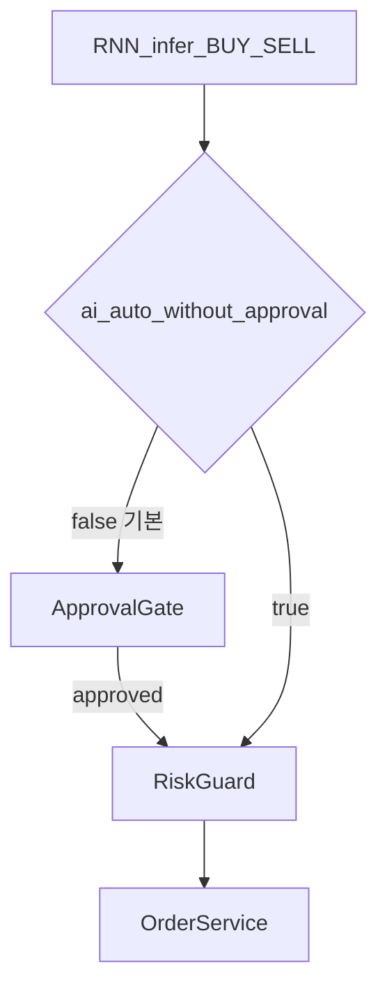
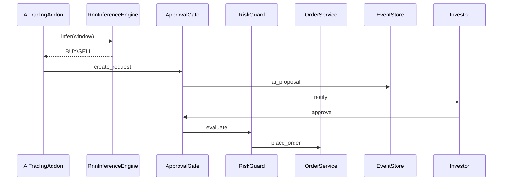

# UC-006 도메인 분석 — AI 자동·승인

| 항목 | 내용 |
|------|------|
| TraceID | DOM-006 |

## 정책 분기

## 컴포넌트 상호작용 (기본: 승인 On)

## 무승인 On 시

- `ApprovalGate` 호출 없음.
- `PolicyResolver.requires_approval()` → `not settings.ai_auto_without_approval`.

## RationaleBundle

| 필드 | 소스 |
|------|------|
| top_features | attribution |
| similar_events | Tier3 k-NN |
| model_version | artifact meta |
| data_as_of | window end ts |

## 내부 동작 규칙

1. 동일 종목 PENDING 승인 중복 생성 금지 (승인 모드만).
2. HOLD 연속 N회 시 추론 주기 백오프.
3. `ai_auto_without_approval` 변경은 감사 로그 필수.
