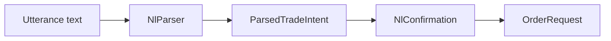
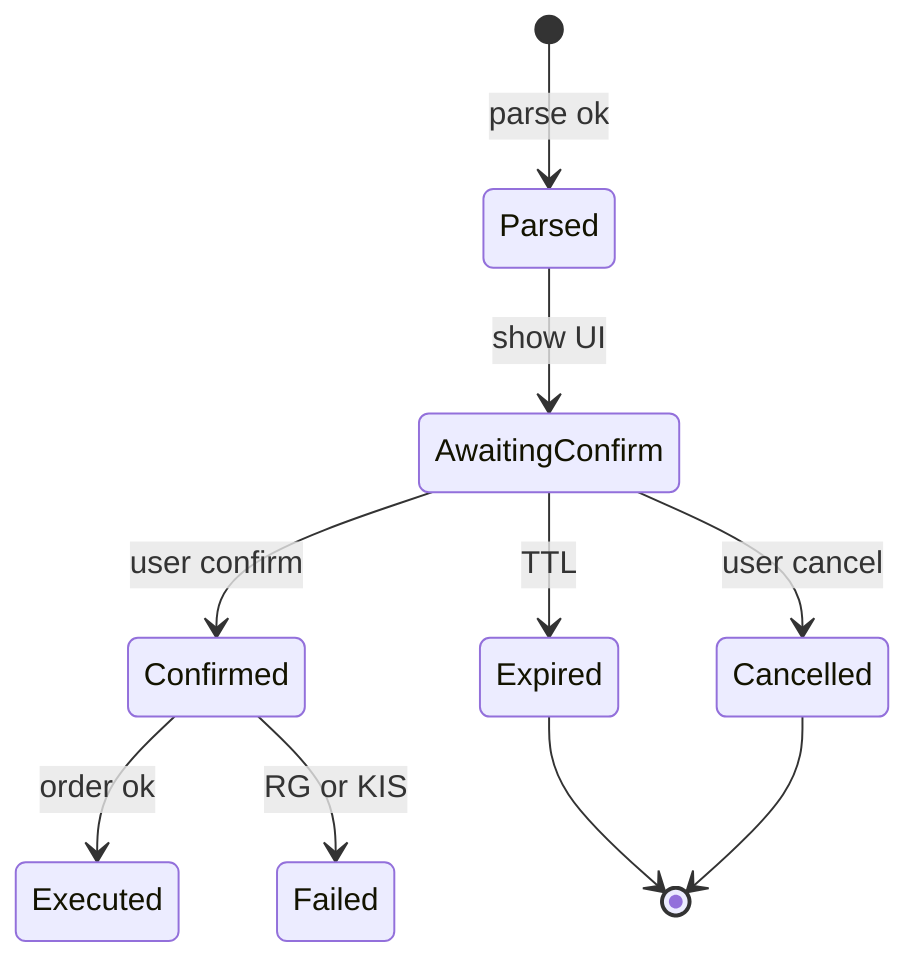

# DOM-013 — 음성·자연어 명령 도메인

| TraceID | DOM-013 |
|---------|---------|
| UC | [UC-013](../usecase/UC-013-voice-nl-trading-android.md) |

## 1. 개념

| 용어 | 설명 |
|------|------|
| **Utterance** | ASR 결과 또는 사용자 타이핑 문자열 |
| **ParsedTradeIntent** | 구조화 매매 의도(슬롯) |
| **NlConfirmation** | 사용자 명시 확인(타임스탬프·채널) |

## 2. ParsedTradeIntent

| 필드 | 타입 | 필수 | 설명 |
|------|------|------|------|
| `intent_id` | UUID | Y | 확인·실행 키 |
| `action` | enum | Y | BUY, SELL, CANCEL, CLARIFY |
| `symbol` | string | 조건부 | 6자리 |
| `symbol_name` | string | N | 표시용 |
| `qty` | int | 조건부 | 주 |
| `price` | decimal | N | 지정가; null=시장가 |
| `order_type` | MARKET/LIMIT | Y | |
| `confidence` | float | Y | 0..1 |
| `locale` | string | Y | ko-KR |
| `source_channel` | voice/text | Y | |
| `raw_text_hash` | string | N | SHA256; 원문 저장 Off 시 |
| `expires_at` | datetime | Y | 확인 TTL 120s |

## 3. 상태 — NlConfirmation

## 4. v1 파싱 규칙 (예)

| 패턴 (개념) | slots |
|-------------|-------|
| `{종목} {N}주 {매수\|매도}` | symbol, qty, side |
| `{종목} 시장가 {매수\|매도}` | MARKET |
| `{종목} {가격}원에 {N}주` | LIMIT |
| `취소` / `아니오` | CANCEL |

종목: watchlist·종목마스터 fuzzy match.

## 5. v2 (FinGPT 보조)

- 규칙 실패 또는 confidence < 0.6 → Hub `nl_llm_parse` (헤드라인 수준 프롬프트, **JSON 스키마만**).
- 출력도 `ParsedTradeIntent` 동일 스키마.

## 6. 감사 이벤트

| event_type | payload |
|------------|---------|
| `nl_parse` | intent_id, action, symbol, confidence, channel |
| `nl_confirm` | intent_id, confirmed bool |
| `nl_execute` | correlation_id → order |

원문 `raw_text`: **기본 저장 안 함**; 설정 `nl_store_raw_text=true` 시 EventStore 암호화 옵션.
