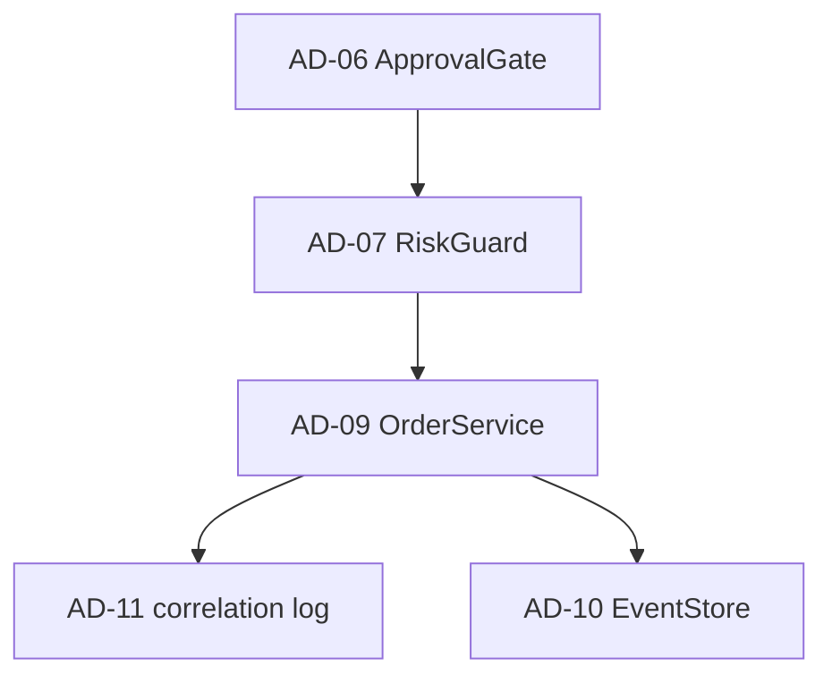

# 구조적 의사결정 식별 (Phase 8.1)

| 항목 | 내용 |
|------|------|
| TraceID | EVL-001 |
| 입력 | [ARC-000-architecture.md](../ARC-000-architecture.md) |
| 버전 | 0.1 |

`architecture-analyzer` 산출: 최종 명세에 **명시·암묵**된 구조 결정 목록.

---

## AD 목록

| AD-ID | 제목 | 명세 위치 | 근거 ADR/DEC | 영향 QA |
|-------|------|-----------|--------------|---------|
| AD-01 | Desktop 시세 WS+REST | §3.1 | D-01, CA-PERF-B | 실시간 |
| AD-02 | Android 시세 Hub 델타 | §3.1, §5.4 | CA-PERF-C | Android, 실시간 |
| AD-03 | SyncHub 중앙 호스트 | §3.1 | D-02, ADR-001 | 보안, 패리티 |
| AD-04 | trading_modes Application | §4 | D-04, ADR-003 | 유지보수 |
| AD-05 | yst_ui 그린필드 | §5 | ADR-005, O-04 | 사용성 |
| AD-06 | ApprovalGate 기본 On | §3.2 | D-05, ADR-004 | 안전 |
| AD-07 | RiskGuard 주문 전 | §3.2 | D-06, UC-011 | 안전 |
| AD-08 | LSTM BC + Tier1/3 | §3.2 | D-03, ADR-002 | AI, 재현 |
| AD-09 | OrderService 단일 실행 | §4.2 | D-06 | 안전 |
| AD-10 | EventStore 감사 정본 | §6 | QS-018 | 보안, 감사 |
| AD-11 | JSON line + correlation | §6 | OPS-003 | 신뢰성, 디버깅 |
| AD-12 | LAN 페어링 토큰 | §5.4 | D-09, ADR-007 | 보안 |
| AD-13 | 상용 CB·멱등·stale | §3.3 | D-14, ARC-004 | 신뢰성 |
| AD-14 | DataSourceRegistry Tier | §2.1 UC-009 | D-08 | 사용성 |
| AD-15 | CI live 주문 금지 | §1.3 | D-12, ADR-008 | 안전 |
| AD-16 | Diagnostic Pack | §6 | OPS-004 | 유지보수 |
| AD-17 | UI ViewModel 포트 | §5.3 | UI-QT6 | 유지보수 |
| AD-18 | paper 승격 게이트 ML | §3.2 | D-13, OPS-002 | AI |

---

## 횡단 결정 관계

---

## 변경 이력

| 날짜 | 내용 |
|------|------|
| 2026-06-02 | v0.1 — ARC-000 기반 18건 |
