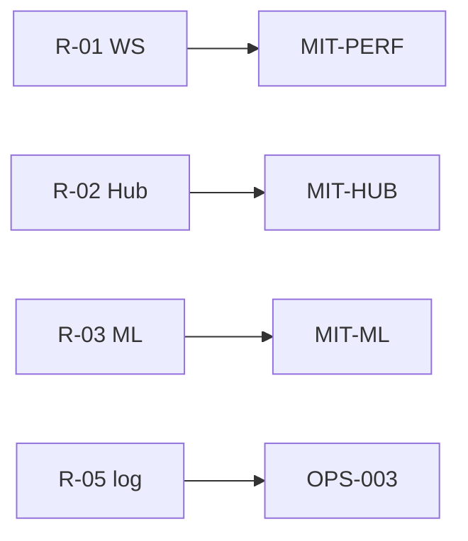

# 최종 구조 평가 보고서 (Phase 8.2~8.3)

| 항목 | 내용 |
|------|------|
| TraceID | EVL-002 |
| 입력 | [EVL-001](EVL-001-architecture-decisions.md), [ARC-000](../ARC-000-architecture.md), [QLT-001](../QLT-001-qualities.md) |
| 버전 | 0.1 |

---

## 1. 평가 요약

| 차원 | 등급 | 평가 근거 |
|------|------|-----------|
| **안전** | 높음 | RG+Gate 기본·live 확인·stale 차단 설계 완료; 구현은 v1 예정 |
| **보안** | 높음 | secrets.enc, Hub 토큰, 로그 마스킹(OPS-003), 감사 append-only |
| **실시간** | 중~높음 | WS+REST+Hub; HTS 100%·틱 단위 **비보장** 명시됨 |
| **신뢰성** | 중~높음 | ARC-004 CB·멱등·401 재시도 명세; 코드 미완 |
| **AI 품질** | 중 | BC+RNN+paper 게이트; 수익 미보장·데이터 최소량 게이트 |
| **유지보수** | 높음 | trading_modes·TraceID·Diagnostic Pack 프로세스 |
| **Android** | 중 | SyncHub 패리티; 맥 의존·WebView 한계 |

**총평**: Phase 1~6 결정과 **일관된** Phase 7 명세. v1 **구현·검증**이 남은 리스크이지, 구조 방향 자체는 채택 후보와 정합한다.

---

## 2. AD별 QA 영향

| AD-ID | 제목 | QS/NFR | 만족 | 비고 |
|-------|------|--------|------|------|
| AD-01 | WS+REST | QS-001, NFR-T-01 | 충족 설계 | MIT-PERF-01~03 |
| AD-02 | Hub 델타 | QS-010 | 충족 설계 | 맥 오프라인 시 저하 |
| AD-03 | SyncHub | QS-012, QS-017 | 충족 설계 | ADR-006 보조 경로 병행 |
| AD-04~05 | TM + yst_ui | — | 충족 | 그린필드 리팩터 비용 수용 |
| AD-06~07 | Gate+RG | QS-004, NFR-S-03 | 충족 설계 | 토글 오용은 운영 리스크 |
| AD-08 | LSTM | QS-008, 011, 020 | 부분 | 데이터·paper 검증 필요 |
| AD-10~11 | Audit+log | QS-009, 018 | 충족 설계 | `yst_logging` 구현 필요 |
| AD-13 | 상용 baseline | QS-013~016 | 설계만 | 테스트 미연결 |
| AD-16 | Diagnostic Pack | — | 프로세스 충족 | 스크립트 구현 예정 |

---

## 3. 채택 후보 대비 정합성

| CA-ID | 명세 반영 | 갭 |
|-------|-----------|-----|
| CA-PERF-B/C | §3.1 | WS manager 코드 |
| CA-AND-B | §3.1, §5.4 | Hub pair API |
| CA-MOD-B | §4, §5.3 | 패키지 스캐폴드 |
| CA-ML-A | §3.2, DAT-002 | train/export CLI |
| CA-SEC-A+C | §3.2, ARC-004 | RG 규칙 전량 |

[CND-006](../candidate/CND-006-mitigation-adopted.md) MIT-*와 **1:1 대응** 확인.

---

## 4. 위험·완화

| 위험 ID | 제목 | 확률 | 영향 | 완화 |
|---------|------|------|------|------|
| R-01 | WS 재연결 버그 | 중 | 중 | MIT-PERF-01~02, 통합 테스트 |
| R-02 | Hub 맥 슬립 | 중 | 중 | MIT-HUB-01, 제한 모드 UI |
| R-03 | RNN 과적합 | 중 | 고 | MIT-ML-01~03 |
| R-04 | 무승인 설정 오설정 | 저 | 고 | ADR-004 default false |
| R-05 | 로그 시크릿 유출 | 저 | 고 | OPS-003 SensitiveFilter + CI grep |
| R-06 | 구현 갭 누적 | 중 | 중 | Phase 7 명세 기준 체크리스트·OPS-001 CI |

---

## 5. 구현 우선순위 (v1)

| 순위 | 항목 | Trace |
|------|------|-------|
| P0 | kis_core + RG + OrderService + EventStore | ARC-004 |
| P0 | yst_ui 셸·SCR-ORDER·프로필 | UI-001 |
| P0 | OPS-003 `yst_logging` + correlation | OPS-003 |
| P1 | WS+Cache | CND-004 |
| P1 | ApprovalGate + SCR-APPROVAL | UC-006 |
| P1 | OPS-004 collect script + Settings export | OPS-004 |
| P2 | SyncHub + Android | ADR-001 |
| P2 | ml_pipeline train path | DAT-002 |

---

## 6. Phase 8 체크포인트

- [x] 구조적 의사결정 식별 (EVL-001)
- [x] NFR·QA 만족도 평가
- [x] 위험·완화 매핑
- [x] ARC-000 부록 H 반영

---

## 변경 이력

| 날짜 | 내용 |
|------|------|
| 2026-06-02 | v0.1 — Phase 8 평가 |
