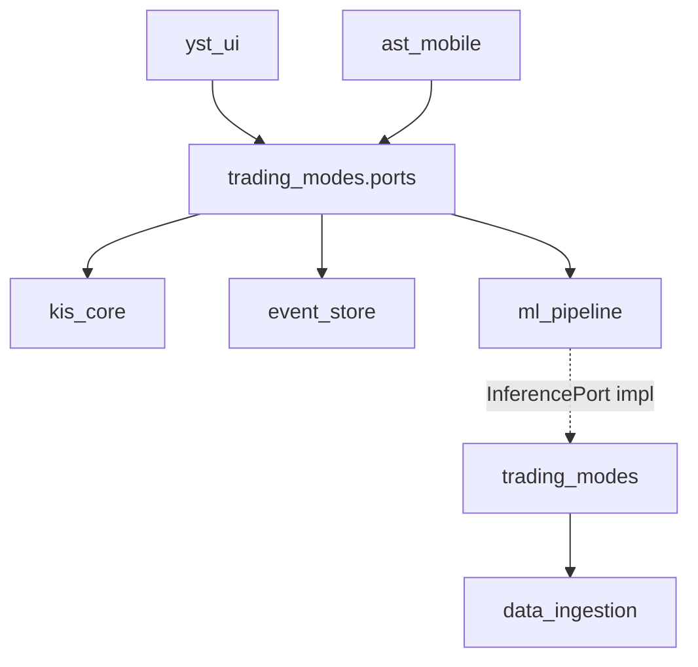

# INT-001 — 모듈 간 인터페이스 명세

| 항목 | 내용 |
|------|------|
| TraceID | INT-001 |
| 버전 | 0.1 |
| 스키마 | [DAT-003](../data/DAT-003-data-schemas.md) |

Python **Protocol/ABC** 기준. Presentation은 **포트만** 호출.

---

## 1. 의존 방향



---

## 2. `trading_modes.ports` — Application 포트

### 2.1 `QuotePort`

```python
# 개념 시그니처
def get_snapshot(symbol: str) -> MarketSnapshotDTO: ...
def subscribe(symbols: list[str], on_tick: Callable[[MarketSnapshotDTO], None]) -> SubscriptionId: ...
```

| 메서드 | 전제 | 사후 | 예외 |
|--------|------|------|------|
| `get_snapshot` | symbol 유효 | `as_of` ≤ 5s (Tier A) 또는 Tier 표시 | `QuoteUnavailableError` |
| `subscribe` | WS 가능 | tick마다 on_tick | `ConnectionDegraded` → REST 폴백 이벤트 |

**DTO `MarketSnapshotDTO`**: [DAT-003 §4.1](../data/DAT-003-data-schemas.md)

---

### 2.2 `OrderPort` / `OrderService`

```python
def submit_order(cmd: SubmitOrderCommand) -> OrderResultDTO: ...
def cancel_order(client_order_id: str) -> CancelResultDTO: ...
```

| `SubmitOrderCommand` | 타입 |
|----------------------|------|
| symbol, side, qty, price, order_type | |
| profile | paper/live |
| correlation_id | UUID |
| client_order_id | UUID (멱등) |

**흐름**: `submit_order` → RiskGuard → (Confirm) → kis_core → EventStore `order_*`

| 예외 | 의미 |
|------|------|
| `RiskDenyError` | rule_id, reason |
| `StaleQuoteError` | RG-07 |
| `CircuitOpenError` | RG-09 |
| `KisApiError` | code, retryable |

---

### 2.3 `ApprovalPort`

```python
def list_pending() -> list[ApprovalDTO]: ...
def approve(request_id: UUID, channel: str) -> None: ...
def reject(request_id: UUID, reason: str) -> None: ...
```

상태: PENDING → APPROVED | REJECTED | EXPIRED ([DOM-001](../domain/DOM-001-model.md))

---

### 2.4 `AuditPort`

```python
def append(event_type: str, payload: dict, *, correlation_id: str, ...) -> None: ...
def query_by_correlation(correlation_id: str) -> list[AuditEventDTO]: ...
```

구현: `event_store`

---

### 2.5 `InferencePort` (ml_pipeline → trading_modes)

```python
def propose_action(ctx: InferenceContextDTO) -> ActionProposalDTO: ...
```

| `ActionProposalDTO` | |
|---------------------|--|
| side | BUY/SELL/HOLD |
| confidence | 0..1 |
| model_version | |
| rationale | dict (피처 요약, v2 TSFM) |

**금지**: `InferencePort`가 `OrderPort` 직접 호출.

---

### 2.6 `ModeOrchestratorPort` (yst_ui → trading_modes)

```python
def on_mode_action(mode: TradingMode, action: ModeActionDTO) -> ModeActionResultDTO: ...
```

| Mode | action 예 |
|------|-----------|
| MANUAL | submit_order |
| DAY | run_pattern, accept_suggestion |
| LONG | run_scoring |
| AI | request_inference, approve |

---

## 3. `kis_core` — Infrastructure

### 3.1 `KisClient`

```python
def place_order(req: KisOrderRequest) -> KisOrderResponse: ...
def get_balance() -> BalanceDTO: ...
def get_minute_bars(symbol: str, interval: str) -> pd.DataFrame: ...
```

| 내부 | 책임 |
|------|------|
| `OAuthTokenProvider` | 401 1회 갱신 |
| `CircuitBreaker` | OPEN/HALF_OPEN/CLOSED |
| `WsSubscriptionManager` | §ARC-004 |

---

## 4. `data_ingestion`

### 4.1 `DataSourceRegistry`

```python
def register(source_id: str, adapter: SourceAdapter) -> None: ...
def fetch(source_id: str, **kwargs) -> FetchResult: ...
```

| adapter | SRC-ID |
|---------|--------|
| `DartListAdapter` | DART-LIST |
| `RssNewsAdapter` | RSS-* |
| `FdrDailyAdapter` | FDR (Tier0) |
| `PykrxDailyAdapter` | PYK-OHLC |

### 4.2 `CrossmodalJoiner` (v1.5+)

```python
def join(symbol: str, ts: datetime) -> CrossmodalFeaturesDTO: ...
```

출력: [DAT-003 §5](../data/DAT-003-data-schemas.md)

---

## 5. `ml_pipeline`

| 모듈 | 인터페이스 |
|------|------------|
| `FeatureSnapshotter` | `capture(symbol, ts, event) -> TrainingExample` |
| `export_training_corpus` | CLI |
| `train_rnn_personal` | CLI |
| `RnnInferenceEngine` | `InferencePort` 구현 |
| `batch_sentiment` (v2) | FinGPT |
| `TsfmForecastAddon` (v2) | Chronos sidecar |

---

## 6. `yst_ui` — ViewModel 경계

```python
class OrderViewModel:
    def submit(self, form: OrderFormDTO) -> UiResultDTO: ...
```

| 규칙 | |
|------|--|
| ViewModel | `trading_modes` 포트만 |
| `UiResultDTO` | success / validation_errors / correlation_short |

시나리오 테스트: `UiDriver`가 ViewModel·위젯에 이벤트 주입 ([TST-001](TST-001-testing-strategy.md))

---

## 7. `trading_modes.nl_command` — 음성·자연어 (UC-013)

### 7.1 `NlCommandPort`

```python
def parse(text: str, *, channel: Literal["voice", "text"], locale: str = "ko-KR") -> ParseResultDTO: ...
def confirm(intent_id: UUID, *, correlation_id: str) -> OrderResultDTO: ...
```

| `ParseResultDTO` | |
|------------------|--|
| `intent` | `ParsedTradeIntentDTO` |
| `requires_clarification` | bool |
| `clarification` | str?, candidates? |
| `requires_confirm` | always true for BUY/SELL |

**규칙**: `confirm` 전 `OrderPort.submit` **호출 금지**.

### 7.2 Hub REST (ast_mobile)

| Method | Path | Body |
|--------|------|------|
| POST | `/nl/parse` | `{ "text", "channel", "locale" }` |
| POST | `/nl/confirm` | `{ "intent_id", "correlation_id" }` |
| GET | `/nl/intent/{id}` | 확인 화면 refresh |

응답 DTO: [DOM-013](../domain/DOM-013-voice-nl-domain.md)

---

## 8. `ast_mobile` — HTTP

FastAPI 라우터가 **동일 DTO**로 `trading_modes` 호출. [ADR-007](../adr/ADR-007-connectivity-and-shared-math-v1.md)

| Middleware | |
|------------|--|
| `SessionTokenAuth` | X-Session-Token |
| `CorrelationId` | X-Correlation-Id 전파 |

---

## 9. `yst_logging`

```python
def configure_logging(config: LoggingConfig) -> None: ...
def get_correlation_id() -> str | None: ...
def set_correlation_id(cid: str) -> ContextManager: ...
```

[OPS-003](../operations/OPS-003-logging-observability.md)

---

## 변경 이력

| 날짜 | 내용 |
|------|------|
| 2026-06-02 | v0.1 |
