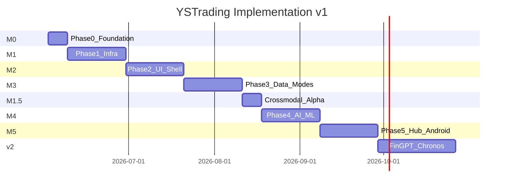

# PLAN-001 — 구현 계획·일정

| 항목 | 내용 |
|------|------|
| TraceID | PLAN-001 |
| 버전 | 0.1 |
| 기준일 | 2026-06-02 |
| 진행 갱신 | [TRACK-001-progress.md](TRACK-001-progress.md) |
| 테스트 | [TST-001-testing-strategy.md](TST-001-testing-strategy.md) |

**전제**: 1인 개발·주 20~25h 가정. 일정은 **TRACK-001** 실적에 따라 슬립.

---

## 1. 릴리스 목표

| 마일스톤 | 목표일 (가정) | 산출 |
|----------|---------------|------|
| **M0** | 2026-06-09 | repo 스캐폴드·pytest·CI green |
| **M1** | 2026-06-30 | kis_core·EventStore·RG·Order (paper) |
| **M2** | 2026-07-21 | yst_ui 셸·수동주문·시세 |
| **M3** | 2026-08-11 | Day/Long·데이터 Tier0/1 |
| **M4** | 2026-09-01 | AI·RNN·Approval·UC-007 |
| **M5** | 2026-09-22 | SyncHub·Android·UC-010·**UC-013 음성/NL** |
| **M1.5** | M3 직후 | Alpha158류·crossmodal v1.5 |
| **M6 (v2)** | 2026-11+ | FinGPT·Chronos·TSFM Addon |

---

## 2. Phase 상세

### Phase 0 — 기반 (M0, 1주)

| ID | 작업 | 패키지 | 테스트 (선행 TDD) | TRACK |
|----|------|--------|-------------------|-------|
| P0-01 | `pyproject.toml`, ruff, pytest, pytest-cov | root | `tests/unit/test_smoke.py` | |
| P0-02 | `packages/yst_logging` | yst_logging | NBDE 로그·마스킹 | |
| P0-03 | `config/defaults.yaml`, migrate 스켈레톤 | root | schema load | |
| P0-04 | GHA `ci.yml` lint+unit | .github | CI green | |
| P0-05 | `tests/`·`scenario_session`·HTML 리포트 | tests | [TST-001](TST-001-testing-strategy.md), [TST-002](TST-002-scenario-html-report.md) | |

### Phase 1 — Infrastructure 코어 (M1, 3주)

| ID | 작업 | 패키지 | 테스트 |
|----|------|--------|--------|
| P1-01 | OAuth·REST client | kis_core | mock KIS NBDE |
| P1-02 | CircuitBreaker·retry | kis_core | abnormal 5xx |
| P1-03 | WS+REST 폴백 | kis_core | disconnect 3s |
| P1-04 | EventStore schema v3 | event_store | append-only |
| P1-05 | RiskGuard RG-01~09 | trading_modes | deny/allow |
| P1-06 | OrderService 멱등 | trading_modes | duplicate client_order_id |
| P1-07 | MarketSnapshotCache | kis_core | stale boundary |

### Phase 2 — Presentation 셸 (M2, 3주)

| ID | 작업 | 패키지 | 테스트 |
|----|------|--------|--------|
| P2-01 | yst_ui shell·mode rail | yst_ui | scenario SCR-SHELL |
| P2-02 | 프로필·paper/live | yst_ui + tm | UC-001 scenario |
| P2-03 | SCR-ORDER·ViewModel | yst_ui | UC-002 NBDE |
| P2-04 | SCR-HOME·차트 호스트 | yst_ui | UC-003 |
| P2-05 | TierFooter·배너 | yst_ui | boundary tier |

### Phase 3 — 데이터·모드 (M3, 3주)

| ID | 작업 | 패키지 | 테스트 |
|----|------|--------|--------|
| P3-01 | Tier0 FDR/pykrx ETL | data_ingestion | DAT-003 bars_1d |
| P3-02 | Tier1 minute ETL | data_ingestion | gap fill |
| P3-03 | DART/RSS adapters | data_ingestion | UC-012 unit |
| P3-04 | CrossmodalJoiner v1.5 | data_ingestion | join window NBDE |
| P3-05 | Daytrade 휴리스틱 | trading_modes | UC-004 |
| P3-06 | Longterm scorer | trading_modes | UC-005 |
| P3-07 | `shared/features_alpha` | trading_modes | feature parity |

### Phase 4 — AI·ML (M4, 3주)

| ID | 작업 | 패키지 | 테스트 |
|----|------|--------|--------|
| P4-01 | FeatureSnapshotter | ml_pipeline | UC-007 |
| P4-02 | export·build_sequences | ml_pipeline | walk-forward |
| P4-03 | train_rnn_personal | ml_pipeline | smoke 1 epoch |
| P4-04 | ApprovalGate | trading_modes | UC-006 scenario |
| P4-05 | AiTradingAddon | addons | propose only |
| P4-06 | eval·OPS-005 BT-01~03 | ml_pipeline | gates |
| P4-07 | SCR-MODE-AI·ML dock | yst_ui | scenario |

### Phase 5 — Hub·Android (M5, 3주)

| ID | 작업 | 패키지 | 테스트 |
|----|------|--------|--------|
| P5-01 | ast_mobile pair·token | ast_mobile | 401 abnormal |
| P5-02 | approvals API | ast_mobile | UC-010 |
| P5-03 | quote delta push | ast_mobile | seq gap |
| P5-04 | Android WebView·poll | android | scenario SCR-AND |
| P5-05 | Diagnostic pack script | scripts | OPS-004 |
| P5-06 | `nl_command` parse·confirm | trading_modes | UC-013 NBDE |
| P5-07 | Hub `/nl/*` | ast_mobile | integration |
| P5-08 | Android Voice+Confirm UI | android | scenario UC-013 |
| P5-09 | TTS live 확인 (선택) | android | boundary |

### Phase v2 — FinGPT·TSFM (M6)

| ID | 작업 | 패키지 | 테스트 |
|----|------|--------|--------|
| V2-01 | batch_sentiment FinGPT | ml_pipeline | mock HF |
| P3-04b | join sentiment columns | data_ingestion | no future leak |
| V2-02 | TsfmForecastAddon | ml_pipeline | confidence floor |
| V2-03 | corpus schema v2 full | ml_pipeline | QS-020 |

---

## 3. Gantt (개요)

---

## 4. Definition of Done (공통)

| # | 기준 |
|---|------|
| 1 | **테스트 선행** (TDD): Red → Green → Refactor |
| 2 | Unit **N+B+A+E** ([TST-001](TST-001-testing-strategy.md)) |
| 3 | 해당 UC **scenario** 1건 이상 green |
| 4 | `TRACK-001` 상태 `done` + 커밋 SHA |
| 5 | 로그·Audit `correlation_id` ([OPS-003](../operations/OPS-003-logging-observability.md)) |
| 6 | 문서 TraceID 링크 (DAT/INT) |

---

## 5. 리스크·버퍼

| 리스크 | 버퍼 |
|--------|------|
| KIS TR 변경 | +1주 P1 |
| PySide6 학습 | P2 +3일 |
| RNN 데이터 부족 | M4 paper만; live 승격 연기 |

---

## 변경 이력

| 날짜 | 내용 |
|------|------|
| 2026-06-02 | v0.1 |
