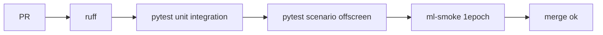

# TST-001 — 테스트 전략 (TDD·pytest·시나리오)

| 항목 | 내용 |
|------|------|
| TraceID | TST-001 |
| 버전 | 0.1 |
| 지침 | [.cursor/rules/tdd-implementation.mdc](../../.cursor/rules/tdd-implementation.mdc) |
| CI | [OPS-001](../operations/OPS-001-github-cicd.md) |

---

## 1. 원칙

| 원칙 | 설명 |
|------|------|
| **TDD** | 프로덕션 코드 전 **실패하는 테스트** 작성 (Red → Green → Refactor) |
| **pytest** | **기본** 테스트 러너 |
| **이중 레이어** | **Unit** (빠름·mock) + **Scenario** (UI·사용자 이벤트) |
| **NBDE** | 모든 테스트 파일은 **Normal + Boundary + Abnormal + Exceptional** 포함 |
| **live 금지** | CI·기본 시나리오는 **mock/paper only** |

---

## 2. 디렉터리 구조

```text
tests/
  conftest.py                 # 공통 fixture, mock KIS, temp EventStore
  unit/
    kis_core/
      test_oauth_normal.py
      test_oauth_abnormal.py
      ...
    trading_modes/
    event_store/
    data_ingestion/
    ml_pipeline/
  integration/
    test_ws_fallback_rest.py
    test_order_audit_chain.py
  scenario/
    conftest.py               # QApplication, UiDriver
    uc_001_profile/
      test_profile_normal.py
      test_profile_boundary.py
      ...
    uc_002_manual_order/
    uc_006_ai_approval/
  fixtures/
    bars_1m_sample.parquet
    audit_events_sample.json
```

---

## 3. NBDE 정의·필수 케이스

| 클래스 | 코드 | 의미 | 예 (주문) |
|--------|------|------|-----------|
| **Normal** | N | 정상·해피패스 | paper LIMIT 매수 성공 |
| **Boundary** | B | 경계값 | qty=1, 가격=호가단위, 만료 직전 승인 |
| **Abnormal** | A | 잘못된 입력·비즈니 거부 | qty=0, RG deny, stale quote |
| **Exceptional** | E | 외부 장애·예외 | KIS 401, 5xx, WS 단절, DB locked |

**규칙**: 파일명 `test_{feature}_{n|b|a|e}.py` 또는 한 파일 내 `class TestNormal`, `TestBoundary` …

```python
# 예: pytest 마커
pytestmark = [pytest.mark.unit]

def test_submit_order_normal_paper_buy(): ...  # N
def test_submit_order_boundary_min_qty(): ...   # B
def test_submit_order_abnormal_zero_qty(): ...  # A
def test_submit_order_exceptional_kis_503(): ... # E
```

마커 등록 (`pyproject.toml`):

```toml
[tool.pytest.ini_options]
markers = [
  "unit: unit tests",
  "integration: integration tests",
  "scenario: UI scenario tests",
  "normal", "boundary", "abnormal", "exceptional",
]
```

---

## 4. Unit 테스트

| 대상 | mock | DB |
|------|------|-----|
| kis_core | `responses` / `httpx.MockTransport` | — |
| RiskGuard | fake Quote, Position | — |
| EventStore | tmp_path SQLite | 실제 WAL |
| CrossmodalJoiner | fixture DART/RSS rows | — |
| FeatureSnapshotter | frozen bars | — |

**커버리지 목표**: `trading_modes`, `kis_core`, `event_store` **≥80%** (M1 이후).

---

## 5. 시나리오 테스트 (사용자 이벤트·UI)

### 5.1 목적

Use Case **사용자 관점** 흐름: 클릭·입력·다이얼로그 확인 → ViewModel → trading_modes → (mock) KIS.

### 5.2 스택

| 도구 | 용도 |
|------|------|
| **pytest** | 러너 |
| **pytest-qt** | `qtbot`, signal, `QApplication` |
| **UiDriver** (자체) | SCR-ID별 위젯 탐색·이벤트 주입 |

### 5.3 UiDriver (개념)

```python
class UiDriver:
    def __init__(self, main_window, qtbot):
        self.win = main_window
        self.qtbot = qtbot

    def click_mode(self, label: str) -> None: ...
    def fill_order(self, symbol: str, qty: int, price: float) -> None: ...
    def click_submit_order(self) -> None: ...
    def expect_dialog(self, title_contains: str) -> None: ...
```

### 5.4 시나리오 매핑

| UC | scenario 경로 | SCR | NBDE 최소 |
|----|---------------|-----|-----------|
| UC-001 | `scenario/uc_001_profile/` | SCR-001 | N: paper 연결 |
| UC-002 | `scenario/uc_002_manual_order/` | SCR-ORDER | N/A/B/E 각 1+ |
| UC-006 | `scenario/uc_006_ai_approval/` | SCR-APPROVAL | 승인·거부·만료 |
| UC-010 | `scenario/uc_010_android/` | Hub API test | 토큰 없음 A |
| UC-013 | `scenario/uc_013_voice_nl/` | SCR-AND-VOICE, NL-CONFIRM | N/B/A/E; confirm skip E |

### 5.5 시나리오 예 (UC-002 N)

```python
@pytest.mark.scenario
def test_manual_order_normal_paper_buy(qtbot, ui_driver, mock_kis):
    ui_driver.select_profile("paper")
    ui_driver.fill_order("005930", qty=10, price=70000)
    ui_driver.click_submit_order()
    qtbot.waitUntil(lambda: ui_driver.last_result().success)
    assert mock_kis.last_order["side"] == "BUY"
    assert audit_has(mock_kis.correlation_id, "order_request")
```

### 5.6 Headless

CI: `QT_QPA_PLATFORM=offscreen` (Linux), macOS 로컬은 native.

### 5.7 HTML 리포트·스크린샷 (필수)

**시나리오 실행마다** 단계별 스크린샷 + 분석 + **HTML 리포트** — [TST-002-scenario-html-report.md](TST-002-scenario-html-report.md).

| 항목 | 내용 |
|------|------|
| 산출 | `artifacts/test-reports/{run_id}/index.html` |
| API | `scenario_session.step(..., expectation=, capture_widget=)` |
| 실행 | `./scripts/run_scenario_with_report.sh` |
| 분석 | UI 스냅샷 키워드 + PNG 품질; `analysis_verdict` |

---

## 6. 통합 테스트

| ID | 내용 |
|----|------|
| INT-WS-01 | WS 끊김 3s → REST 폴백 |
| INT-AUDIT-01 | order correlation_id → EventStore 3+ events |
| INT-CM-01 | crossmodal join 미래 누수 0 |

---

## 7. ML·백테스트 테스트

| 유형 | 방법 |
|------|------|
| export | 합성 Parquet → `data_hash` deterministic |
| train | 1 epoch smoke (<60s) |
| walk-forward | train ts < val ts < test ts assert |
| BT-01~03 | [OPS-005](../operations/OPS-005-backtest-procedure.md) 리포트 JSON schema validate |
| FinGPT v2 | mock transformers; **CI GPU 없음** |
| Chronos v2 | mock pipeline; 출력 shape only |

**crossmodal + FinGPT (ADR-010 #7)**:

| 케이스 | 검증 |
|--------|------|
| N | 공시·뉴스 있음 → 피처 >0 |
| B | 윈도우 24h 경계 정각 |
| A | symbol 불일치 → 0 |
| E | FinGPT timeout → sentiment NaN → 학습 skip row |

---

## 8. CI 파이프라인



| Job | 명령 |
|-----|------|
| unit | `pytest tests/unit tests/integration -m "not slow"` |
| scenario | `pytest tests/scenario --maxfail=3` |
| ml-smoke | `pytest tests/unit/ml_pipeline -k smoke` |

---

## 9. TDD 워크플로 (태스크당)

1. `TRACK-001` → `in_progress`
2. **Red**: NBDE 테스트 4클래스 스켈레ton 또는 1파일 4함수
3. **Green**: 최소 구현
4. **Refactor**: 중복 제거 (테스트 green 유지)
5. scenario 1+ green (해당 UC) + **`index.html` 확인** ([TST-002](TST-002-scenario-html-report.md))
6. `TRACK-001` → `done` / CI 후 `verified`

---

## 10. 테스트 데이터·금지

| 허용 | 금지 |
|------|------|
| `tests/fixtures/` 합성 | live KIS 키 |
| `secrets.enc` test 더블 | 커밋 평문 키 |
| recorded mock (VCR 선택) | 뉴스 본문 fixture 대량 |

---

## 변경 이력

| 날짜 | 내용 |
|------|------|
| 2026-06-02 | v0.1 |
