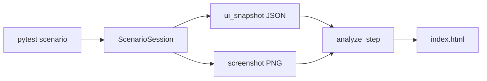

# TST-002 — 시나리오 테스트 HTML 리포트·스크린샷

| 항목 | 내용 |
|------|------|
| TraceID | TST-002 |
| 버전 | 0.1 |
| 상위 | [TST-001](TST-001-testing-strategy.md) |
| 구현 | `tests/scenario/support/`, `scripts/run_scenario_with_report.sh` |

## 1. 원칙

| # | 원칙 |
|---|------|
| 1 | **시나리오 테스트를 실행할 때마다** 단계별 진행·스크린샷·HTML 리포트를 **자동** 생성 |
| 2 | **Pass/Fail** 1차는 pytest **assertion**; 스크린샷 **분석**은 UI 상태 스냅샷 + 기대치 대조 + (선택) 시각 검토 메모 |
| 3 | 리포트는 **브라우저에서 스크린샷 인라인** 열람 (`index.html`) |
| 4 | 리포트·PNG는 `artifacts/test-reports/` — **Git 미추적** |

---

## 2. 산출물 구조

```text
artifacts/test-reports/{run_id}/
  index.html              # 메인 리포트
  report.json             # 기계 판독용
  steps/
    01_{slug}.png
    02_{slug}.png
  steps.json              # 단계 메타·분석 결과
```

`run_id` = `{YYYYMMDD_HHMMSS}_{uc}_{nbde}_{outcome}`  
예: `20260602_143052_uc002_N_pass`

---

## 3. 단계(Step) 모델

| 필드 | 설명 |
|------|------|
| `index` | 1, 2, 3… |
| `title` | 「paper 프로필 선택」 |
| `expectation` | 기대 UI/동작 (한글) |
| `action_log` | 수행한 이벤트 요약 |
| `screenshot` | `steps/01_....png` |
| `ui_snapshot` | 제목·버튼 텍스트·다이얼로그 여부 (Qt) |
| `assertion` | pass / fail / skip |
| `analysis_verdict` | pass / fail / review / inconclusive |
| `analysis_notes` | 자동·에이전트 분석 문장 |
| `duration_ms` | |



---

## 4. 테스트 코드 패턴

```python
@pytest.mark.scenario
@pytest.mark.normal
def test_manual_order_paper_buy(scenario_session, ui_driver, qtbot):
    scenario_session.begin(uc="UC-002", scr="SCR-ORDER", nbde="N")

    scenario_session.step(
        title="1. 모의투자 프로필 확인",
        expectation="상단 배너에 모의투자 표시",
        action=lambda: ui_driver.assert_profile_banner("모의투자"),
    )

    scenario_session.step(
        title="2. 주문서 입력",
        expectation="종목·수량·매수 버튼 활성",
        action=lambda: ui_driver.fill_order("005930", 10, 70000),
    )

    scenario_session.finish()
```

`step()` 내부: action 실행 → assert → **스크린샷** → `analyze_step` → 실패 시 즉시 기록 후 re-raise.

---

## 5. 스크린샷 분석 (정상 동작 판단)

### 5.1 자동 (구현)

| 검사 | 실패 시 |
|------|---------|
| PNG 존재·크기 > 1KB | `analysis_verdict=fail` |
| `ui_snapshot` 기대 키워드 포함 | fail |
| pytest assert 결과 | `assertion` 필드 |
| 빈/단색 이미지 (엔트로피/분산) | review |

### 5.2 기대치 파일 (선택)

`tests/scenario/uc_002_manual_order/expectations/normal.yaml`:

```yaml
steps:
  - title: "1. 모의투자 프로필 확인"
    ui_contains: ["모의투자"]
  - title: "2. 주문서 입력"
    ui_contains: ["매수", "005930"]
```

### 5.3 시각 검토 (에이전트·수동)

- 리포트 `analysis_notes`에 **에이전트/오너 메모** 추가 가능
- CI: 자동만; **로컬·릴리스 전** HTML 열람 권장

---

## 6. HTML 리포트 UI

| 섹션 | 내용 |
|------|------|
| 헤더 | UC, NBDE, run_id, git_sha, outcome, 시각 |
| 요약 | 총 단계·pass/fail·소요 |
| 타임라인 | 단계별 카드: 썸네일·기대·실제·판정 배지 |
| 클릭 | 썸네일 → 원본 PNG (lightbox 또는 새 탭) |
| 실패 | 스택트레이스 접이 |

스타일: 단일 `index.html` + embedded CSS (오프라인 열람).

---

## 7. 실행 방법

```bash
# 시나리오 + 리포트 (권장 래퍼)
./scripts/run_scenario_with_report.sh tests/scenario/uc_002_manual_order

# 또는 pytest 직접 (conftest가 리포트 경로 출력)
QT_QPA_PLATFORM=offscreen pytest tests/scenario -m scenario -v

# 최신 리포트 열기 (macOS)
open "$(ls -td artifacts/test-reports/*/index.html | head -1)"
```

---

## 8. CI

| Job | 리포트 |
|-----|--------|
| `scenario` | 실패 시 `artifacts/test-reports/` **GHA upload** (7일) |
| PR 코멘트 | v2 — 링크만 |

---

## 9. Android 시나리오

| v1 | macOS `yst_ui` + pytest-qt |
| v1.1 | Appium/스크린 캡처 → **동일 `steps.json` + HTML 템플릿** |

---

## 10. 체크리스트 (시나리오 PR)

- [ ] `scenario_session.begin/finish` 사용
- [ ] 단계마다 `expectation` 명시
- [ ] `index.html` 로컬 확인·스크린샷 가시
- [ ] NBDE 4종 또는 skip 사유
- [ ] live/mock only

---

## 변경 이력

| 날짜 | 내용 |
|------|------|
| 2026-06-02 | v0.1 — HTML 리포트·스크린샷·분석 절차 |
