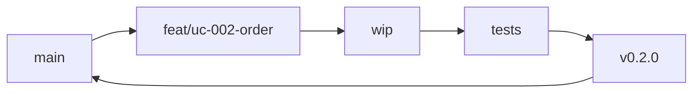
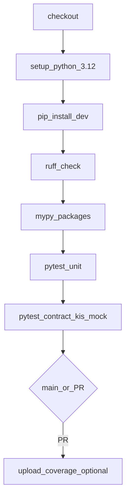
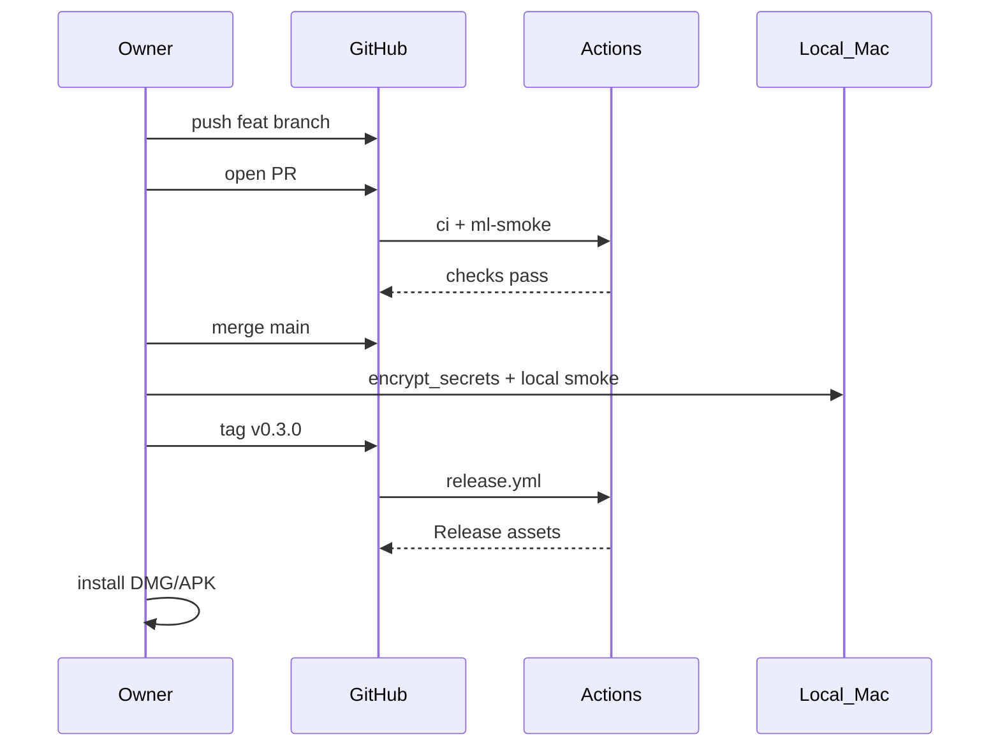

# OPS-001 — GitHub CI/CD 설계

| 항목 | 내용 |
|------|------|
| TraceID | OPS-001 |
| 버전 | 0.1 |
| ADR | [ADR-008](../adr/ADR-008-github-cicd-devops-mlops.md) |

---

## 1. 목표·범위

| 포함 | 제외 |
|------|------|
| PR/`main` 자동 검증(lint, test, 계약, ML smoke) | KIS **live** 주문·실계좌 E2E |
| 태그 기반 릴리스 아티팩트 업로드(선택) | 스토어 공개 배포·다인 SaaS |
| 워크플로·브랜치·시크릿 정책 정의 | 평문 API 키를 repo/Secrets에 저장 |

---

## 2. 저장소·브랜치 전략

| 브랜치 | 용도 | 병합 대상 | CI |
|--------|------|-----------|-----|
| `main` | 정본·릴리스 가능 상태 | — | `ci` + `ml-smoke` 필수 |
| `feat/*`, `fix/*`, `docs/*` | 기능·수정 | `main` via PR | 동일 |
| `release/*` (선택) | 릴리스 안정화 | `main` | + 수동 smoke |
| 태그 `v*.*.*` | 배포 스냅샷 | `main` 상 커밋 | `release` 워크플로 |

**`main` 보호 규칙(GitHub Settings 권장)**

- PR 필수, force-push 금지
- Required checks: `ci / validate`, `ml-smoke / validate`
- 리뷰: 솔로 프로젝트이므로 **self-merge 허용**, 단 checks 통과 필수

---

## 3. 워크플로 목록

구현 시 `.github/workflows/` 에 아래 3개를 둔다.

| 파일 | 트리거 | 러너 | 목적 |
|------|--------|------|------|
| `ci.yml` | `pull_request`, `push`→`main` | `ubuntu-latest` | Python lint·type·unit·kis mock |
| `ml-smoke.yml` | `pull_request`, `push`→`main`, `paths`: `ml_pipeline/**`, `packages/**` | `ubuntu-latest` | 합성 데이터로 train 1 epoch·export·메트릭 파일 존재 |
| `release.yml` | `workflow_dispatch`, `push` tags `v*` | `ubuntu-latest` (+ 선택 `macos-latest`) | 버전 태깅·휠/소스 dist·릴리스 노트 초안 |

### 3.1 `ci.yml` — 상세 단계

| Job | 단계 | 실패 시 |
|-----|------|---------|
| `validate` | `ruff check .` | PR 병합 차단 |
| | `mypy packages/ yst_ui/ trading_modes/` (경로는 구현 시 조정) | 동일 |
| | `pytest tests/unit tests/contract -m "not live"` | 동일 |
| | `KIS_PROFILE=paper` **mock server**만 — [ADR-006](../adr/ADR-006-personal-credentials-encryption.md) | 실키 주입 금지 |

**마커(pytest)**

- `@pytest.mark.live` — 로컬 전용, CI에서 `-m "not live"` 제외
- `@pytest.mark.integration` — paper + 오너 `~/.YSTrading/` 필요, CI 제외

### 3.2 `ml-smoke.yml` — 상세 단계

| 단계 | 명령(개념) | 검증 |
|------|------------|------|
| 합성 코퍼스 생성 | `python -m ml_pipeline.tools.make_synthetic_corpus` | Parquet 존재 |
| 시퀀스 빌드 | `build_sequences.py --max-rows 1000` | shape assert |
| 학습 smoke | `train_rnn_personal.py --epochs 1 --cpu` | `metrics.json` |
| 아티팩트 | `artifacts/models/rnn_personal/smoke/` | `model.pt` + `metadata.json` |
| 게이트 | `data_hash`, `schema_version` 필드 존재 | 스크립트 exit 0 |

실제 대용량 학습·하이퍼튜닝은 **로컬** ([OPS-002](OPS-002-devops-mlops.md) §MLOps).

### 3.3 `release.yml` — 상세 단계

| 단계 | macOS | Android |
|------|-------|---------|
| 버전 | `VERSION` from tag | `versionName` 동기 |
| 자격증명 | **로컬** `encrypt_secrets` 후 `resources/secrets.enc` 커밋 **또는** dispatch 입력으로 enc 업로드(비권장) | `android/.../assets/secrets.enc` 동일 blob |
| 빌드 | GHA `macos-latest`: PyInstaller **또는** 아티팩트 없이 소스만 | `gradle assembleRelease` (JDK 17) |
| 산출 | GitHub Release에 `.dmg`/`.zip` 첨부 | `.apk` 첨부 |
| 서명 | Apple Developer ID — **로컬 notarize** (문서화만) | keystore — **GitHub Encrypted Secret** `ANDROID_KEYSTORE_BASE64` 등 |

**원칙**: 릴리스 워크플로는 **주문 API를 호출하지 않는다**. 빌드·패키징만.

---

## 4. GitHub Secrets·Variables

| 이름 | 용도 | 필수 |
|------|------|------|
| *(기본 없음)* | KIS app_key/secret **저장 안 함** | — |
| `ANDROID_KEYSTORE_BASE64` | APK 서명(선택) | Android 릴리스 시 |
| `ANDROID_KEY_ALIAS` 등 | Gradle signing | 동일 |
| `GITHUB_TOKEN` | 기본 제공 | Release upload |

Repository **Variables** (비밀 아님):

| 이름 | 예 |
|------|-----|
| `PYTHON_VERSION` | `3.12` |
| `DEFAULT_KIS_MOCK_PORT` | `18080` |

---

## 5. 품질 게이트(merge 조건)

| 게이트 | 도구 | 임계값(v1) |
|--------|------|------------|
| Lint | ruff | 0 error |
| Types | mypy | strict packages 핵심 모듈 |
| Unit | pytest | 100% pass |
| Contract | httpx + mock KIS | OpenAPI/핸들러 스냅샷 |
| ML smoke | custom | 1 epoch loss finite, 메타 필드 |
| Coverage (선택) | pytest-cov | ≥ 60% packages (로드맵) |

---

## 6. 아티팩트·캐시

| GHA artifacts | 보존 | 내용 |
|---------------|------|------|
| `coverage-xml` | 7일 | PR 코멘트용(선택) |
| `ml-smoke-model` | 14일 | smoke `model.pt` |
| `release-macos` | 90일 | DMG/ZIP |
| `release-apk` | 90일 | APK |

**캐시**: `actions/cache` — pip `~/.cache/pip`, Gradle `~/.gradle/caches`.

---

## 7. PR·릴리스 운영 흐름

---

## 8. 구현 체크리스트(코드 단계)

- [ ] `.github/workflows/ci.yml`
- [ ] `.github/workflows/ml-smoke.yml`
- [ ] `.github/workflows/release.yml`
- [ ] `tests/contract/kis_mock_server.py`
- [ ] `ml_pipeline/tools/make_synthetic_corpus.py`
- [ ] `docs/operations/OPS-001` ↔ 실제 job 이름 일치

---

## 9. 관련 문서

- [OPS-002-devops-mlops.md](OPS-002-devops-mlops.md)
- [DEP-001-deployment.md](../DEP-001-deployment.md)
- [secrets/README.md](../../secrets/README.md)
