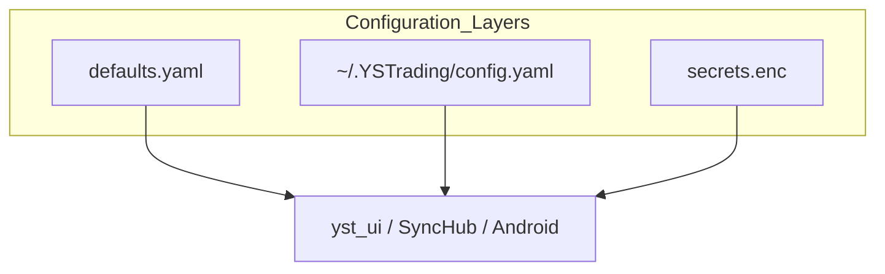
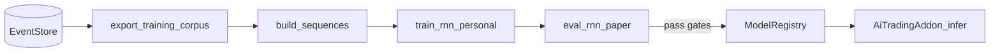
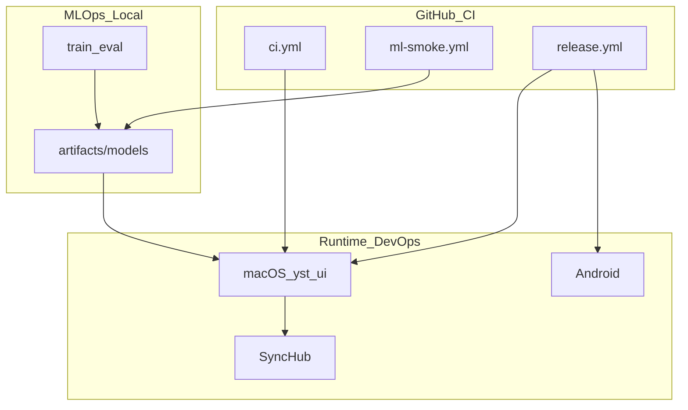

# OPS-002 — DevOps · MLOps 적용 설계

| 항목 | 내용 |
|------|------|
| TraceID | OPS-002 |
| 버전 | 0.1 |
| ADR | [ADR-008](../adr/ADR-008-github-cicd-devops-mlops.md) |

본 문서는 **개인 단독** YSTrading에 맞춘 **실행 가능한** DevOps·MLOps 절차이다. 엔터프라이즈 Kubernetes·멀티 테넌트 SaaS는 **범위 밖**이다.

---

## Part A — DevOps

### A.1 DevOps 범위 정의

| 관심사 | YSTrading 적용 |
|--------|----------------|
| Build | GitHub Actions + 로컬 PyInstaller/Gradle |
| Test | CI mock; paper 통합은 로컬 |
| Release | Git tag → GitHub Release → 수동 설치 |
| Operate | macOS 앱 + SyncHub + Android; **단일 오너** |
| Monitor | 로컬 로그·SQLite 메트릭; Datadog 등 **해당 없음(v1)** |
| Respond | 롤백=이전 앱 버전 + 이전 `model` 버전 |

### A.2 환경 모델

| 환경 ID | 실행 위치 | KIS | 용도 |
|---------|-----------|-----|------|
| `local-dev` | 오너 Mac | paper(수동) | 일상 개발 |
| `ci` | GHA ubuntu | **mock only** | 회귀 |
| `paper-runtime` | Mac/Android | paper API | 모의 매매·AI 검증 |
| `live-runtime` | Mac/Android | live API | 실매매(승인·RiskGuard) |
| `release` | 설치된 빌드 | 오너 선택 프로필 | 배포 산출물 |

**전환**: 앱 내 `KisProfile` 스왑 — [ARC-002](../architecture/ARC-002-deployment.md) §3.

### A.3 구성·비밀 (DevOps)



| 계층 | 경로 | Git |
|------|------|-----|
| 기본값 | `config/defaults.yaml` | 추적 |
| 사용자 | `~/.YSTrading/config.yaml` | 무시 |
| 비밀 | `secrets.enc`, Android assets | enc만 추적 가능; 평문 금지 |
| 빌드 | `VERSION`, `pyproject.toml` | 추적 |

### A.4 관측(Observability) v1

| 신호 | 저장 | 보존 |
|------|------|------|
| 앱 로그 | `~/.YSTrading/logs/yst_{date}.log` | 30일 로테이션 |
| 감사 | EventStore `audit_events` | append-only |
| SyncHub | uvicorn access log | 7일 |
| 헬스 | `GET /healthz` (Hub), GUI 내부 tick | — |

**최소 알람(수동)**: live 주문 실패 연속 N회 → 로그 ERROR + (선택) macOS 알림.

**향후**: ASR 위반·RiskGuard 트립을 동일 로그 채널에 구조화(JSON line).

### A.5 릴리스·변경 관리

| 변경 유형 | 절차 |
|-----------|------|
| 앱 패치 | PR → `main` → tag → Release → 로컬 설치 |
| DB 스키마 | `migrations/` 순번 적용; 앱 기동 시 자동 migrate |
| `secrets.enc` | KIS 키 로테이션 시 재암호화 → 앱 재빌드 ([ADR-006](../adr/ADR-006-personal-credentials-encryption.md)) |
| Hotfix | `fix/*` from `main` → 동일 tag 정책 |

### A.6 롤백 (DevOps)

| 대상 | 롤백 | 금지 |
|------|------|------|
| macOS 앱 | 이전 DMG 재설치; `~/.YSTrading` 유지 | DB migrate **다운그레이드** 없이 구버전 실행 |
| Android | 이전 APK sideload | — |
| Hub | 이전 wheel/소스 checkout | — |
| 설정 | `config.yaml.bak` 복원 | — |

**DB**: migrate 실패 시 앱 기동 중단; 백업 `~/.YSTrading/backups/events_YYYYMMDD.db` (주 1회 cron 또는 수동).

### A.7 DevOps와 CI 연동

| 이벤트 | DevOps 동작 |
|--------|-------------|
| PR merge | `main` HEAD = 다음 릴리스 후보 |
| Tag push | Release 노트·아티팩트; [OPS-001](OPS-001-github-cicd.md) |
| CI red | live/paper 설치 **금지** |

---

## Part B — MLOps

### B.1 MLOps 범위 (UC-007 · ADR-002)

| 단계 | 책임 컴포넌트 | 산출 |
|------|---------------|------|
| Collect | `FeatureSnapshotter`, EventStore | Tier3 이벤트 |
| Export | `export_training_corpus` | Parquet |
| Transform | `build_sequences.py` | train/val/test splits |
| Train | `train_rnn_personal.py` | `model.pt`, `metrics.json` |
| Evaluate | `eval_rnn_paper.py` | 승인률·혼동행렬·PnL proxy |
| Register | `ModelRegistry` (파일) | `artifacts/models/rnn_personal/{version}/` |
| Deploy | `AiTradingAddon` | active version pointer |
| Monitor | 월간 drift job | `reports/drift_YYYYMM.json` |

### B.2 디렉터리·버전 규칙

```
artifacts/
  models/rnn_personal/
    20260602-001/
      model.pt
      metadata.json      # schema_version, data_hash, git_sha, metrics
      metrics.json
  datasets/
    corpus_20260602.parquet   # 선택: Git LFS 또는 로컬만
```

| 필드 | 의미 |
|------|------|
| `version` | `YYYYMMDD-NNN` (당일 순번) |
| `data_hash` | export Parquet SHA256 |
| `schema_version` | 피처 스키마 ([DOM-001](../domain/DOM-001-model.md)) |
| `git_sha` | 학습 시 커밋 |
| `promotion_stage` | `candidate` → `paper` → `live` |

**Git LFS**: 코퍼스 >50MB 시 `artifacts/datasets/*.parquet` LFS; **모델은 Release/로컬** 우선(GHA artifact 보조).

### B.3 MLOps 파이프라인 (오프라인)



### B.4 품질 게이트 (승격)

| Gate | `candidate` → `paper` | `paper` → `live` |
|------|----------------------|------------------|
| walk-forward | 필수 (ASR-007) | 필수 |
| val loss | < baseline_hold | 동일 |
| paper 백테스트 | 7일 이상 시뮬 | 14일 + 오너 확인 |
| 승인 게이트 | UC-006 dry-run | **ADR-004** 기본 Off 유지 |
| drift | — | KS p-value 기록 ([AIQ-001](../AIQ-001-ai_quality_profile.md)) |

**자동 live 승격 없음** — 오너가 `config.yaml` `ml.active_version` 수동 설정 또는 UI 「모델 적용」.

### B.5 CI vs 로컬 MLOps

| 작업 | CI (`ml-smoke`) | 로컬 |
|------|-----------------|------|
| 합성 1 epoch | ✅ | — |
| 실데이터 export | ❌ | ✅ |
| full train | ❌ | ✅ |
| paper eval | ❌ | ✅ |
| drift report | ❌ | ✅ (cron `launchd`) |

### B.6 MLOps 메타데이터 스키마 (`metadata.json`)

```json
{
  "version": "20260602-001",
  "model_type": "lstm_bc",
  "schema_version": 1,
  "data_hash": "sha256:…",
  "git_sha": "abc123",
  "train_window": { "start": "2024-01-01", "end": "2026-05-01" },
  "metrics": { "val_loss": 0.42, "val_acc": 0.55 },
  "promotion_stage": "candidate",
  "created_at": "2026-06-02T12:00:00Z"
}
```

### B.7 재현성·실험 추적

| 요구 | 구현 |
|------|------|
| NFR-04 | `git_sha` + `data_hash` + 고정 seed in `train_rnn_personal.py` |
| 실험 비교 | `experiments/{run_id}/` 로컬; MLflow **v2 후보** |
| CI 재현 | 합성 seed=42 고정 |

### B.8 모니터링 (ML 운영)

| 지표 | 주기 | 조치 |
|------|------|------|
| inference latency | 실시간 로그 | >500ms 경고 |
| HOLD 비율 | 일 | >95% → 모델 점검 |
| 승인률/거부율 | 주 | AIQ 대시보드(로컬 HTML) |
| feature drift | 월 | 재학습 후보 알림 |

### B.9 실패·침묵 실패 ([AIQ-001](../AIQ-001-ai_quality_profile.md))

| 증상 | 탐지 | 대응 |
|------|------|------|
| HOLD만 반복 | 24h 통계 | `active_version` 이전으로 롤백 |
| 저신뢰 제안 숨김 | confidence < θ 로그 | threshold 조정 |
| 추론 예외 | try/except → HOLD + audit | 알림 |

---

## Part C — DevOps × MLOps × GitHub 통합 뷰



---

## Part D — 구현 로드맵

| 순서 | 항목 | 패키지/경로 |
|------|------|-------------|
| 1 | mock KIS + contract tests | `tests/contract/` |
| 2 | `ml_pipeline` smoke corpus | `ml_pipeline/tools/` |
| 3 | `ModelRegistry` read/write | `ml_pipeline/registry.py` |
| 4 | GHA workflows | `.github/workflows/` |
| 5 | paper eval CLI | `scripts/eval_rnn_paper.py` |
| 6 | drift batch | `scripts/ml_drift_report.py` |

---

## 관련

- [OPS-001-github-cicd.md](OPS-001-github-cicd.md)
- [UC-007](../usecase/UC-007-rnn-training-data.md)
- [ADR-002](../adr/ADR-002-rnn-personal-model.md)
- [DEP-001-deployment.md](../DEP-001-deployment.md)
