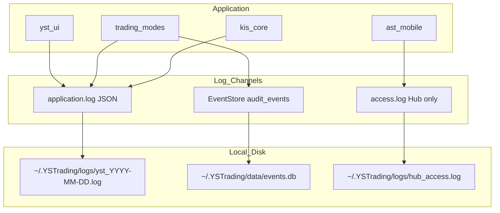
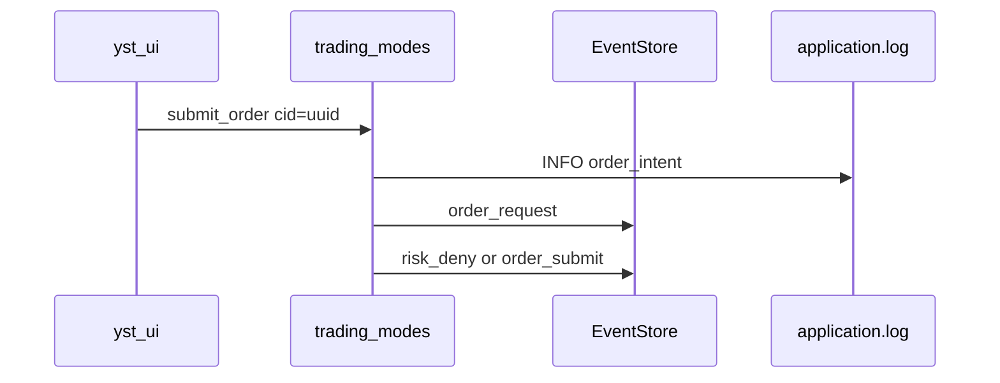
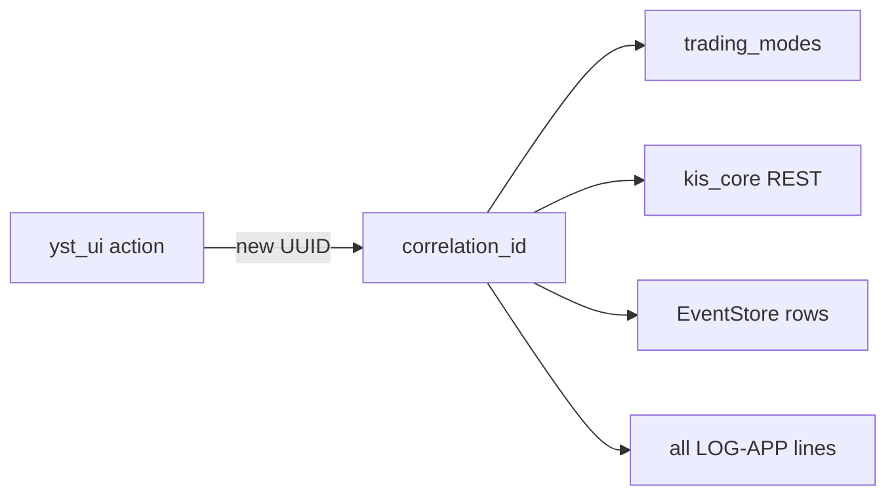

# OPS-003 — 로깅·관측(Observability) 설계

| 항목 | 내용 |
|------|------|
| TraceID | OPS-003 |
| 버전 | 0.1 |
| NFR | NFR-SEC-01 (QS-009), NFR-R-01, [QLT-002](../QLT-002-commercial-quality-baseline.md) |
| 연동 | [ARC-004](../architecture/ARC-004-resilience-security-crosscut.md), [OPS-004](OPS-004-debugging-issue-intake.md) |

개인 단독 앱 v1: **중앙 SaaS 로그 수집 없음**. 로컬 파일·EventStore·구조화 JSON line이 정본이다.

---

## 1. 목표

| 목표 | 설명 |
|------|------|
| **감사** | 주문·승인·체결·거부는 EventStore 정본 ([QS-018](../quality/QS-018-audit-trail.md)) |
| **운영** | 장애·KIS 오류·WS 단절을 **재현 가능**하게 남김 |
| **보안** | 시크릿·계좌번호·PII **마스킹** (QS-009) |
| **디버깅** | `correlation_id`로 UI→TM→kis 한 흐름 추적 ([OPS-004](OPS-004-debugging-issue-intake.md)) |

---

## 2. 로그 채널 (3계층)



| 채널 | ID | 내용 | 정본 여부 |
|------|-----|------|-----------|
| **Application** | `LOG-APP` | 기술·연동·성능 이벤트 | 운영 디버깅 |
| **Audit** | `LOG-AUD` | 비즈니스·규제 추적 이벤트 | **법적·분쟁 정본** |
| **Access** | `LOG-ACC` | SyncHub HTTP 요청 | 보안·LAN 디버깅 |

**원칙**: 주문·승인 판단은 **Audit만** 신뢰. Application 로그는 보조.

---

## 3. Application 로그 (LOG-APP)

### 3.1 포맷

- **한 줄 = 한 JSON 객체** (JSON Lines, UTF-8)
- 필수 필드:

| 필드 | 타입 | 설명 |
|------|------|------|
| `ts` | ISO8601 ms | UTC 또는 `Asia/Seoul` 고정(설정) |
| `level` | string | DEBUG, INFO, WARN, ERROR |
| `logger` | string | `kis_core.ws`, `trading_modes.order` |
| `msg` | string | 짧은 영문 snake 또는 한글 운영 문구 |
| `correlation_id` | UUID? | UC 경로에 있으면 **필수** |
| `component` | string | `yst_ui`, `trading_modes`, `kis_core`, `ml_pipeline`, `ast_mobile` |
| `profile` | string? | `paper` / `live` |
| `symbol` | string? | 종목 |
| `duration_ms` | int? | REST/규칙 체인 |
| `error_code` | string? | `KIS_401`, `CB_OPEN`, `RG_DENY` |
| `extra` | object? | 비민감 key-value |

예시:

```json
{"ts":"2026-06-02T14:03:01.123+09:00","level":"WARN","logger":"kis_core.ws","msg":"ws_silent_fallback","correlation_id":null,"component":"kis_core","extra":{"silent_sec":3.2,"action":"start_rest_poll"}}
```

### 3.2 레벨 정책

| 레벨 | 사용 |
|------|------|
| DEBUG | 개발·`config.logging.level=DEBUG` |
| INFO | 정상 비즈니스(연결 성공, 학습 완료) |
| WARN | 폴백·재시도·승인 만료 임박 |
| ERROR | 사용자 영향 실패(주문 거부 제외 — RG deny는 INFO+audit) |

### 3.3 마스킹 (QS-009)

`logging.SensitiveFilter` — 로그 **출력 전** 적용:

| 패턴 | 동작 |
|------|------|
| `appkey`, `appsecret`, `access_token` | `[REDACTED]` |
| 계좌번호 8~12자리 | 마지막 4자만 |
| `crtfc_key`, `Authorization:` | 전체 redact |

**금지**: 요청/응답 body 전체 덤프(기본 Off). `logging.dump_kis_response=true`는 **개발 전용**.

### 3.4 로테이션

| 항목 | 값 |
|------|-----|
| 경로 | `~/.YSTrading/logs/yst_{date}.log` |
| 로테이션 | 자정 또는 50MB |
| 보존 | 30일 ([OPS-002](OPS-002-devops-mlops.md) A.4) |
| 압축 | `.log.gz` (선택, 7일 이상) |

---

## 4. Audit 로그 (LOG-AUD) — EventStore

### 4.1 이벤트 타입

| `event_type` | 발생처 | 필수 필드 |
|--------------|--------|-----------|
| `order_request` | OrderService | side, qty, symbol, profile, `client_order_id` |
| `order_submit` | kis_core 응답 | `client_order_id`, broker_id? |
| `fill` | 체결 콜백 | price, qty |
| `ai_proposal` | AiAddon | model_version, confidence |
| `ai_approval` | ApprovalGate | approve / reject / defer |
| `risk_deny` | RiskGuard | rule_id, reason |
| `training_snapshot` | FeatureSnapshotter | example_id (PII 없음) |

모든 행: `correlation_id`, `ts`, `source_uc`, `schema_version`.

### 4.2 Application vs Audit



---

## 5. SyncHub Access 로그 (LOG-ACC)

| 항목 | 값 |
|------|-----|
| 형식 | uvicorn combined + `X-Session-Token` **해시 8자**만 |
| 경로 | `~/.YSTrading/logs/hub_access.log` |
| 보존 | 7일 |
| 401/403 | WARN + `pairing_failed` 카운터 |

---

## 6. correlation_id 전파



| 규칙 | 설명 |
|------|------|
| 생성 | 사용자 주문·승인·AI 제안 **1 액션 = 1 UUID** |
| 전파 | `contextvars` / `CorrelationContext` (Python) |
| Hub | Android 요청 헤더 `X-Correlation-Id` (선택, 있으면 유지) |
| UI | 오류 다이얼로그에 「주문 번호: {short}」= correlation_id 앞 8자 |

---

## 7. 패키지별 로깅 책임

| 패키지 | logger root | 대표 이벤트 |
|--------|-------------|-------------|
| `yst_ui` | `yst_ui` | 화면 전환, 사용자 확인 |
| `trading_modes` | `trading_modes.*` | 모드 평가, RG 결과 |
| `kis_core` | `kis_core.*` | OAuth, WS, CB state, TR id |
| `ml_pipeline` | `ml_pipeline` | inference ms, model_version |
| `data_ingestion` | `data_ingestion` | SRC-ID, fetch ok/fail |
| `ast_mobile` | `ast_mobile` | pair, session refresh |

**구현**: `packages/yst_logging/` (공통 `configure_logging()`, filter, context).

---

## 8. 설정 (`config/defaults.yaml`)

```yaml
logging:
  level: INFO
  dir: "~/.YSTrading/logs"
  json_lines: true
  mask_secrets: true
  dump_kis_response: false
  correlation_header: true
```

---

## 9. 헬스·메트릭 (v1 최소)

| 신호 | 노출 | 로그 연계 |
|------|------|-----------|
| Hub alive | `GET /healthz` | 200 → access log |
| WS connected | GUI status bar | `kis_core.ws` INFO |
| CB state | 내부 enum | ERROR on OPEN |
| 마지막 tick | `MarketSnapshotCache` | WARN on stale |

Datadog/Prometheus는 **v2** ([OPS-002](OPS-002-devops-mlops.md)).

---

## 10. 검증

| 테스트 | 기대 |
|--------|------|
| 주문 1건 | Audit 3행+ ; APP에 동일 `correlation_id` |
| live 로그 grep appsecret | 0건 |
| WS 3s 단절 | WARN `ws_silent_fallback` |

---

## 변경 이력

| 날짜 | 내용 |
|------|------|
| 2026-06-02 | v0.1 — LOG-APP/AUD/ACC, correlation, 마스킹 |
