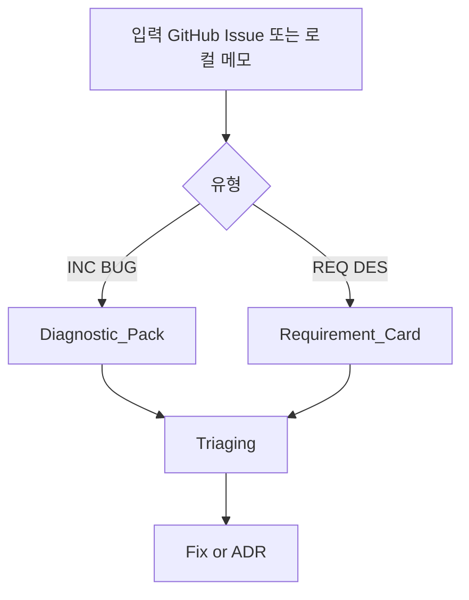
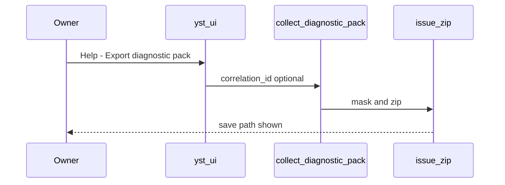
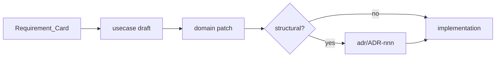
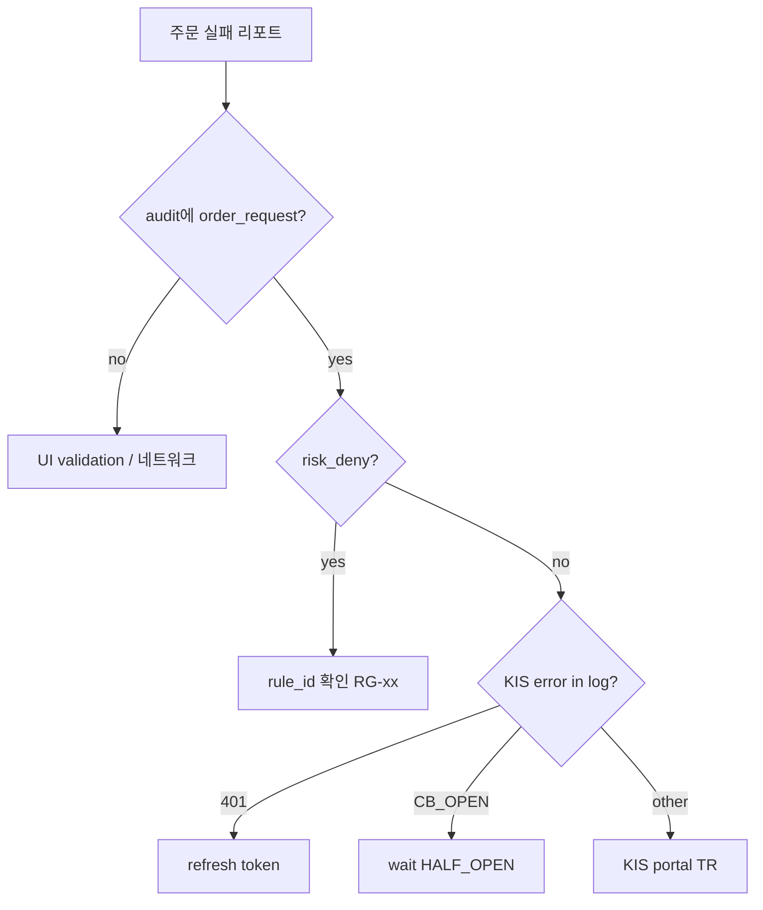

# OPS-004 — 이슈·요구 수집 및 디버깅 설계

| 항목 | 내용 |
|------|------|
| TraceID | OPS-004 |
| 버전 | 0.1 |
| 로깅 정본 | [OPS-003](OPS-003-logging-observability.md) |
| 배포 | [DEP-001](../DEP-001-deployment.md) |

**목적**: 버그·장애·추가 요구가 생겼을 때 **무엇을 수집**하고, **어떤 순서로** 원인을 좁혀 재현·수정하는지 정의한다.

---

## 1. 이슈 유형 분류

| 유형 | 코드 | 예 | 1차 수집 |
|------|------|-----|----------|
| **장애** | `INC` | 주문 실패, 앱 크래시 | 로그+audit+재현 단계 |
| **결함** | `BUG` | UI 오표시, 잘못된 라벨 | 스크린+버전 |
| **요구 추가** | `REQ` | 새 지표, 화면 필드 | 시나리오+우선순위 |
| **설계 질문** | `DES` | 모드 경계, 정책 | 관련 UC·ADR 링크 |
| **데이터** | `DATA` | 시세 지연, 학습 실패 | Tier·SRC-ID·ETL 로그 |



---

## 2. 정보 수집 — Diagnostic Pack

오너·에이전트가 이슈 리포트 시 **아래 번들**을 만든다. 스크립트: `scripts/collect_diagnostic_pack.py` (구현 예정).

### 2.1 필수 메타

| 필드 | 출처 | 예 |
|------|------|-----|
| `app_version` | `VERSION` / About | `0.3.1` |
| `git_sha` | 빌드 시 embed | `abc1234` |
| `profile` | 실행 중 | `paper` / `live` |
| `platform` | OS | `macOS 15.x` / `Android 14` |
| `correlation_id` | 오류 다이얼로그 | UUID |
| `occurred_at` | 사용자 입력 | KST |

### 2.2 자동 수집 파일

| 파일 | 경로 | 마스킹 |
|------|------|--------|
| Application 로그 | 최근 24h `yst_*.log` | OPS-003 필터 적용본 |
| Hub access | `hub_access.log` | 토큰 해시만 |
| Audit excerpt | EventStore by `correlation_id` | SQL export JSON |
| Config redacted | `config.yaml` | 키 이름만, 값 redact |
| WS/KIS 상태 | `health_snapshot.json` | CB, last_tick, profile |

### 2.3 수동 첨부 (권장)

| 항목 | 형식 |
|------|------|
| 재현 단계 | 1,2,3… (모드·화면 ID) |
| 스크린샷 | SCR-* ID 명시 |
| 기대 vs 실제 | 2문장 |

### 2.4 산출물

```text
~/.YSTrading/diagnostics/issue_{YYYYMMDD}_{shortid}.zip
  manifest.json
  logs/
  audit/
  health_snapshot.json
  README.txt  # 재현 단계 (사용자 편집)
```



---

## 3. 요구사항 추가 — Requirement Card

설계 변경이 필요한 **REQ/DES**는 GitHub Issue 본문에 다음 템플릿을 쓴다 (`.github/ISSUE_TEMPLATE/requirement.yml` 예정).

| 섹션 | 내용 |
|------|------|
| **배경** | 왜 필요한가 (BUS 목표 링크) |
| **사용자 스토리** | As … I want … So that … |
| **화면** | SCR-* ID ([UI-001](../ui/UI-001-storyboards-shell-common.md) 등) |
| **UC** | 신규 / 기존 UC-xxx 확장 |
| **품질** | QS / NFR 영향 |
| **비범위** | 하지 않을 것 |
| **우선순위** | P0~P2 |

**흐름**: REQ → HUB 또는 UC 초안 → 오너 확인 → ADR(구조적이면) → 구현.



---

## 4. 디버깅 플레이북 (유형별)

### 4.1 주문·승인 실패 (`INC`)

| 단계 | 행동 | 기대 |
|------|------|------|
| 1 | `correlation_id`로 Audit 조회 | `order_request` → `risk_deny` or `order_submit` |
| 2 | 동일 id APP 로그 grep | KIS TR, CB, 401 |
| 3 | `profile` paper vs live 확인 | 혼선 ASR-002 |
| 4 | RG-07 stale | `as_of` > 5s? |
| 5 | KIS 장 상태·TR 한도 | 외부 |



### 4.2 시세 지연·끊김 (`INC` / `DATA`)

| 단계 | 행동 |
|------|------|
| 1 | UI Tier 배지·`collected_at` |
| 2 | 로그 `ws_silent_fallback`, `rest_poll_started` |
| 3 | [CND-004](../candidate/CND-004-performance-realtime.md) MIT-PERF |
| 4 | Hub 사용 시 `seq` gap → full snapshot |

### 4.3 AI·RNN (`INC` / `DATA`)

| 단계 | 행동 |
|------|------|
| 1 | `model_version`, `confidence` in audit |
| 2 | `ai_auto_without_approval` 설정값 |
| 3 | `artifacts/models/.../metrics.json` |
| 4 | [DAT-002](../data/DAT-002-rnn-training-collection-flow.md) 최소 샘플 |

### 4.4 Android SyncHub (`INC`)

| 단계 | 행동 |
|------|------|
| 1 | Hub `/healthz`, 맥 슬립 여부 |
| 2 | 페어링·`X-Session-Token` 401 |
| 3 | `hub_access.log` |
| 4 | [CND-001](../candidate/CND-001-android-sync.md) MIT-HUB |

### 4.5 크래시 (`INC`)

| 항목 | 수집 |
|------|------|
| macOS | `~/Library/Logs/DiagnosticReports/` 해당 시간 |
| Python | traceback in `yst_*.log` ERROR |
| Android | logcat excerpt (개발 빌드) |

---

## 5. 개발·CI 디버깅

| 환경 | 원칙 |
|------|------|
| `local-dev` | `logging.level=DEBUG`; paper only |
| `ci` | mock KIS; 로그 artifact upload 7일 |
| live | **Diagnostic Pack에 live audit 포함 시 주의** — export 기본 **paper-only** |

CI 실패 시: Actions 로그 + `correlation_id` 없으면 테스트 name으로 Audit fixture 조회.

---

## 6. GitHub Issue·PR 연계

| 라벨 | 용도 |
|------|------|
| `incident` | INC |
| `bug` | BUG |
| `enhancement` | REQ |
| `design` | DES |
| `needs-diagnostic-pack` | zip 미첨부 |

PR 본문: `Fixes #nnn`, **재현·검증** 체크리스트 ([OPS-001](OPS-001-github-cicd.md)).

**Traceability**: PR → UC / QS / ADR 링크 한 줄.

---

## 7. 에이전트(Cursor) 협업 규칙

| 상황 | 에이전트 행동 |
|------|----------------|
| 버그 리포트 | `collect_diagnostic_pack` 또는 수동 동일 파일 요청 |
| 원인 불명 | 플레이북 §4 해당 트리 따름; **추측 구현 금지** |
| REQ | Requirement Card 초안 → 오너 확인 후 UC/ADR |
| 설계 변경 | `docs/` only; [REG-001](../REG-001-trace-registry.md) TraceID |

---

## 8. 설정 UI 연동

[UI-003](../ui/UI-003-storyboards-system-android.md) SCR-SETTINGS:

| 위젯 | 동작 |
|------|------|
| `export_diagnostic_btn` | Pack zip 저장 대화상자 |
| `open_logs_folder_btn` | `~/.YSTrading/logs` |
| `log_level_combo` | DEBUG (재현 후 INFO 복귀 권고) |

---

## 변경 이력

| 날짜 | 내용 |
|------|------|
| 2026-06-02 | v0.1 — Diagnostic Pack, 플레이북, REQ 카드 |
