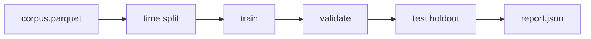

# OPS-005 — 백테스트·paper 검증 절차

| 항목 | 내용 |
|------|------|
| TraceID | OPS-005 |
| 버전 | 0.1 |
| ADR | [ADR-010](../adr/ADR-010-open-ml-data-and-crossmodal-training.md) #6 |
| MLOps | [OPS-002](OPS-002-devops-mlops.md) B.4 |

오너 피드백: FinRL-X **전체 스택 미도입**, **절차·메트릭**만 표준화.

---

## 1. 목적

| 목표 | 설명 |
|------|------|
| 재현 | 동일 `data_hash`·`git_sha`에서 동일 결과 |
| 안전 | live 승격 **전** paper·시뮬 필수 |
| 비교 | HOLD·단순 MA 베이스라인 대비 |

---

## 2. 백테스트 유형

| ID | 이름 | 입력 | 용도 |
|----|------|------|------|
| BT-01 | **Walk-forward ML** | corpus, model | val/test IC, 혼동행렬 |
| BT-02 | **Policy paper sim** | paper API, 제안 스트림 | 7~14일 승인·체결 |
| BT-03 | **Rule baseline** | bars_1d, MA crossover | 모델 대비 하한 |

---

## 3. BT-01 Walk-forward (오프라인)

| 단계 | 명령 (개념) | 산출 |
|------|-------------|------|
| 1 | `build_sequences --walk-forward` | train/val/test npz |
| 2 | `train_rnn_personal` | model.pt |
| 3 | `eval_offline --split test` | `reports/bt01_{version}.json` |

| 메트릭 | 게이트 (paper) |
|--------|----------------|
| val_loss | < baseline_hold |
| test accuracy | 기록만 (과적합 감시) |
| BUY/SELL recall | 각 > 0.25 (데이터 충분 시) |

**금지**: test 구간으로 하이퍼파라미터 튜닝.

---

## 4. BT-02 Paper 시뮬레이션

| 항목 | 값 |
|------|-----|
| 환경 | `paper-runtime` |
| 기간 | **≥7일** (candidate→paper), **≥14일** (paper→live) |
| 데이터 | KIS paper TR + 실제 ApprovalGate |
| 기록 | EventStore + 일별 PnL snapshot |

| 일일 체크 | |
|-----------|--|
| 제안 수·승인률 | |
| RG deny 비율 | |
| stale 차단 횟수 | |
| correlation_id 추적 가능 | |

산출: `reports/paper_sim_{YYYYMMDD}.json`

---

## 5. BT-03 베이스라인

| 베이스라인 | 규칙 |
|------------|------|
| HOLD | 항상 HOLD |
| MA cross | 5/20 일봉 (Tier0) |

모델 Sharpe(단순) **≤ 베이스라인**이면 `candidate` **승격 거부**.

---

## 6. FinRL-X 참고 (코드 비의존)

| 차용 | 미차용 |
|------|--------|
| weight-centric **리밸런싱 리포트** 형식 | Alpaca live |
| `bt` 엔진 **메트릭 이름** (Sharpe, MDD) | DRL trainer |

---

## 7. CI 연동

| Job | 범위 |
|-----|------|
| `ml-smoke` | 합성 1 epoch + BT-01 미니 |
| `main` nightly (선택) | BT-03 baseline only |

live 주문 **CI 금지** ([OPS-001](OPS-001-github-cicd.md)).

---

## 8. 체크리스트 (live 승격 전)

- [ ] BT-01 test 리포트 첨부
- [ ] BT-02 ≥14일 paper 로그
- [ ] `metadata.json` `promotion_stage` = paper
- [ ] 오너 UI 「모델 적용」 또는 config `ml.active_version`
- [ ] ADR-004 무승인 **Off** 확인

---

## 변경 이력

| 날짜 | 내용 |
|------|------|
| 2026-06-02 | v0.1 — 오너 #6 반영 |
