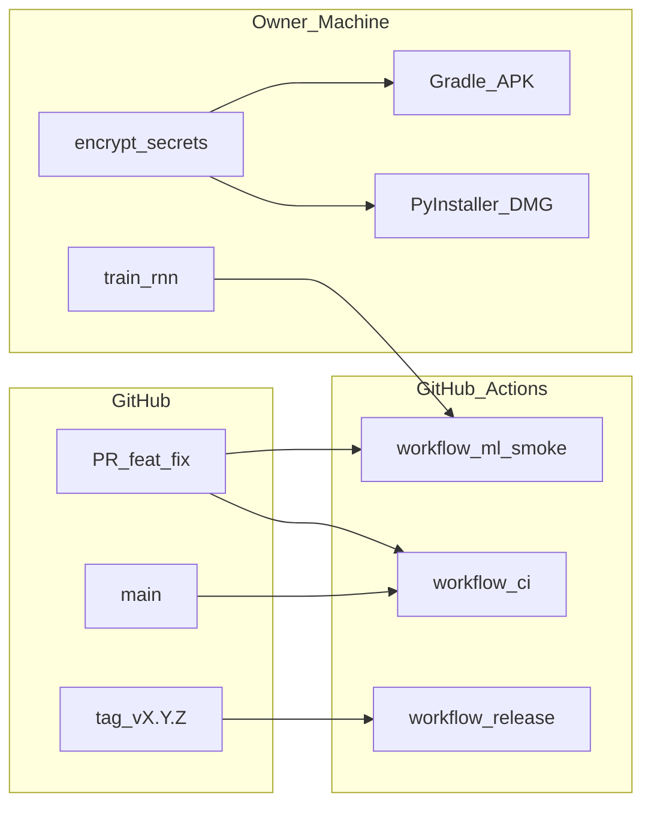

# 운영·CI/CD·MLOps 설계 (`docs/operations/`)

| 항목 | 내용 |
|------|------|
| TraceID | OPS-IDX-001 |

개인용 YSTrading의 **GitHub 기반 CI/CD**, **DevOps**, **MLOps** 상세 설계입니다. 배포·롤백·환경 정본은 [DEP-001-deployment.md](../DEP-001-deployment.md)를 따릅니다.

| TraceID | 문서 | 요약 |
|---------|------|------|
| OPS-001 | [OPS-001-github-cicd.md](OPS-001-github-cicd.md) | GitHub Actions 워크플로·브랜치·게이트·아티팩트 |
| OPS-002 | [OPS-002-devops-mlops.md](OPS-002-devops-mlops.md) | 관측·릴리스·롤백(DevOps) + 데이터·학습·승격(MLOps) |
| OPS-003 | [OPS-003-logging-observability.md](OPS-003-logging-observability.md) | 로깅 3계층·correlation·마스킹 |
| OPS-004 | [OPS-004-debugging-issue-intake.md](OPS-004-debugging-issue-intake.md) | Diagnostic Pack·디버깅 플레이북·REQ 카드 |
| OPS-005 | [OPS-005-backtest-procedure.md](OPS-005-backtest-procedure.md) | BT-01~03 백테스트·paper 검증 |
| ADR-008 | [../adr/ADR-008-github-cicd-devops-mlops.md](../adr/ADR-008-github-cicd-devops-mlops.md) | 도구체인 결정 |
| DEP-001 | [../DEP-001-deployment.md](../DEP-001-deployment.md) | 배포 11절 목차 |

