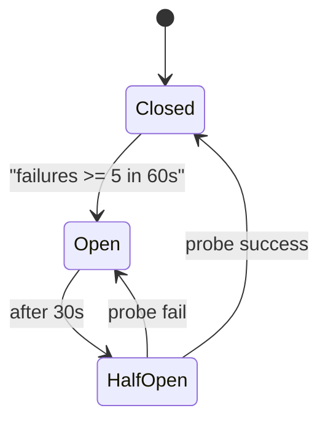

# REL-001 — SLO · 복원력 패턴

| 항목 | 내용 |
|------|------|
| TraceID | REL-001 |
| 버전 | 0.1 |
| ADR | [ADR-009](../adr/ADR-009-commercial-quality-security-baseline.md) |

---

## 1. SLO 정의

[QLT-002](../QLT-002-commercial-quality-baseline.md) §3과 동일. 측정은 **로컬 에이전트**가 `~/.YSTrading/metrics/` 에 일별 롤업(구현 예정).

| SLI | 계산 |
|-----|------|
| order_success_rate | `audit order_submit ok / attempts` |
| token_refresh_success | `token_refresh ok / 401` |
| quote_fresh_ratio | samples where `now - as_of <= 5s` |

---

## 2. Circuit Breaker (KIS)

| 상태 | 주문 | 시세 |
|------|------|------|
| Closed | 허용 | 허용 |
| Open | **거부**(명시 UI) | 캐시만 + 배지 |
| HalfOpen | paper만 probe | 제한 |

---

## 3. Retry 정책

| HTTP | 동작 |
|------|------|
| 401 | refresh 1회 → 동일 요청 1회 |
| 429 | Retry-After 존중, max 3, jitter |
| 5xx | backoff 0.5,1,2s, max 3 |
| 4xx(기타) | **no retry** |

**멱등**: POST 주문은 `client_order_id` 필수 — 재시도 시 동일 ID.

---

## 4. 시세·WS 폴백

| 단계 | 동작 |
|------|------|
| T+0 | WS disconnect 감지 |
| T+3s | REST 폴링 3s interval |
| T+60s | 사용자 알림 「실시간 연결 끊김」 |
| 복구 | WS reconnect → 폴링 중지 |

live 주문: `as_of` > **5s** → [ASR-019](../ASR-001-asr.md) 차단.

---

## 5. 데이터 내구성

| 항목 | 값 |
|------|-----|
| RPO | 24h (일 백업) |
| RTO | 15min (앱 재설치+DB 복원) |
| SQLite | WAL; `integrity_check` at startup |
| 미확정 주문 | 기동 시 `reconcile_open_orders()` |

---

## 6. 프로세스 헬스

| 컴포넌트 | probe |
|----------|-------|
| SyncHub | `GET /healthz` 5s interval |
| GUI | Qt event loop watchdog |
| 실패 | Hub 재시작 정책(수동); 로그 ERROR |

---

## 7. Degraded 모드

| 조건 | UX |
|------|-----|
| KIS CB OPEN | 주문 버튼 비활성 + 사유 |
| Hub down (Android) | 조회만; 「맥북 연결 필요」 |
| ML infer fail | HOLD + audit |
| DB corrupt | 기동 중단; 백업 복원 안내 |

---

## 8. 장애 대응 (Incident)

| 심각도 | 예 | 조치 |
|--------|-----|------|
| S1 | live 오주문 의심 | `live_trading_enabled=false`; KIS 주문 취소 |
| S2 | 토큰/키 유출 의심 | 키 폐기·rotate |
| S3 | Hub 침해 의심 | 토큰 전체 무효·재페어링 |
| S4 | KIS 장애 | degraded; 대기 |

---

## 9. 테스트

| 유형 | 도구 |
|------|------|
| 단위 | CB 상태 전이, retry |
| 통합 | mock KIS 5xx/401 시퀀스 |
| soak | paper 7일 체크리스트 |
| chaos (로드맵) | toxiproxy 네트워크 지연 |

---

## 관련

- [ARC-004](../architecture/ARC-004-resilience-security-crosscut.md)
- [DEP-001](../DEP-001-deployment.md) §5·§8
