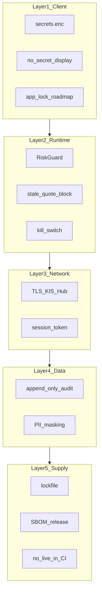

# SEC-001 — 위협 모델·보안 통제

| 항목 | 내용 |
|------|------|
| TraceID | SEC-001 |
| 버전 | 0.1 |
| ADR | [ADR-009](../adr/ADR-009-commercial-quality-security-baseline.md), [ADR-006](../adr/ADR-006-personal-credentials-encryption.md) |

**범위**: 개인 단독 앱; 스토어 공개·다인 테넌트 **비목표**. 그럼에도 **실계좌** 기준 통제를 정의한다.

---

## 1. 자산

| 자산 | 민감도 |
|------|--------|
| KIS app_key/secret, 계좌번호 | **최고** |
| OAuth access/refresh token | **최고** |
| EventStore(주문·체결·AI 이력) | **高** |
| ML 모델·학습 데이터 | **中** |
| 시세 캐시 | **低** |

---

## 2. STRIDE 요약

| 위협 | 예시 | 통제 (v1) |
|------|------|-----------|
| **S** Spoofing | LAN 가짜 Hub | 페어링 QR + `X-Session-Token` |
| **T** Tampering | DB·설정 변조 | WAL, integrity_check, append-only audit |
| **R** Repudiation | “주문 안 함” | audit_events + KIS 체결 대조 |
| **I** Info disclosure | 로그·APK 역공학 | 마스킹, `secrets.enc`, gitignore 평문 |
| **D** DoS | Hub/API 폭주 | rate limit, self throttle |
| **E** Elevation | Addon 직접 주문 | ASR-009, RiskGuard |

---

## 3. 통제 계층 (Defense-in-Depth)

---

## 4. 감사 로그 (금전)

| 필드 | 필수 |
|------|------|
| `event_id` | UUID |
| `ts_utc` | ISO8601 |
| `actor` | user / ai / system |
| `action` | order_submit, approve, deny, token_refresh, … |
| `profile` | paper / live |
| `symbol`, `side`, `qty`, `price` | 해당 시 |
| `client_order_id` | 주문 시 |
| `result` | ok / deny / error |
| `reason_code` | RG-xx, KIS-xx |
| `trace_id` | 상관 |

**정책**: UPDATE/DELETE **금지**(DB 트리거);보내기만 허용.

---

## 5. 비밀·키 수명

| 항목 | 정책 |
|------|------|
| 저장 | `secrets.enc` only ([ADR-006](../adr/ADR-006-personal-credentials-encryption.md)) |
| 메모리 | 기동 시 복호화; 종료 시 참조 해제(베스트 effort) |
| 로그 | 정규식 마스킹 `PS*`, Bearer, account 패턴 |
| Git | 평문·`.master.key`·`_embedded.py` 기본 ignore |
| 회전 | KIS 포털 재발급 → encrypt → 재빌드; 감사 `credential_rotated` |
| Hub 토큰 | 24h TTL; 재페어링 |

---

## 6. SyncHub (LAN)

| 통제 | 상세 |
|------|------|
| Bind | 기본 `127.0.0.1`; LAN은 설정 + **페어링 필수** |
| TLS | 자체서명 허용 시 **pinning 옵션**(로드맵) |
| 인증 | 6자리/QR 1회 → 세션 토큰 |
| AuthZ | 주문·승인 API 토큰 필수 |
| 감사 | 실패 로그인·401 집계 |

---

## 7. Android

| 위험 | 완화 |
|------|------|
| APK 역공학 | 암호화 blob; **공개 스토어 금지**; 사이드로드 |
| 기기 분실 | OS 잠금; 앱 PIN(로드맵) |
| 루팅 | 탐지 시 live 주문 차단(로드맵, ASR 후보) |

---

## 8. ML·데이터

| 위협 | 통제 |
|------|------|
| 학습 데이터 오염 | `data_hash`, 출처 Tier 태그 |
| 모델 스왑 | `metadata.json` 서명(로드맵) 또는 경로 화이트리스트 |
| 추론 조작 | read-only artifact; ApprovalGate |

---

## 9. 검증·준수

| 활동 | 주기 |
|------|------|
| `grep` 시크릿 패턴 CI | 매 PR |
| Hub 토큰 무효 E2E | CI |
| 의존성 `pip audit` / `gradle dependencyCheck` | 릴리스 전 |
| 수동 threat walkthrough | 메이저 릴리스 |

---

## 10. 잔여 리스크 (오너 인지)

| 리스크 | 수용 조건 |
|--------|-----------|
| APK+blob 역공학 | 개인 전용·비공개 배포 |
| `secrets.enc` in Git | **비공개 repo** 권장; 키는 `_embedded` 로컬 |
| KIS 장애 | 외부 의존; SLO 제외 |

---

## 관련

- [ARC-004](../architecture/ARC-004-resilience-security-crosscut.md)
- [QS-017](../quality/QS-017-hub-session-security.md), [QS-018](../quality/QS-018-audit-trail.md)
