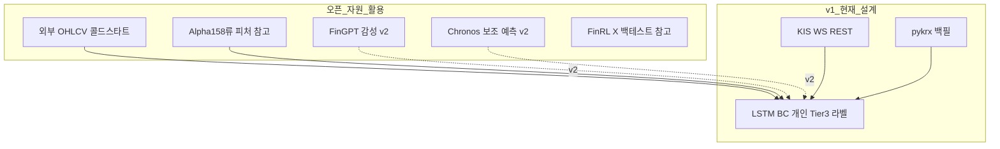
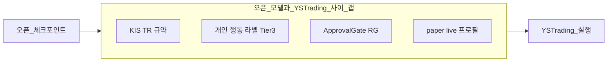
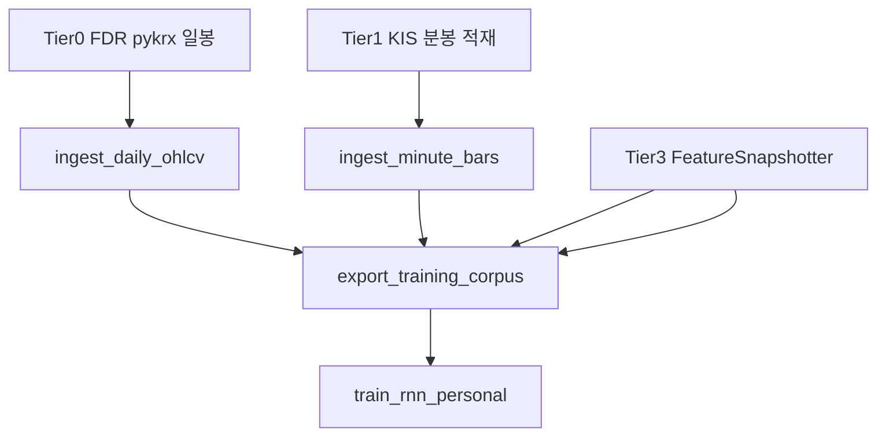

# SRV-001 — 오픈 AI·ML 모델 및 학습 데이터 서베이 (주식 자동매매)

| 항목 | 내용 |
|------|------|
| TraceID | SRV-001 |
| 버전 | 0.1 |
| 작성일 | 2026-06-02 |
| 상태 | **오너 피드백 반영됨** — [ADR-010](../adr/ADR-010-open-ml-data-and-crossmodal-training.md) |
| 프로젝트 맥락 | [ADR-002](../adr/ADR-002-rnn-personal-model.md), [DAT-002](../data/DAT-002-rnn-training-collection-flow.md), [CND-003](../candidate/CND-003-ml-rnn-architecture.md) |

---

## 0. 요약 (Executive Summary)

| 질문 | 결론 |
|------|------|
| **“바로 쓸 수 있는” 오픈 자동매매 AI 모델이 있나?** | **없음에 가깝다.** 공개된 것은 **프레임워크·연구용 체크포인트·감성 LLM**이며, **KIS 개인 계좌·승인 게이트·한국 장 규칙**에 맞는 **완성형 상용 모델**은 없다. |
| **학습용 오픈 데이터는 있나?** | **있다.** KRX 일봉·분봉(제한적)은 **pykrx·FinanceDataReader**; 글로벌·중국은 **Yahoo/Qlib**; 뉴스·감성은 **FinGPT·RSS/DART(이미 설계)**. |
| **YSTrading에 어떻게 쓸 수 있나?** | v1 **개인 LSTM BC**는 유지하고, 오픈 자원은 **(1) Tier1 백필·콜드스타트 (2) 피처·백테스트 참고 (3) v2 보조 신호·감성** 로 **점진 통합**하는 것이 타당하다. |

---

## 1. 조사 범위·방법

| 항목 | 내용 |
|------|------|
| 목적 | 오픈 모델·데이터 존재 여부, 라이선스·한계, **YSTrading 활용안** |
| 기간 | 2026-06 공개 정보·문서 기준 |
| 제외 | 유료 블룸버그 터미널, 폐쇄형 헤지펀드 모델, 불법 크롤링 |
| 정렬 기준 | **개인 솔로 앱**, KIS, **ApprovalGate**, 이미 채택한 **pykrx·DART** |

---

## 2. 오픈 AI·ML 모델 (자동매매 관련)

### 2.1 분류 개요

| 유형 | 대표 | “자동매매 완제품”? | YSTrading 적합도 |
|------|------|-------------------|------------------|
| A. RL·퀀트 프레임워크 | FinRL, **FinRL-X** | 아니오 (파이프라인) | v2 참고·백테스트 |
| B. 금융 LLM | **FinGPT** | 아니오 (감성·텍스트) | v1.1~v2 맥락·피처 |
| C. 시계열 Foundation | **Chronos**, **TimesFM** | 아니오 (예측) | v2 보조 신호 |
| D. 퀀트 ML 플랫폼 | **Microsoft Qlib** | 아니오 (연구 플랫폼) | 피처·벤치 참고 |
| E. 멀티에이전트 | TradingAgents 등 | 실험적 | v3+ 검토 |
| F. 개인화 BC RNN | **자체 LSTM** (ADR-002) | 앱 전용 | **v1 정본** |

---

### 2.2 A — FinRL / FinRL-X (강화학습·퀀트 인프라)

| 항목 | 내용 |
|------|------|
| 저장소 | [FinRL](https://github.com/AI4Finance-Foundation/FinRL) (~15k★, MIT), [FinRL-Trading / FinRL-X](https://github.com/AI4Finance-Foundation/FinRL-Trading) (2026, Apache-2.0) |
| 제공 | DRL(PPO, A2C, DDPG 등), 데이터 처리, 백테스트, **Alpaca 등 해외 브로커** 연동 예제 |
| 한계 | **KIS·한국 장 미내장**; live는 해외 API 전제; 개인 앱에 **전체 스택 이식은 과대** ([CND-003](../candidate/CND-003-ml-rnn-architecture.md) 후보 C = 로드맵) |
| 논문 | FinRL-X: [arXiv:2603.21330](https://arxiv.org/abs/2603.21330) — 모듈·weight-centric, LLM 신호 **입력 가능** |

**활용안 (제안)**

| 단계 | 활용 | 설계 반영 |
|------|------|-----------|
| v1 | **미사용** | ADR-002 유지 |
| v2 | `bt` 엔진·walk-forward **패턴 참고** | OPS-002 paper eval 절차 보강 |
| v3 | FinRL-X **policy 모듈**을 `ml_pipeline/rl/` 옵션 | **신규 ADR 필요** |

---

### 2.3 B — FinGPT (금융 LLM·감성)

| 항목 | 내용 |
|------|------|
| 저장소 | [FinGPT](https://github.com/AI4Finance-Foundation/FinGPT) (~20k★, MIT) |
| HuggingFace | 예: `FinGPT/fingpt-sentiment_llama2-13b_lora` 등 **감성 분석** 체크포인트 |
| 강점 | 뉴스·헤드라인 **감성 점수**; [DAT-001](../data/DAT-001-external-sources-catalog.md) RSS/DART와 **시너지** |
| 한계 | **매매 신호 직결 X**; GPU·추론 비용; 헤드라인만 저장 정책과 **로컬 추론 범위** 정합 필요 |
| 라이선스 | MIT + **기반 LLM 라이선스**(Llama 등) 별도 확인 |

**활용안 (제안)**

| 단계 | 활용 | 설계 반영 |
|------|------|-----------|
| v1 | **RNN 입력에 넣지 않음** (현행 DAT-002) | 유지 |
| v1.1 | `data_ingestion` → 일 배치 **sentiment_score** Parquet | DAT-002 `has_news_sentiment` (v2 예정 필드) |
| v2 | UI 「뉴스 톤」 배지; AI 제안 **설명 문구** 생성(옵션) | UC-012, DOM-006 확장 — **ADR 필요** |

---

### 2.4 C — Chronos / TimesFM (시계열 Foundation Model)

| 항목 | 내용 |
|------|------|
| 저장소 | [chronos-forecasting](https://github.com/amazon-science/chronos-forecasting) (Apache-2.0), Google TimesFM (HF) |
| HF | `amazon/chronos-2`, `google/timesfm-1.0-200m-pytorch` 등 |
| 강점 | **zero-shot** 단기 예측; 빠른 프로토타입 |
| 한계 (중요) | 금융 일별 초과수익 **zero-shot은 벤치마크 대비 약함** ([Re(Visiting) TSFM in Finance](https://arxiv.org/html/2511.18578v1): Chronos/TimesFM **R² 음수·방향 정확도 ~50%** 수준 보고); **BUY/SELL/HOLD 직접 출력 아님** |
| Finetune | 금융 continual pretrain 연구 존재 ([arXiv:2412.09880](https://arxiv.org/html/2412.09880)) — **자체 데이터·GPU** 필요 |

**활용안 (제안)**

| 단계 | 활용 | 설계 반영 |
|------|------|-----------|
| v1 | **미채택** (ADR-002 LSTM 유지) | — |
| v2 | `ForecastAddon`: 다음 5~15분 **수익률 분포** → RG+Gate **참고 피처** (단독 주문 X) | 신규 QS·ADR |
| v2 | 소형 `chronos-bolt-mini` 로컬 CPU 추론 실험 | `ml_pipeline/tsfm/` |

---

### 2.5 D — Microsoft Qlib

| 항목 | 내용 |
|------|------|
| 저장소 | [microsoft/qlib](https://github.com/microsoft/qlib) |
| 데이터셋 | **Alpha158**(158 테크니컬 팩터), Alpha360 — 주로 **중국 A주·미국** CSI300 등 |
| 모델 벤치 | LightGBM, MLP, Transformer 등 **Alpha158 예측** |
| 한계 | **KRX 기본 미포함**; 파이프라인 무겁고 **개인 앱 런타임과 분리** |

**활용안 (제안)**

| 단계 | 활용 | 설계 반영 |
|------|------|-----------|
| v1 | `trading_modes/shared/indicators.py` 에 **수식 참고** (RSI, CORR 등) | [ADR-007 O-03](../adr/ADR-007-connectivity-and-shared-math-v1.md) |
| v1.5 | `export_training_corpus` 전 **팩터 엔지니어링** 모듈 (qlib **비의존** 순수 pandas) | DAT-002 피처 F 확장 |
| v2 | Qlib **전체 스택 도입은 비권장** | — |

---

### 2.6 E — 기타 (TradingAgents, 범용 DL)

| 이름 | 비고 | YSTrading |
|------|------|-----------|
| TradingAgents (LangGraph) | LLM 에이전트 토론형 트레이딩 **연구** | v3+; ApprovalGate·비용 |
| 범용 LSTM/Transformer (Kaggle 노트북) | 재현성·라이선스 불명 | **비권장** |
| BloombergGPT 등 | **비오픈** | 제외 |

---

### 2.7 “완제품”에 가까운 것이 없는 이유 (프로젝트 관점)

오픈 모델은 대부분 **가격 예측·포트폴리오 가중치**까지이고, **한국 개인 계좌·승인·감사**는 앱이 직접 구현해야 한다 ([ARC-000](../ARC-000-architecture.md)).

---

## 3. 학습·분석용 오픈 데이터

### 3.1 한국 (KRX) — 프로젝트와 직접 연관

| SRC-ID | 제공 | 데이터 | 분봉 | 라이선스·주의 | 설계 반영 |
|--------|------|--------|------|---------------|-----------|
| **PYK-*** | pykrx | 일/주/월 OHLCV, 시총, 거래대금 | 일봉 중심; 분봉 API 제한적 | KRX·네이버 **스크래핑**; 과도 호출 금지 | **DAT-002 Tier1** 채택됨 |
| **FDR** | FinanceDataReader | `KRX:005930` 일봉 1995~ | 분봉 제한 | 오픈소스; 출처 표시 | **백필 ETL 후보** |
| **KIS-*** | KIS Open API | 당일 분봉, 일봉, 실시간 | **당일 분봉** 조합 가능; **과거 일자 분봉 API 없음** (커뮤니티·포털 FAQ) | 약관·TR 한도 | **런타임 정본**; 장중 로컬 적재로 이력 축적 |
| **DART-*** | OpenDART | 공시 메타 | — | API 키 | UC-012 (RNN v1 미사용) |
| **RSS-*** | 한경·네이버 등 | 헤드라인 | — | **본문 저장 금지** | UC-012 |

**KIS 분봉 이력 전략 (설계 정합)**

| 방법 | 설명 |
|------|------|
| **자체 적재 (권장)** | 장중 WS/REST → `bars_1m` Parquet ([DAT-002](../data/DAT-002-rnn-training-collection-flow.md)) |
| **일봉 백필** | pykrx/FDR로 **일봉**·장기 피처; 분봉은 **합성 불가**(정밀도 한계) |
| **외부 분봉 DB** | 유료(키움 OpenAPI+ 등) 또는 비공개 — v1 **범위 밖** |

---

### 3.2 글로벌·타 시장 (보조·전이학습)

| 소스 | 내용 | 활용 |
|------|------|------|
| Yahoo (`yfinance`) | 해외·일부 KR | 벤치·상관; FinRL 예제와 동일 |
| Qlib 공식 데이터 | 중국·미국 Alpha158 | **팩터 정의 참고**만 |
| Hugging Face `datasets` | `financial_phrasebank`, 주가 CSV 등 | **감성·소규모 실험** |
| WRDS / CRSP | 학술 | 개인 앱 **비현실** (유료·계약) |

---

### 3.3 라벨( y ) 데이터 — 오픈 vs 자체

| 라벨 유형 | 오픈 제공 여부 | YSTrading |
|-----------|----------------|-----------|
| BUY/SELL/HOLD (개인 체결) | **없음** | **Tier3 EventStore 전용** (핵심 자산) |
| 시장 중립 벤치 라벨 (다음일 수익률 부호) | Qlib 등 | **개인화와 불일치** — 보조 실험만 |
| 감성 라벨 | FinGPT, Financial PhraseBank | 뉴스 맥락·v2 피처 |

**결론**: 오픈 데이터는 **X(시장)** 는 풍부, **y(개인 행동)** 는 **앱 사용으로만** 축적 가능 → ADR-002 **BC 전략이 타당**.

---

## 4. YSTrading 활용 로드맵 (제안)

### 4.1 Tier 데이터 모델 확장 (제안)

| Tier | 내용 | 신규 여부 |
|------|------|-----------|
| Tier0 | **오픈 일봉 백필** (pykrx/FDR) — 관심종목 **콜드스타트** | **제안** |
| Tier1 | KIS + pykrx (현행) | 유지 |
| Tier2 | paper 스냅샷 (현행) | 유지 |
| Tier3 | 개인 행동 라벨 (현행) | 유지 |
| TierE | 외부 **감성·TSFM** 점수 (v2) | 제안 |

### 4.2 모듈별 통합 (최대 활용·최소 침범)

| 모듈 | 오픈 자원 | 통합 방식 |
|------|-----------|-----------|
| `data_ingestion` | FDR, pykrx | `adapters/fdr_daily.py` — Tier0 |
| `trading_modes/shared` | Qlib Alpha158 **수식** | indicators 확장 (코드 복사 X, 수식 문서화) |
| `ml_pipeline/rnn` | — | v1 **LSTM BC 정본** |
| `ml_pipeline/tsfm` | Chronos-mini | v2 **옵션** 패키지 |
| `ml_pipeline/sentiment` | FinGPT small | v2 **배치**만; GUI 무GPU 기본 |
| `addons` | — | propose만; 오픈 모델도 **Gate 통과** |

### 4.3 하지 않을 것 (명시)

| 항목 | 이유 |
|------|------|
| FinRL-X live를 KIS에 직접 연결 | 브로커·규모 불일치 |
| 오픈 모델 출력으로 **무승인 주문** | QS-004, ADR-004 |
| 뉴스 **본문** 대량 다운로드·학습 | 저작권·DAT-001 |
| Transformer v1 채택 | DEC X-02, 데이터 부족 |

---

## 5. 리스크·라이선스

| 리스크 | 완화 |
|--------|------|
| 오픈 모델 **과장 광고** (수익 보장) | paper 게이트·UI 고지 유지 |
| pykrx/FDR **차단** | rate limit, 캐시, KIS Tier A |
| FinGPT **Llama 라이선스** | 상업·배포 시 별도 ADR |
| TSFM **환각·오적합** | 보조 피처만; RG-07 stale |
| 외부 데이터 **미래 정보 누수** | walk-forward, ASR-007 |

---

## 6. 오너 피드백 확정 (2026-06-02)

| # | 응답 | 반영 문서 |
|---|------|-----------|
| 1 | 동의 | ADR-002 유지 |
| 2 | 응 | Tier0 — [DAT-003](DAT-003-data-schemas.md), [ADR-010](../adr/ADR-010-open-ml-data-and-crossmodal-training.md) |
| 3 | 반영 | Alpha158류 — `ml_feature_schema.yaml`, DAT-003 |
| 4 | v2 | FinGPT — v2 `batch_sentiment.py` |
| 5 | 포함 | Chronos — v2 `ml_pipeline/tsfm/` |
| 6 | 백테스트 | [OPS-005](../operations/OPS-005-backtest-procedure.md) |
| 7 | DART/RSS↔KIS + FinGPT | v1.5 crossmodal 플래그; v2 sentiment 조인 학습 — DAT-003 §5, ADR-010 |

---

## 8. 참고 링크

| 구분 | URL |
|------|-----|
| FinRL | https://github.com/AI4Finance-Foundation/FinRL |
| FinRL-X | https://github.com/AI4Finance-Foundation/FinRL-Trading |
| FinGPT | https://github.com/AI4Finance-Foundation/FinGPT |
| Qlib | https://github.com/microsoft/qlib |
| Chronos | https://github.com/amazon-science/chronos-forecasting |
| FinanceDataReader | https://github.com/FinanceData/FinanceDataReader |
| pykrx | https://pypi.org/project/pykrx/ |
| TSFM in Finance (2025) | https://arxiv.org/html/2511.18578v1 |
| TSFM Finance repo | https://github.com/DeepIntoStreams/TSFM_Finance |

---

## 변경 이력

| 날짜 | 내용 |
|------|------|
| 2026-06-02 | v0.1 — 초판 서베이; 설계 미반영 |
