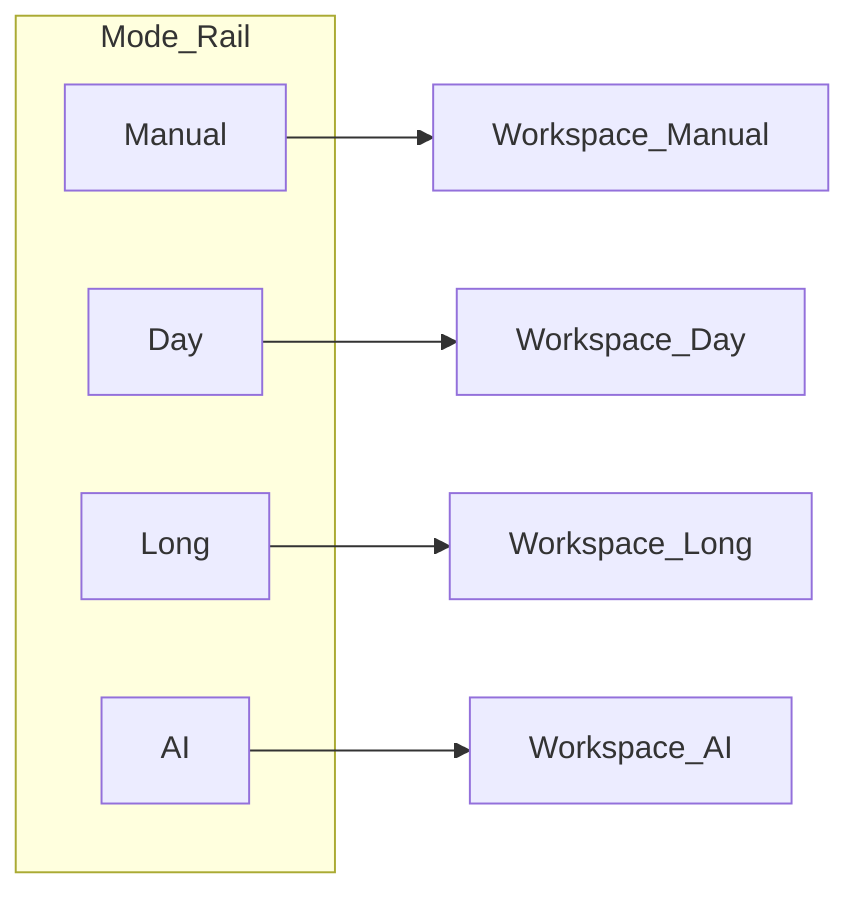
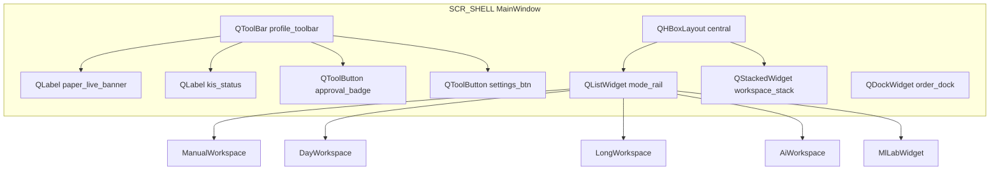

# UI 그린필드 원칙·정보 구조 (IA)

| TraceID | UI-000 |
|---------|------------|
| 상태 | 초안 — 구현 전 검토용 |
| 범위 | macOS `yst_ui` v1; Android는 동등 플로우(WebView 셸) |

---

## 1. 설계 목표

1. **PoC GUI 무관** — 레이아웃·위젯·탭 이름을 PoC에서 가져오지 않는다.
2. **모드 중심** — **매매 모드 레일**이 1차 내비게이션이다.
3. **일반 용어 UI** — 화면 글자는 [UI-004](UI-004-plain-language-and-labels.md)만 사용(Tier·OAuth 등 금지).
4. **신뢰 UI** — **기준 시각·출처·실시간 여부**를 항상 노출(`TierFooterWidget`).
5. **안전** — **모의투자 / 실전투자** 배너 + 주문·자동 매매 정책 변경 시 추가 확인.
6. **Cursor Light** — 밝은 Look & Feel ([UI-005](UI-005-cursor-light-theme.md)); v1 다크 비목표.
7. **자격증명** — KIS 키는 암호화 blob; Android APK 포함 ([ADR-006](../adr/ADR-006-personal-credentials-encryption.md)).

---

## 2. 화면 ID 체계

| 접두 | 의미 | 예 |
|------|------|-----|
| `SCR-0xx` | 온보딩·연결 | SCR-001 프로필 마법사 |
| `SCR-SHELL` | 앱 셸(공통 크롬) | 모드 레일·상태바 |
| `SCR-HOME` … | HTS 공통 기능 | 현황·시세·차트·주문·이력 |
| `SCR-MODE-*` | 매매 모드 워크스페이스 | DAY, LONG, AI |
| `SCR-ML` | 학습·모델 | UC-007 |
| `SCR-SYS-*` | 설정·승인·RG | 설정, 승인 모달 |
| `SCR-AND-*` | Android | SyncHub 셸 |

전체 목록·콘티: [README.md](./README.md) 하위 storyboard 문서.

---

## 3. 1차 내비게이션 (모드 레일)

앱 실행 후 **항상 좌측(또는 상단) 모드 레일**이 보인다. 모드는 **배타적 워크스페이스**가 아니라 **포커스 전환**이다(백그라운드 Tier3 수집은 공통).

| 코드 | **화면 라벨** | 설명 한 줄 |
|------|-------------|------------|
| Manual | **직접 매매** | 시세·차트·주문 |
| Day | **당일 매매** | 오늘 매수·매도 타이밍 제안 |
| Long | **장기 투자** | 종목 추천 |
| AI | **자동 매매** | AI 제안·승인 |

**공통 화면**(현황·이력·시장정보)은 Manual 워크스페이스의 **2차 탭**으로 두되, **모드 레일에서 `⌘+숫자` 단축**으로도 진입 가능하게 한다.

---

## 4. 2차 내비게이션 (Manual / 공통 탭)

Manual 포커스 시 **하단 또는 상단 탭**:

| 탭 ID | 라벨 | UC |
|-------|------|-----|
| T-HOME | **홈** | UC-003, UC-008 |
| T-QUOTE | **시세** | UC-003 |
| T-CHART | **차트** | UC-003, UC-004 |
| T-ORDER | **주문** | UC-002 |
| T-HIST | **거래·손익** | UC-008 |
| T-MKT | **시장·뉴스** | UC-009, UC-012 |

Day/Long/AI 워크스페이스에서도 **「주문 열기」** 시 `T-ORDER`를 **슬라이드 패널**으로 띄워 UC-002와 동일 티켓을 쓴다(중복 구현 없음).

---

## 5. 전역 크롬 (SCR-SHELL)

PySide6 위젯 트리 정본: [UI-QT6-layout-conventions.md](UI-QT6-layout-conventions.md) §2.

| 영역 | Qt6 | 동작 |
|------|-----|------|
| PAPER/LIVE | `paper_live_banner` | 클릭 → `ProfileDialog` (UC-001) |
| 연결 | `kis_status` | 실패 시 → SCR-OFFLINE |
| 승인 | `approval_badge` | → `ApprovalDialog` |
| ML | `mode_rail` 5번째 행 | → `MlLabWidget` |

---

## 6. 시각·컴포넌트 원칙

| 원칙 | 적용 |
|------|------|
| 밀도 | HTS보다 여백 큼; 핵심 숫자(현재가·손익)는 1.5x 타이포 |
| 색 | 다크 베이스; 상승/하락은 색맹 안전 팔레트(청록/산호) |
| 데이터 카드 | `as_of`, `tier`, `source` 3줄 푸터 필수 |
| 제안 카드 | 단타·장기·AI 공통 **「근거 접기/펼치기」** 패턴 |
| 면책 | 모드 워크스페이스 하단 `QLabel disclaimer_label` |
| 공통 위젯 | `ProposalCardWidget`, `TierFooterWidget` — [UI-QT6](UI-QT6-layout-conventions.md) |

**도식 규칙**: 설계 UI 문서의 레이아웃·흐름은 **Mermaid만** 사용(ASCII 와이어 제거).

---

## 7. UC ↔ 화면 매핑 (갱신)

| 화면 ID | UC | 비고 |
|---------|-----|------|
| SCR-001 | UC-001 | 최초 연결·볼트 |
| SCR-HOME | UC-003, UC-008 | |
| SCR-QUOTE, SCR-CHART | UC-003, UC-004 | 차트 오버레이는 Day에서도 동일 컴포넌트 |
| SCR-ORDER | UC-002, UC-004, UC-006 | 단일 주문 티켓 |
| SCR-MODE-DAY | UC-004 | |
| SCR-MODE-LONG | UC-005 | |
| SCR-MODE-AI | UC-006 | |
| SCR-ML | UC-007 | |
| SCR-MKT, SCR-NEWS | UC-009, UC-012 | 탭 또는 분할 |
| SCR-APPROVAL | UC-006, UC-010 | |
| SCR-RISK | UC-011 | |
| SCR-AND-* | UC-010 | |

---

## 8. PoC와의 관계

| PoC | 그린필드 |
|-----|----------|
| `gui_desktop` 화면·탭 | **참조 안 함** |
| `doc/` 요구·IA 참고 | **기능 범위만** 참고 |
| `kis_core`, `event_store` | 인프라 **재사용 가능** (ADR 별도) |

**다음**: [UI-001-storyboards-shell-common.md](./UI-001-storyboards-shell-common.md)
