# 화면 콘티 — 셸·온보딩·공통 HTS (PySide6)

| TraceID | UI-001 |
|---------|------------|
| Qt6 정본 | [UI-QT6-layout-conventions.md](UI-QT6-layout-conventions.md) |

도식은 **Mermaid만** 사용합니다. 위젯 이름은 `objectName` / 클래스명 기준입니다.

---

## SCR-000 — 기동·스플래시

| UC | UC-001 |
|----|--------|
| 진입 | `QApplication` 실행 직후 |

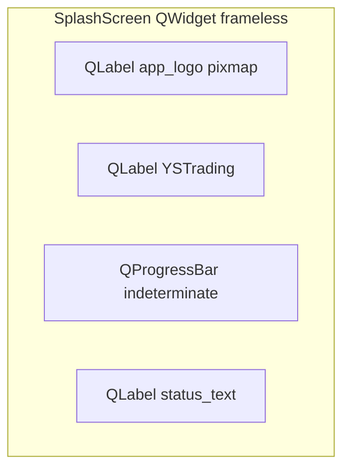

| 위젯 | 역할 |
|------|------|
| `QProgressBar` | `setRange(0,0)` 무한 진행 |
| `status_text` | 「볼트 확인」「프로필 로드」 |

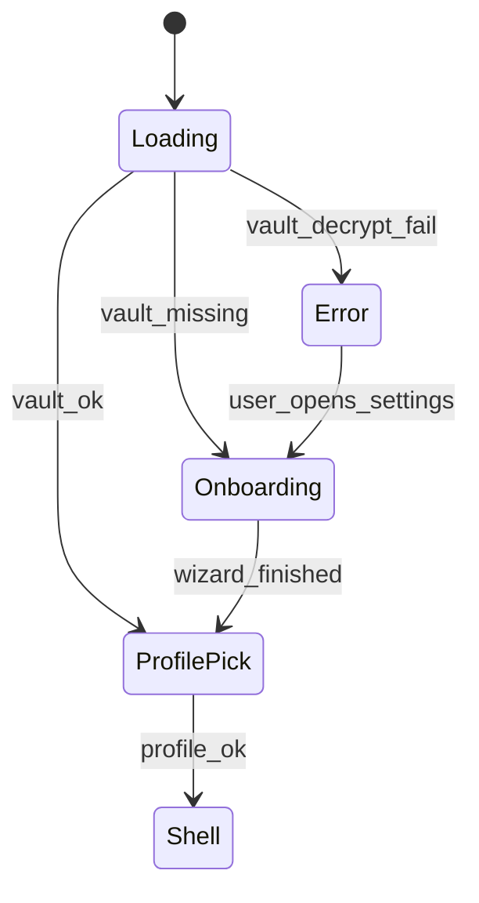

---

## SCR-001 — 최초 설정 (`QWizard`)

| UC | UC-001 |

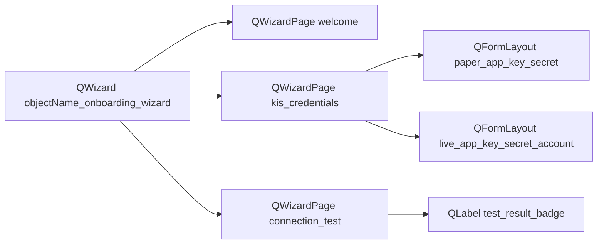

| 페이지 | 주요 위젯 |
|--------|-----------|
| 환영 | `QLabel` 설명 · `QPushButton` 다음 |
| 키 | `QLineEdit` echoMode=Password · `QPushButton` import_json_btn |
| 테스트 | `QPushButton` run_test_btn · `QLabel` success/fail |

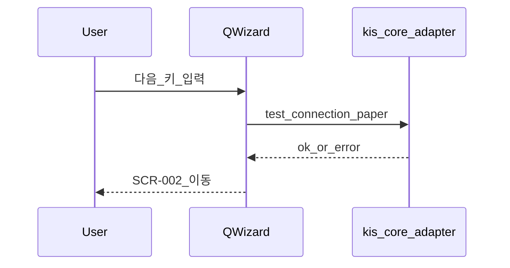

---

## SCR-002 — 프로필 선택

| UC | UC-001, UC-011 |

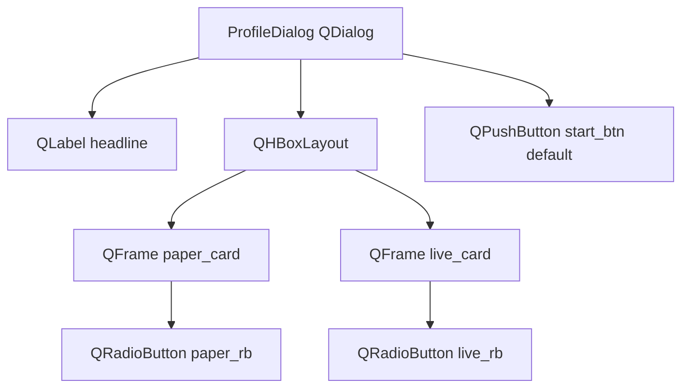

| 동작 | Qt6 처리 |
|------|----------|
| live 선택 | `live_card` 클릭 → `RiskAckDialog` (`QMessageBox`) → `MainWindow.apply_profile(live)` |
| paper | 녹색 `stylesheet` border on `paper_card` |

---

## SCR-SHELL — 앱 셸

정본 위젯 트리: [UI-QT6 §2](UI-QT6-layout-conventions.md).

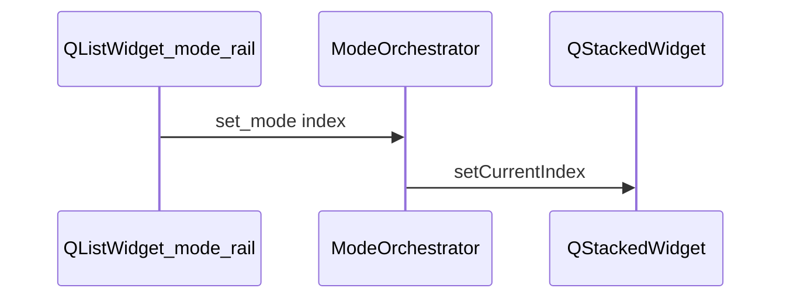

---

## SCR-HOME — 현황 (`HomeDashboardWidget`)

| UC | UC-003, UC-008 |
|----|----------------|
| 탭 | `manual_tabs` index 0 |

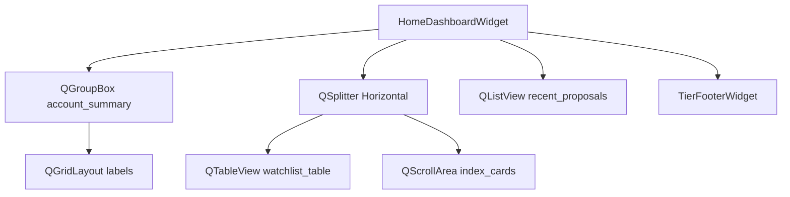

| 위젯 | 데이터 |
|------|--------|
| `watchlist_table` | `QStandardItemModel` · symbol, price, change% |
| `recent_proposals` | `ProposalCardWidget` delegate 또는 compact row |

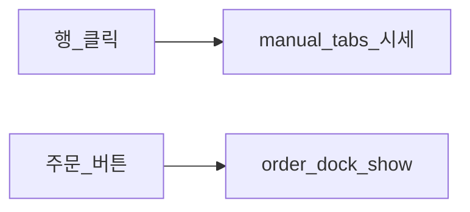

| 상태 | UI |
|------|-----|
| 로딩 | `watchlist_table.setEnabled false` + `QStackedWidget` skeleton page |
| KIS 끊김 | `profile_toolbar` 에 `QLabel` offline_banner |

---

## SCR-QUOTE — 시세 (`QuotePanelWidget`)

| UC | UC-003 |

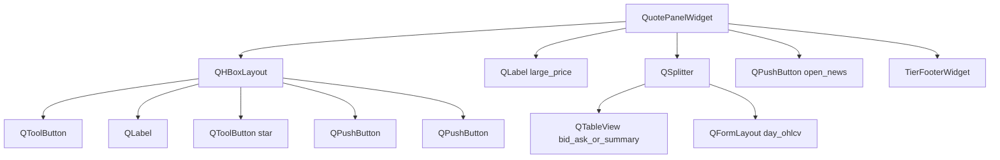

---

## SCR-CHART — 차트 (`ChartPanelWidget`)

| UC | UC-003, UC-004 |

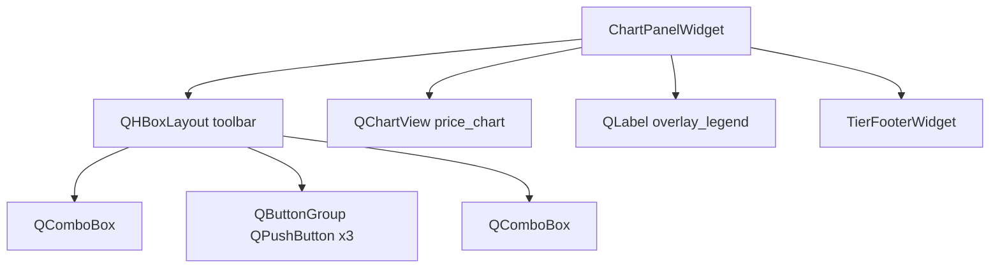

Day 모드: 동일 `ChartPanelWidget` 인스턴스를 `DayWorkspace` 좌측에 embed; 밴드는 `QLineSeries` 2개 추가.

---

## SCR-ORDER — 주문 (`OrderTicketWidget` in `QDockWidget`)

| UC | UC-002, UC-004, UC-006 |

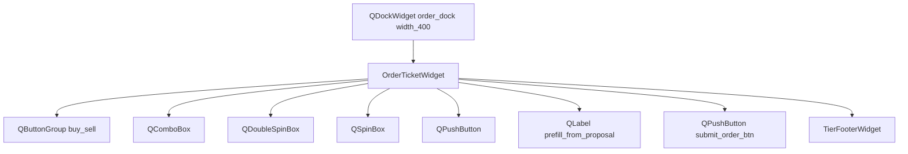

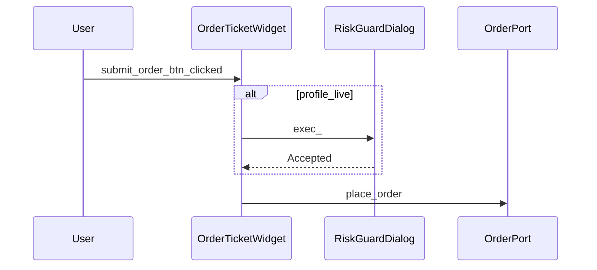

---

## SCR-HISTORY — 거래·손익 (`HistoryPanelWidget`)

| UC | UC-008 |

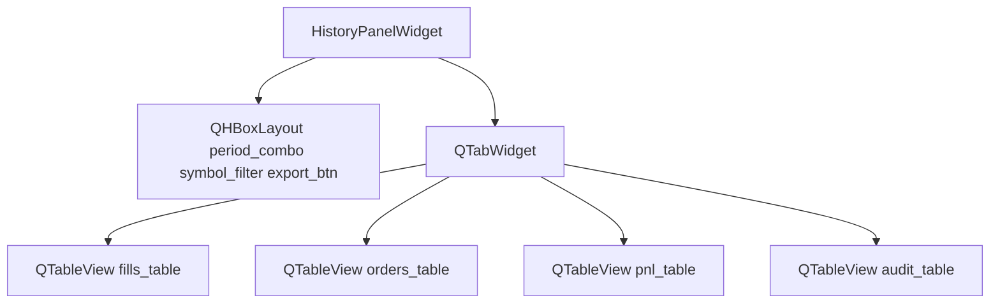

`audit_table` 필터: `ai_proposal`, `ai_approval`, `daytrade_suggestion`.

---

## SCR-MKT / SCR-NEWS — 시장·뉴스

| UC | UC-009, UC-012 |

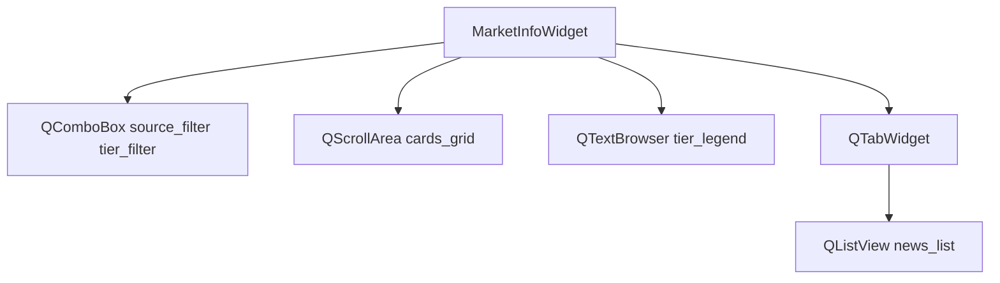

`NewsList` 항목: `QStandardItem` + role `tier`, `published_at`.

---

**다음**: [UI-002-storyboards-trading-modes.md](UI-002-storyboards-trading-modes.md)
