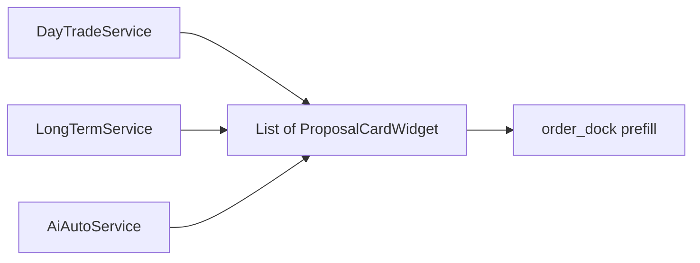
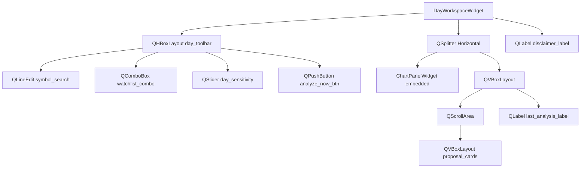
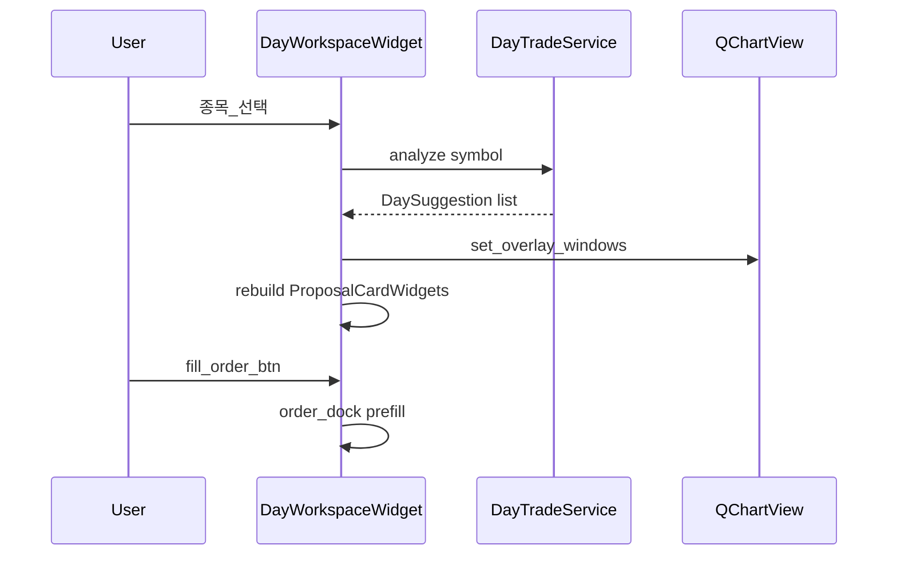
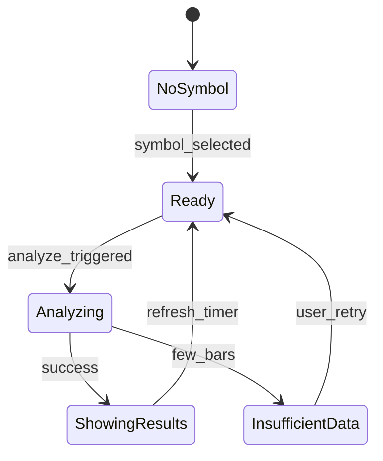
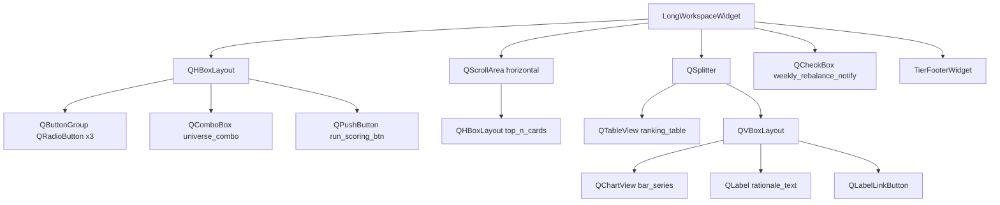
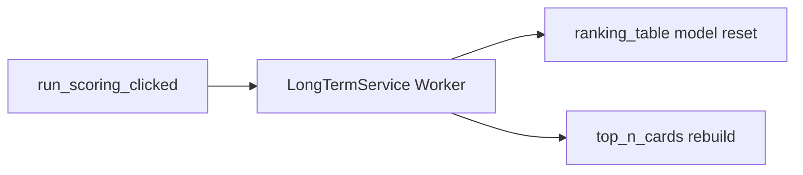
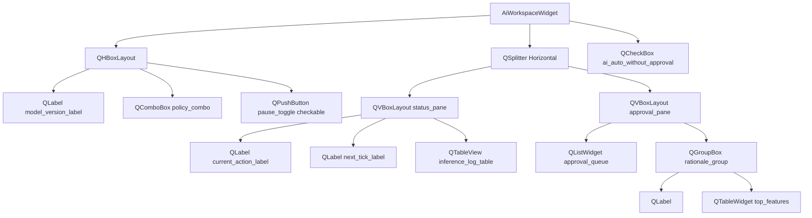
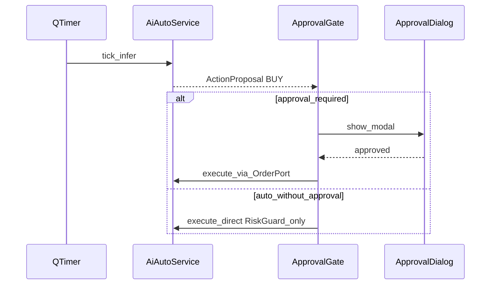
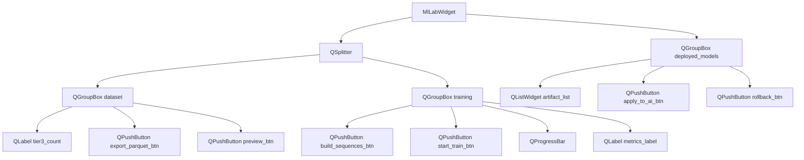
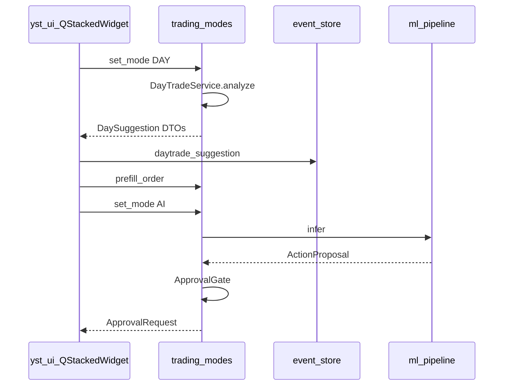

# 화면 콘티 — 매매 모드 (Day · Long · AI · ML) PySide6

| TraceID | UI-002 |
|---------|------------|
| UC | UC-004, UC-005, UC-006, UC-007 |
| Qt6 정본 | [UI-QT6-layout-conventions.md](UI-QT6-layout-conventions.md) |
| 모드 정의 | [SYS-001-system.md](../SYS-001-system.md) §4 |

도식은 **Mermaid만** 사용합니다.

---

## 공통 — `ProposalCardWidget`

위젯 트리: [UI-QT6 §3.2](UI-QT6-layout-conventions.md).

---

## SCR-MODE-DAY — `DayWorkspaceWidget`

| UC | UC-004 |
|----|--------|
| 스택 인덱스 | `workspace_stack` = 1 |

### Qt6 배치

| 위젯 | objectName | 동작 |
|------|------------|------|
| `QSlider` | `day_sensitivity` | 0=low,1=med,2=high → `DayTradeService.set_sensitivity` |
| `analyze_now_btn` | | 클릭 시 Worker `analyze(symbol)` |
| `ChartPanelWidget` | | `QCandlestickSeries` + `QAreaSeries` buy/sell band |
| `proposal_cards` | | `ProposalCardWidget` 동적 add |

### 사용자 흐름

### 상태

---

## SCR-MODE-LONG — `LongWorkspaceWidget`

| UC | UC-005 |
|----|--------|
| 스택 인덱스 | 2 |

| 위젯 | 비고 |
|------|------|
| `ranking_table` | columns: rank, symbol, score, tags |
| `top_n_cards` | `QFrame` × N, 클릭 → table selection sync |
| `run_scoring_btn` | `QProgressDialog` during Worker |

---

## SCR-MODE-AI — `AiWorkspaceWidget`

| UC | UC-006 |
|----|--------|
| 스택 인덱스 | 3 |

| 위젯 | 값 |
|------|-----|
| `policy_combo` | 「승인 필수」「무승인 자동」— `ai_auto_without_approval` |
| `approval_queue` | `ApprovalRequest` id, TTL `QTimer` 로 행 갱신 |
| `pause_toggle` | On 시 `AiAutoService.pause()` |

---

## SCR-ML — `MlLabWidget`

| UC | UC-007 |
|----|--------|
| 스택 인덱스 | 4 |

| Worker | UI 피드백 |
|--------|-----------|
| `train_rnn_personal` | `QProgressBar` + `QPlainTextEdit` log (optional dock) |

---

## 모드 간 데이터 흐름

---

**다음**: [UI-003-storyboards-system-android.md](UI-003-storyboards-system-android.md)
