# 화면 콘티 — 설정·승인·Android·예외 (PySide6 + WebView)

| TraceID | UI-003 |
|---------|------------|
| Qt6 정본 (macOS) | [UI-QT6-layout-conventions.md](UI-QT6-layout-conventions.md) |
| O-01·O-02 확정 | [ADR-007](../adr/ADR-007-connectivity-and-shared-math-v1.md) (배경 [DEC-003](../decision/DEC-003-open-issues-guide.md)) |

도식은 **Mermaid만** 사용합니다.

---

## SCR-SETTINGS — `SettingsDialog`

| 진입 | `settings_btn` · `QAction` Preferences |

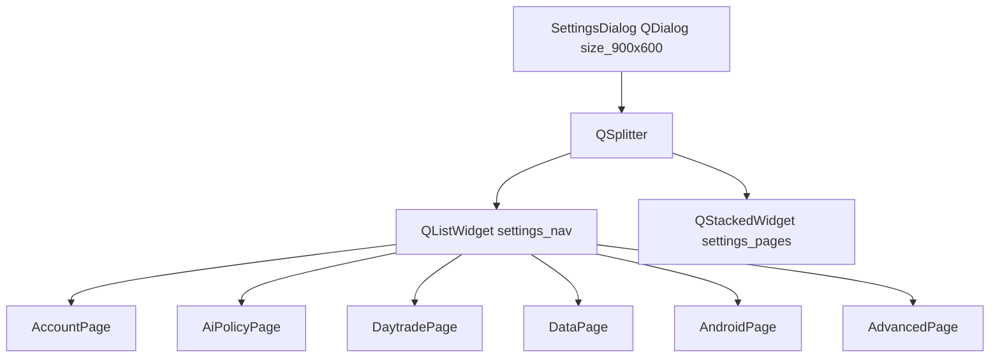

### 페이지별 Qt6 위젯

| 페이지 | 주요 위젯 |
|--------|-----------|
| Account | `QRadioButton` paper/live · `QPushButton` test_connection · `QLabel` kis_status |
| AI 매매 | `QCheckBox` ai_auto_without_approval · `QSpinBox` ai_approval_ttl_sec |
| 단타 | `QComboBox` daytrade_sensitivity · `QSpinBox` daytrade_auto_refresh_sec |
| 데이터 | `QCheckBox` show_tier_badges · `QCheckBox` use_websocket |
| Android | `QLineEdit` sync_hub_url · `QPushButton` open_pairing_wizard → SCR-AND-PAIR |
| 고급 | `QPlainTextEdit` log_path_readonly |

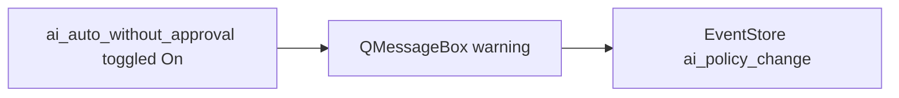

---

## SCR-APPROVAL — `ApprovalDialog`

| UC | UC-006, UC-010 |

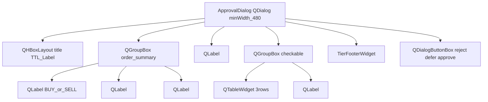

| `QDialogButtonBox` | 역할 |
|--------------------|------|
| Approve | `ApprovalGate.approve` → `RiskGuardDialog` if live |
| Reject | `QComboBox` reject_reason |
| Defer | close, queue 유지 |

```mermaid
sequenceDiagram
  participant Mac as MainWindow
  participant Badge as QToolButton approval_badge
  participantDlg as ApprovalDialog
  Mac->>Badge: setText count
  Badge->>Dlg: clicked show queue pick
  Dlg->>Dlg: user Approve
```

---

## SCR-RISK — `RiskGuardDialog`

| UC | UC-011 |

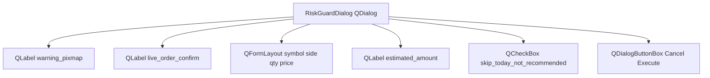

| 트리거 | 호출 위치 |
|--------|-----------|
| live 주문 | `OrderTicketWidget.submit` |
| AI 무승인 실행 | `AiAutoService.execute` |

---

## SCR-AND-PAIR — Android 페어링 (macOS 측 Qt6)

| UC | UC-010 |
|----|--------|
| O-01 | **확정** LAN + 페어링 토큰 — [ADR-007](../adr/ADR-007-connectivity-and-shared-math-v1.md) |

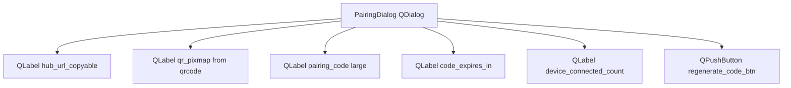

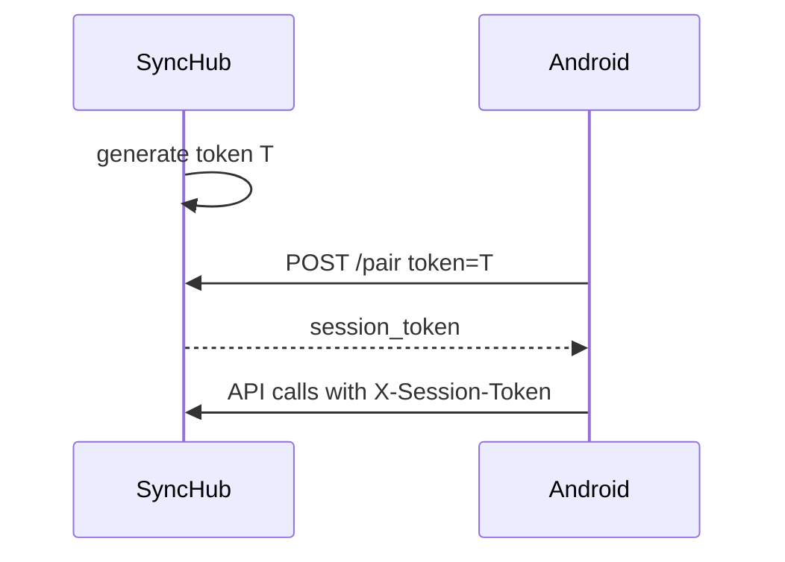

---

## SCR-AND-SHELL — Android (WebView / 간소 Qt)

Android 네이티브 전체 Qt는 v1 범위 밖; **WebView + HTML** 또는 **Qt Quick** 중 택일은 구현 Phase.

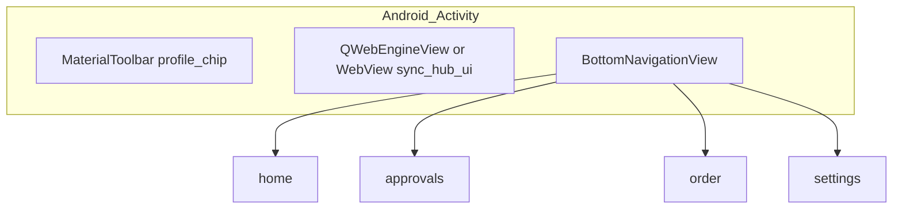

| 탭 | 내용 |
|----|------|
| home | 잔고·관심 JSON render |
| approvals | pending list → SCR-AND-APPROVAL |
| order | 간소 form POST `/orders` |
| settings | read-only profile |

**O-02 알림**: **확정** 폴링 15초 + 로컬 알림 — [ADR-007](../adr/ADR-007-connectivity-and-shared-math-v1.md).

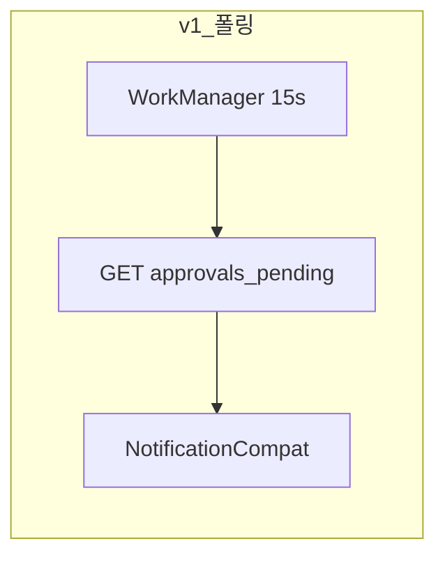

---

## SCR-AND-APPROVAL — Android 승인 화면

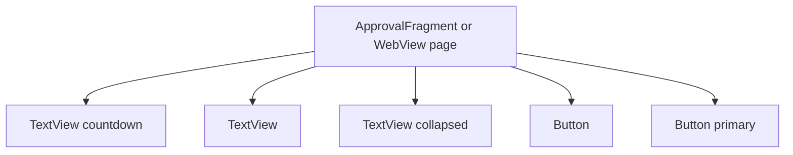

---

## SCR-OFFLINE — 연결 끊김

| 진입 | KIS/WS/SyncHub fail |

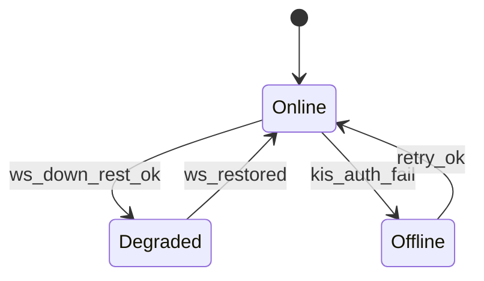

macOS: `QMessageBox` 또는 `OfflineOverlay` `QWidget` on `workspace_stack`.

| 모드 | `QPushButton` |
|------|----------------|
| 조회만 | `offline_readonly_btn` — 캐시 model |
| 주문 | `submit_order_btn.setEnabled false` |

---

## SCR-ERROR — 피드백

| 유형 | Qt6 |
|------|-----|
| 일반 | `QStatusBar.showMessage` 5s |
| 심각 | `QMessageBox.critical` |
| 주문 TR 거부 | `QMessageBox` + `QPushButton` copy audit id |

---

## MVP 화면 목록

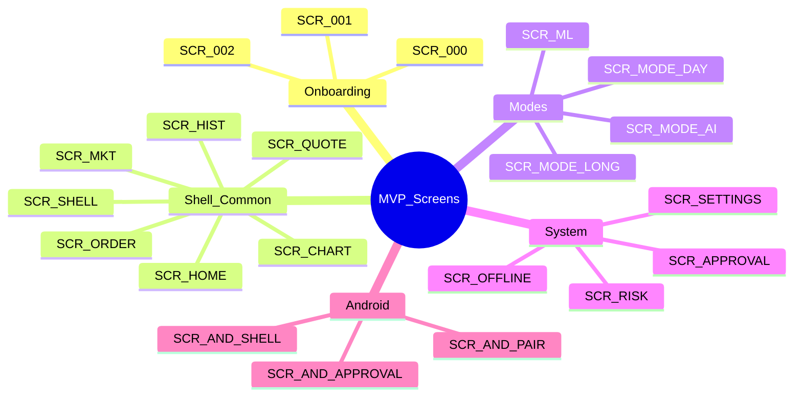

---

**관련**: [ARC-003](../architecture/ARC-003-trading-modes-greenfield.md) · [ADR-005](../adr/ADR-005-greenfield-ui-and-modes.md)
