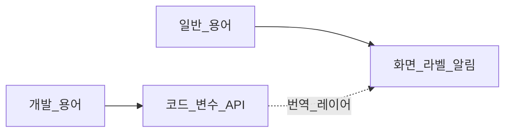

# UI 표시 용어 — 일반 사용자용 (구현 필수)

| TraceID | UI-004 |
|---------|--------|
| 적용 | `yst_ui` · Android UI **모든 사용자 대면 문자열** |
| 금지 | 개발·아키텍처 용어를 버튼·메뉴·라벨에 노출 |

코드·로그·설계 문서(TraceID, UC)는 기술어를 써도 됩니다. **화면에 보이는 글자만** 아래 규칙을 따릅니다.

---

## 1. 원칙

1. **초등 HTS 사용자**가 증권 앱을 처음 켜도 버튼 이름만으로 다음 행동을 알 수 있게 쓴다.
2. 영문 약어는 **한글 설명을 먼저** 쓰고, 괄호로만 보조한다.  
   - 좋음: 「모의투자」  
   - 나쁨: 「paper」  
3. 내부 ID(`MODE_DAY`, `Tier A`, `ApprovalGate`)는 **코드에만** 둔다.
4. 오류 메시지는 **무엇이 문제인지 + 무엇을 하면 되는지** 한 문장씩.

---

## 2. 모드·내비 (모드 레일)

| 코드/설계 | 화면 라벨 (macOS·Android) | 툴팁 (선택) |
|-----------|---------------------------|-------------|
| Manual | **직접 매매** | 직접 주문하고 시세를 봅니다 |
| Day | **당일 매매** | 오늘 종목의 매수·매도 타이밍을 제안받습니다 |
| Long | **장기 투자** | 보유 후보 종목을 추천받습니다 |
| AI | **자동 매매** | AI가 매매를 제안하고, 승인 후 주문합니다 |
| ML (ML Lab) | **학습·모델** | 내 패턴을 학습합니다 |

---

## 3. 계정·연결

| 설계 | 화면 라벨 |
|------|-----------|
| paper | **모의투자** |
| live | **실전투자** |
| KIS 연결됨 | **한국투자증권 연결됨** |
| KIS 끊김 | **증권사 연결이 끊어졌습니다** |
| OAuth/토큰 (내부) | 노출 안 함 → 「다시 연결하기」 |
| 프로필 전환 | **투자 계정 바꾸기** |

---

## 4. 시세·데이터 신뢰 (Tier 대체 문구)

사용자에게 **Tier A/B/C** 를 쓰지 않는다.

| Tier | 화면 표시 (짧게) | 툴팁 |
|------|------------------|------|
| A | **실시간(공식 API)** | 한국투자증권 API 시세 |
| B | **공식 API** | 한국투자증권 API (지연 가능) |
| C | **참고용** | 공개 데이터·뉴스 등 |

공통 푸터 3줄 (기존 `TierFooterWidget`):

| 줄 | 라벨 예 |
|----|---------|
| 1 | **기준 시각** 2026-06-02 09:01:05 |
| 2 | **출처** 한국투자증권 |
| 3 | (필요 시) **참고** 지연될 수 있는 데이터입니다 |

---

## 5. 주문·안전

| 설계 | 화면 라벨 |
|------|-----------|
| RiskGuard live | **실전 주문 확인** |
| 주문하기 | **주문하기** |
| 매수/매도 | **매수** / **매도** |
| Approval | **매매 승인** |
| 승인 필수 정책 | **주문 전에 내가 승인** |
| 무승인 자동 | **승인 없이 자동 주문** (적색 경고) |
| TTL 만료 | **시간이 지나 취소되었습니다** |

---

## 6. 단타·장기·AI 제안 카드

| 설계 | 화면 라벨 |
|------|-----------|
| buy_window | **매수 타이밍 제안** |
| sell_window | **매도 타이밍 제안** |
| confidence | **확신도** (또는 **추천 강도**) |
| rationale | **왜 이렇게 보였나요** (펼치기) |
| fill order | **이 내용으로 주문서 열기** |
| dismiss | **다시 보지 않기** |

---

## 7. 음성·자연어 주문 (UC-013)

| 설계 | 화면 라벨 |
|------|-----------|
| Voice input | **말로 주문** |
| Text NL | **글로 주문** |
| Interpret | **해석하기** |
| Confirm title | **이렇게 주문할까요?** |
| Confirm button | **주문하기** |
| Edit | **수정하기** |
| Low confidence | **잘 못 알아들었어요. 다시 말씀해 주세요** |
| Clarify | **어떤 종목인가요?** |
| Listening | **듣고 있어요…** |

---

## 8. Android·맥북 연동

| 설계 | 화면 라벨 |
|------|-----------|
| SyncHub | **맥북과 연결** |
| 페어링 코드 | **연결 코드** |
| SyncHub offline | **맥북이 꺼져 있거나 연결되지 않았습니다** |

> Android에 KIS 키를 넣는 배포 모델에서는, 일부 기능은 **폰 단독**으로도 동작할 수 있습니다. [ADR-006](../adr/ADR-006-personal-credentials-encryption.md).

---

## 9. 금지어 목록 (화면)

다음은 **라벨·버튼·토스트에 사용 금지** (로그·개발자 메뉴 제외):

`Tier`, `OAuth`, `TR`, `WebSocket`, `WS`, `REST`, `Fernet`, `vault`, `orchestrator`, `Addon`, `RNN`, `Parquet`, `SyncHub`, `protobuf`, `schema`, `UUID`, `correlation_id` (화면에는 **주문 번호** 등으로 대체)

---

## 10. 구현 체크리스트

- [ ] 모든 `setText` / `tr()` 문자열이 본 표 또는 동의어 사전에 있음
- [ ] QML/WebView Android도 동일 한글 사전 사용
- [ ] 영문은 **설정 → 고급 → 개발자** 안에서만 (v1 선택)

**관련**: [UI-005-cursor-light-theme.md](UI-005-cursor-light-theme.md) · [ADR-006](../adr/ADR-006-personal-credentials-encryption.md)
