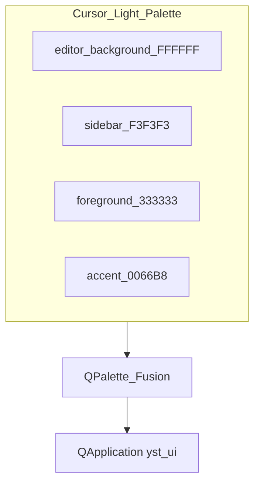
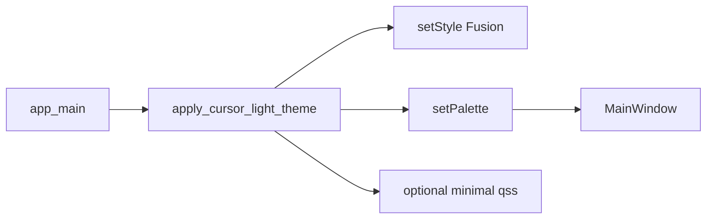

# UI Look & Feel — Cursor Light 테마

| TraceID | UI-005 |
|---------|--------|
| 적용 | macOS `yst_ui` (PySide6) v1 |
| 기준 | **Cursor IDE Light** 와 동일한 밝기·대비·포인트 색 |

Android는 Material **Light** 를 쓰되, **색 값은 본 문서 팔레트와 맞춘다**.

---

## 1. 목표

1. 개발할 때 쓰는 Cursor와 **같은 밝은 톤**으로 피로를 줄인다.
2. 실전투자(적색)·모의투자(녹색) 강조는 **테마 위에** 얇게 덧씌운다.
3. 다크 모드는 v1 **비목표** (후속).

---

## 2. 색 토큰 (Cursor Light 정렬)

| 토큰 | HEX | 용도 |
|------|-----|------|
| `bg_primary` | `#FFFFFF` | `QMainWindow`, 패널 배경 |
| `bg_secondary` | `#F3F3F3` | 모드 레일, 툴바, `QGroupBox` |
| `bg_tertiary` | `#E8E8E8` | 비활성, 구분선 |
| `text_primary` | `#333333` | 본문 |
| `text_secondary` | `#6B6B6B` | 보조·푸터 |
| `text_disabled` | `#999999` | 비활성 |
| `border` | `#E5E5E5` | `QFrame` border |
| `accent` | `#0066B8` | 포커스·선택·링크 (Cursor 블루 계열) |
| `accent_hover` | `#005299` | 버튼 hover |
| `success` | `#2DA44E` | 모의투자 배너·상승(보조) |
| `danger` | `#CF222E` | 실전투자 배너·경고 |
| `up` | `#0969DA` | 상승 숫자 (색맹: 모양 ▲ 병행) |
| `down` | `#CF222E` | 하락 숫자 |

---

## 3. PySide6 적용 (`yst_ui/theme/cursor_light.py`)

| 항목 | 설정 |
|------|------|
| 스타일 | `QApplication.setStyle("Fusion")` |
| 팔레트 | `QPalette` 모든 `ColorRole` 을 위 토큰으로 `setColor` |
| 폰트 | `QApplication.setFont(QFont("Pretendard", 13))` — 없으면 시스템 sans |
| 숫자 | `QFont("SF Mono", 13)` 또는 `Consolas` — 시세·손익만 |
| `QSS` | 최소화; **QPalette 우선** (유지보수) |

### 위젯별 힌트

| 위젯 | 스타일 |
|------|--------|
| `QToolBar` | `bg_secondary`, 하단 `border` 1px |
| `QListWidget` mode_rail | 선택 행 `accent` 배경 + 흰 글자 |
| `QDockWidget` order_dock | `bg_primary`, 떠 있을 때 그림자 얕게 |
| `QPushButton` default | `accent` 배경, 흰 글자 |
| `QPushButton` flat | 투명, `text_primary` |
| `QGroupBox` | `bg_secondary` 타이틀 |

### paper / live 배너 (테마 위 덮기)

| 프로필 | 배경 | 테두리 | 라벨 문구 |
|--------|------|--------|-----------|
| 모의투자 | `#F0FFF4` | `#2DA44E` 2px | **모의투자** |
| 실전투자 | `#FFF5F5` | `#CF222E` 2px | **실전투자** |

---

## 4. 차트 (Qt Charts)

| 항목 | 값 |
|------|-----|
| 플롯 배경 | `#FFFFFF` |
| 그리드 | `#E5E5E5` |
| 캔들 상승 | `#0969DA` |
| 캔들 하락 | `#CF222E` |
| 단타 매수 밴드 | `#0969DA` 15% alpha |
| 단타 매도 밴드 | `#CF222E` 15% alpha |

---

## 5. Android Light (참고)

| Material | 매핑 |
|----------|------|
| `colorPrimary` | `#0066B8` |
| `colorSurface` | `#FFFFFF` |
| `colorBackground` | `#F3F3F3` |

---

## 6. 에이전트·구현 규칙

1. **다크 팔레트·QSS 스니펫을 PoC에서 가져오지 않는다.**
2. 새 화면 추가 시 스크린샷 또는 `QPalette` role 표를 PR에 첨부.
3. 접근성: 본문 대비 WCAG 4.5:1 이상 (`#333` on `#FFF`).

**관련**: [UI-QT6-layout-conventions.md](UI-QT6-layout-conventions.md) · [UI-004-plain-language-and-labels.md](UI-004-plain-language-and-labels.md)
