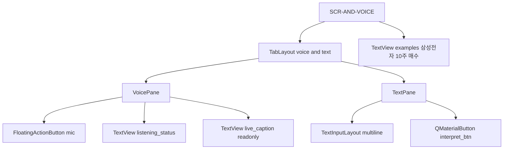
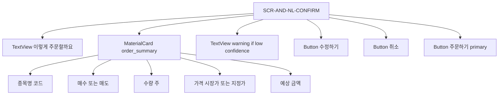
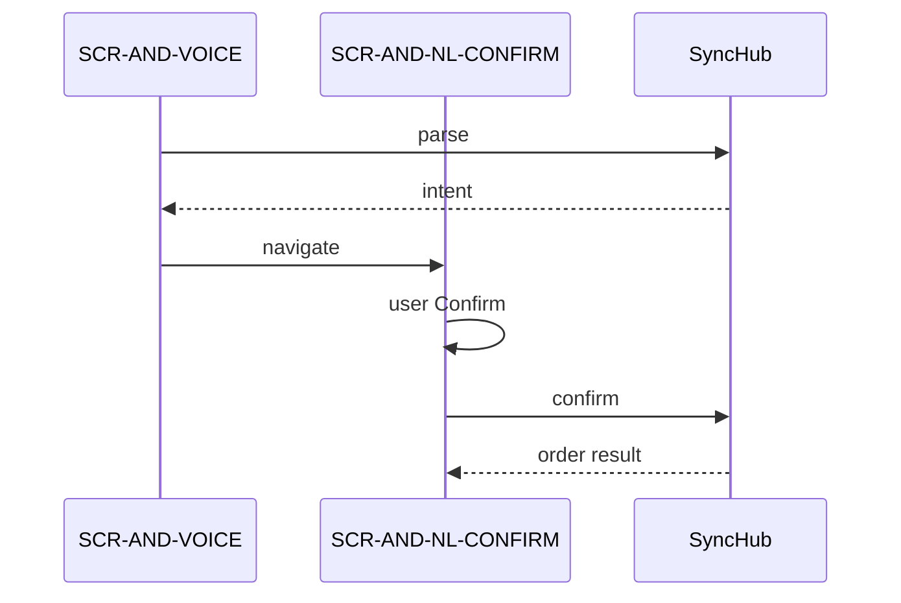
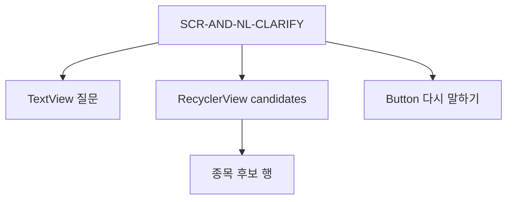

# UI-006 — Android 음성·자연어 매매 화면

| TraceID | UI-006 |
|---------|--------|
| UC | [UC-013](../usecase/UC-013-voice-nl-trading-android.md) |
| ADR | [ADR-011](../adr/ADR-011-android-voice-nl-trading.md) |

화면 라벨은 [UI-004](UI-004-plain-language-and-labels.md) — 금지: 「NLU」「ASR」「intent」.

---

## SCR-AND-VOICE — 입력 (주문 탭 확장)

| 진입 | 주문 탭 상단 **말로 주문** / **글로 주문** |

| 위젯 | 동작 |
|------|------|
| `mic` | `SpeechRecognizer` 시작·중지 |
| `live_caption` | ASR 부분 결과(로컬만) |
| `interpret_btn` | `POST /nl/parse` |

**권한**: `RECORD_AUDIO` — 최초 1회 rationale 다이얼로그.

---

## SCR-AND-NL-CONFIRM — 해석 확인 (필수)

| UC | UC-013 |

| 라벨 (한글) | 필드 |
|-------------|------|
| 종목 | symbol_name + code |
| 매매 | 매수 / 매도 |
| 수량 | N주 |
| 가격 | 시장가 / 지정가 원 |
| 합계 | 예상 금액 원 |

**live**: Confirm 전 `RiskGuardDialog` 동일 WebView 페이지 또는 native bridge.

---

## SCR-AND-NL-CLARIFY — 모호 시

| 진입 | parse.clarification |

---

## SCR-AND-NL-RESULT — 결과

| 상태 | UI |
|------|-----|
| 성공 | 체결 요약 + 주문 번호(correlation 8자) |
| 실패 | 이유 + 다시 시도 |

---

## TTS (live 권장)

확인 화면 진입 시: 「삼성전자, 10주, 매수, 시장가, 주문할까요?」  
`TextToSpeech` 온디바이스; 사용자 **주문하기** 탭으로 최종 확정.

---

## WebView vs Native

| v1 | 권고 |
|----|------|
| 음성 | **Native** `SpeechRecognizer` (WebView 마이크 제약) |
| 확인 UI | WebView 페이지 또는 Native Fragment — **동일 SCR-ID** |

---

## macOS v1.1 (참고)

`yst_ui` 주문 탭에 동일 **글로 주문** 패널; 음성은 OS dictation → 텍스트만 parse API.
