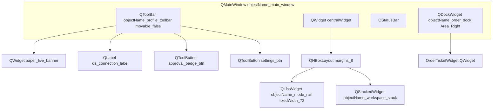
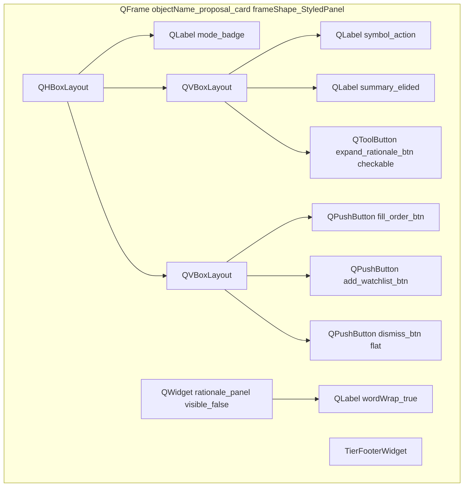
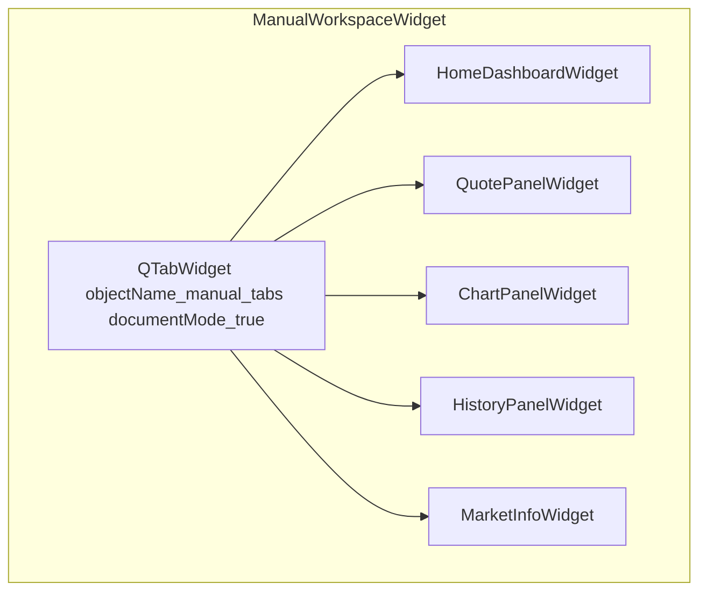

# PySide6(Qt6) 레이아웃 규칙 — yst_ui

| TraceID | UI-QT6-000 |
|---------|------------|

모든 화면 콘티의 **정본 위젯 클래스**입니다. 도식은 **Mermaid만** 사용합니다.

---

## 1. 앱 전역

| 항목 | Qt6 클래스·설정 |
|------|-----------------|
| 진입 | `QApplication` → `MainWindow(QMainWindow)` |
| 테마 | **Cursor Light** — [UI-005](UI-005-cursor-light-theme.md) `apply_cursor_light_theme()` |
| 스타일 | `Fusion` + 밝은 `QPalette` (**다크 금지**) |
| 폰트 | `QFont("Pretendard", 13)` / 숫자 `QFont("SF Mono", 14)` |
| 문자열 | [UI-004](UI-004-plain-language-and-labels.md) `tr()` 사전 |
| 스레드 | KIS·ML·스코어는 `QThread` + `QObject` worker; UI는 main thread only |

---

## 2. SCR-SHELL — `MainWindow`



| 위젯 | 속성·시그널 |
|------|-------------|
| `mode_rail` | `QListWidget` · 5행: Manual, Day, Long, AI, ML · `currentRowChanged` → `ModeOrchestrator.set_mode` |
| `paper_live_banner` | `QLabel` + `property profile` · paper=녹색 border / live=적색 |
| `order_dock` | `QDockWidget` · 기본 hidden · `raise_()` 로 슬라이드 인 |
| `workspace_stack` | 인덱스 0=Manual, 1=Day, 2=Long, 3=AI, 4=ML |

---

## 3. 공통 위젯 (커스텀 `QWidget` 서브클래스)

### 3.1 `TierFooterWidget`

| 자식 | 클래스 | 화면 문구 ([UI-004](UI-004-plain-language-and-labels.md)) |
|------|--------|----------------------------------------------------------|
| `as_of_label` | `QLabel` | **기준 시각** … |
| `freshness_label` | `QLabel` | **실시간(공식 API)** 등 |
| `source_label` | `QLabel` | **출처** 한국투자증권 |

`QHBoxLayout`; 모든 시세·제안·주문 티켓 하단에 붙임.

### 3.2 `ProposalCardWidget`



| 시그널 | 슬롯 |
|--------|------|
| `fill_order_btn.clicked` | `OrderDockPresenter.prefill(ProposalDto)` |
| `expand_rationale_btn.toggled` | `rationale_panel.setVisible` |

### 3.3 `OrderTicketWidget` (SCR-ORDER)

| 영역 | 위젯 |
|------|------|
| 방향 | `QTabBar` 또는 `QSegmentedControl` 대체: `QButtonGroup` + `QPushButton` buy/sell `setCheckable` |
| 가격·수량 | `QDoubleSpinBox` price_spin · `QSpinBox` qty_spin |
| 주문 유형 | `QComboBox` order_type_combo — 지정가/시장가/… |
| 현재가 | `QPushButton` apply_quote_btn |
| 실행 | `QPushButton` submit_order_btn `default` |
| 푸터 | `TierFooterWidget` |

---

## 4. Manual 워크스페이스 — `ManualWorkspaceWidget`



`OrderTicket`은 **탭 밖** `order_dock` 에만 존재(단일 인스턴스).

### 4.1 `HomeDashboardWidget` (SCR-HOME)

| 영역 | 위젯 |
|------|------|
| 계좌 | `QGroupBox` + `QGridLayout` — `QLabel` 평가금/손익/예수금 |
| 본문 | `QSplitter` Horizontal |
| 좌 | `QTableView` watchlist_table · `QStandardItemModel` |
| 우 | `QScrollArea` → `QWidget` index_cards_host · `QGridLayout` of `QFrame` |
| 하단 | `QListView` recent_proposals_list |

### 4.2 `ChartPanelWidget` (SCR-CHART)

| 위젯 | 비고 |
|------|------|
| `QComboBox` symbol_combo | 종목 |
| `QButtonGroup` interval_buttons | 1분/5분/일 |
| `QChartView` price_chart | `QtCharts` `QCandlestickSeries` + `QLineSeries` overlay bands |
| `TierFooterWidget` | |

---

## 5. 다이얼로그

| 화면 | 클래스 |
|------|--------|
| SCR-APPROVAL | `ApprovalDialog(QDialog)` `windowModality=ApplicationModal` |
| SCR-RISK | `RiskGuardDialog(QDialog)` |
| SCR-001 온보딩 | `OnboardingWizard(QWizard)` |
| SCR-OFFLINE | `QMessageBox` 또는 `OfflineDialog` |

---

## 6. 파일·패키지 매핑 (구현 시)

```text
yst_ui/
  shell/main_window.py          # QMainWindow
  shell/mode_rail.py            # QListWidget
  widgets/proposal_card.py
  widgets/tier_footer.py
  widgets/order_ticket.py
  workspaces/manual/...
  workspaces/day/day_workspace.py
  ...
```

**다음**: 화면별 상세는 [UI-001](UI-001-storyboards-shell-common.md), [UI-002](UI-002-storyboards-trading-modes.md), [UI-003](UI-003-storyboards-system-android.md).
