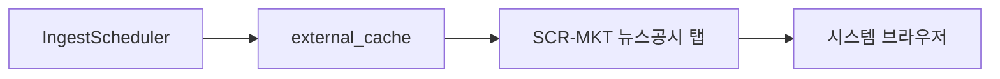

# UC-012 — 뉴스·공시·시장 맥락

| 항목 | 내용 |
|------|------|
| TraceID | UC-012 |
| 우선순위 | P2 |
| 데이터 정본 | [DAT-001-external-sources-catalog.md](../data/DAT-001-external-sources-catalog.md) |

## 목적

투자 판단 보조를 위해 **뉴스 헤드라인·공시 목록·시장 브리핑**을 제공한다. **자동 매매·RNN 입력은 아님**(v1).

## 사용 소스 (v1 요약)

| 구분 | SRC-ID | 제공자 | 앱 동작 |
|------|--------|--------|---------|
| **공시** | DART-LIST, DART-CORP | OpenDART | 목록 표시 → DART-VIEW **외부 브라우저** |
| **뉴스** | RSS-HK, RSS-NAVER | RSS | 제목·링크만 · 본문 **미저장** |
| **뉴스 링크** | LINK-NAVER-NEWS | 네이버 금융 | 종목별 뉴스 페이지 열기 |
| **시장** | KIS-IDX, KIS-MKT | KIS Open API | 지수·시장 요약 카드 |
| **시장 보조** | PYK-MKT | pykrx | 거래대금 상위 등 참고 |
| **환율** (v1.1) | ECOS-FX | 한국은행 ECOS | 현황 환율 |

상세 엔드포인트·주기·저장 필드: [DAT-001](../data/DAT-001-external-sources-catalog.md).

## 기본 흐름

1. `IngestScheduler` 가 DART·RSS·KIS·pykrx 어댑터를 주기 실행 → 로컬 캐시 갱신.
2. **공시** 탭: `corp_code` 매핑 후 종목 필터·`report_nm`·접수일 표시.
3. **뉴스** 탭: RSS 헤드라인 + 종목 키워드 매칭; 행 클릭 시 브라우저.
4. **시장 맥락**: KOSPI/KOSDAQ·보조 지표·관심종목 시세(Tier 배지).
5. iframe 임베드 **금지** — 링크 아웃만.

## 비기능

- 저작권: 뉴스 **본문 저장 금지**; OpenDART·RSS 약관 준수
- ASR-001: 모든 행에 `source`, `collected_at`, Tier
- 원천 장애: last-good + 「지연/실패」([UC-009](UC-009-multi-source-data.md))

## 추적

- SCR-MKT (UI-001), [DAT-001](../data/DAT-001-external-sources-catalog.md)
